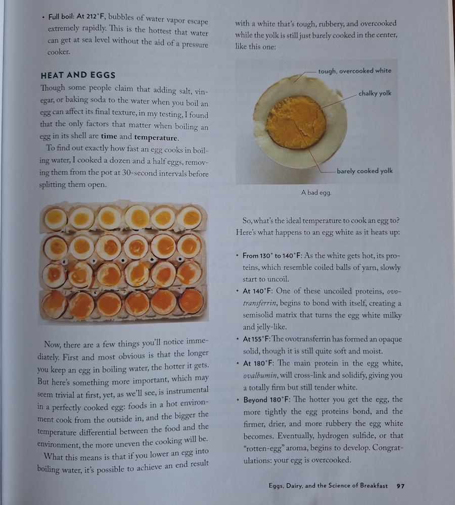
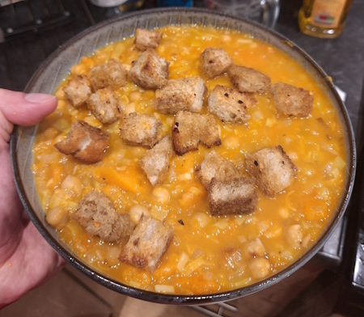

+++
date = '2026-01-04T20:08:55Z'
draft = false
title = 'Week 01 - Pumpkin Pumpkin Pumpkin'
description = 'Going through the cookbooks, and eating a lot of pumpkin.'
image = 'pumpkin.jpg'
+++

# Week One-ish: Thursday Jan 1st - Saturday Jan 3rd

* **Jan 1st**: Thai pumpkin Curry (*new*)
* **Jan 2nd**: Leftover Pumpkin Curry
* **Jan 3rd**: Roast Pumpkin Soup with Chickpeas, Leeks and Spiced Croutons (*new*)

At the start of the year I did A Reckoning. I Reckoned. Which is to say I went through my cookery books and tried to work out how many meals I’ve actually made from each of them.

It ain’t a lot.

Most of them yielded six, maybe seven. The problem is I’m too enamoured with shiny new recipes, I lose track of the good ones. 

So here’s the new years resolution: Record every meal I eat, for a year. This is the main meals of the day, so I’m not bothering with snacks or lunches. My hope is that this is a forcing function, that I end up coming out of this with a reliable list of recipes I can use on rotation. Actually go through my cookbooks and treat them as more than objet d’art.

Here’s the cookbooks I’m working with:

**Dennis Cotter's "For the Love of Food"** is my most chef-y book, with references to stuff like reductions, braising and cartouches. The meals I've made from this are all pretty good, but a bit involved. Also Cotter's Irish, and leans into it hard with eight different mash potato recipes.

> "It must be a cultural thing. I've got spuds in my blood where others, half the world or more, have rice. Some appear to have baked beans, strangely. I imagine that a lot of Italians would say pasta."

**Meera Sodha's "East"** is easily my most-used book, and then there's **"Dinner"** which might be my second most used. Her stuff hits this sweet spot between easy to make and delicious. All hail the queen of Guardian food.

**Georgie Mullen's "What to Cook & When to Cook It"** is a recent Christmas gift, so I haven't made anything from it yet. As you could probably tell from the name, it's all about seasonal recipes.

Keeping on the sustainable vibes, **Anna Jones's "One Pot, Pan, Planet"** mixes ecofriendly cooking with minimal washing up, which is a value proposition I can get behind completely.

The two **Ottolenghi** books - **"Simple"** and **"Flavour"** - represent a kind of aspirational self versus actual self divide. Simple is his attempt at approachability, which is relative when you're Ottolenghi, and I've done a few dishes from it. Flavour is the three-hour Sunday cooking marathon book. Usually worth it, but you have to *commit*.

**Nancy Singleton Hachisu's "Japan: The Vegetarian Cookbook"** is a little terrifying. I'm just not as familiar with Japanese cuisine beyond ramen, katsu or sushi. This book is full of beautifully photographed recipes of small plates of things like "cold tofu with cucumber vinegar". I have not made any of them. I need to take a week off and just commit. 

**J. Kenji Lopez-Alt's "The Food Lab"** isn't really a recipe book, it's more a scientific instruction manual. There's a page with eggs boiled at ten-second increments showing the progressive states of 'doneness'.

**Tyler Kord's "A super upsetting cookbook about sandwiches"** Is definitely my best named cookbook. Best recipe in there is one for a broccoli falafel sandwich, if you have any leftovers it will stink out your fridge, which I say as praise.

# Jan 1st: Thai pumpkin Curry

My parents gave me a pumpkin from their allotment (I'm incredibly middle class and make no apologies for it). I used half of it on a Dennis Cotter recipe I haven't made before, Thai pumpkin curry

It's not too difficult to make, you're meant to roast the pumpkin first for a while then mix it into the rest of the curry ingredients, but I went wrong somewhere. Either the oven's not getting hot enough, or I didn't dice up the pumpkin fine enough, because it was still a bit hard. It did give very precise instructions on how to cut the different bits of the leeks which I appreciated.

I'm not sure if I'd make this again, bit too much work and I tend to like heavier flavours, especially in winter.

# Jan 3rd: Roast Pumpkin Soup with Chickpeas, Leeks and Spiced Croutons

Dead easy. You roast the whole half pumpkin in a tray resting in veg stock, which I guess steams it while it roasts? Ended up much better than my curry attempt, falling apart when it came out the oven. 

Soup is pretty simple, but the croutons make it feel a lot more professional, even if it is just glorified toast. 

I have now been eating mostly pumpkin for three straight days, and I have left overs of both the soup and the curry. The only other stuff I've been eating is left over christmas chocolate. 

# Other than food

I've been getting into a new podcast, *If Books Could Kill*. Fun one, it deep dives into unhelpful self-help books.

I've also been playing **Megabonk** ([there's a review here if you care](https://rogueliker.com/megabonk-review/)), which is one of those bullet heaven games like Vampire Survivors. Main attraction is you can play a skeleton on a skateboard. Perfect to play while listening to a podcast.

Happy new year!