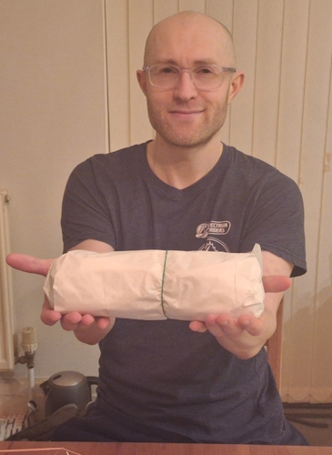
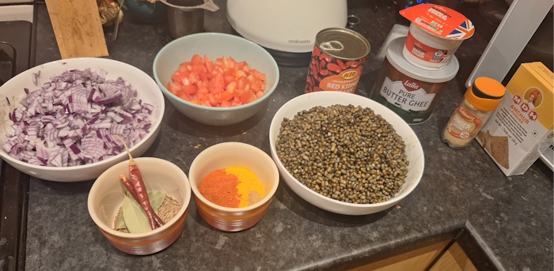
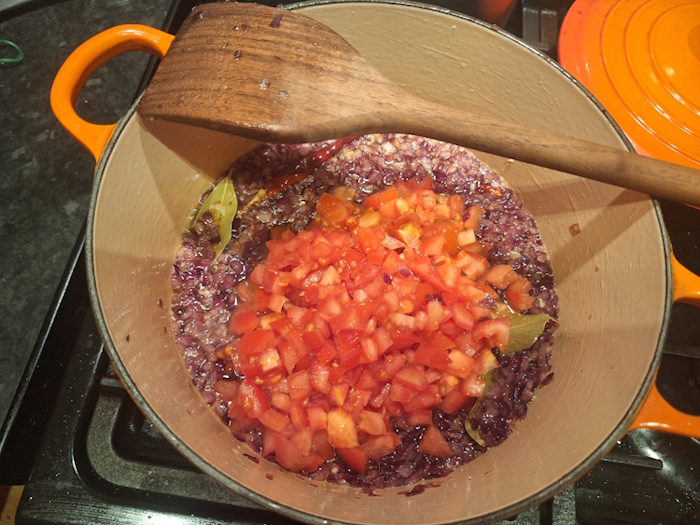
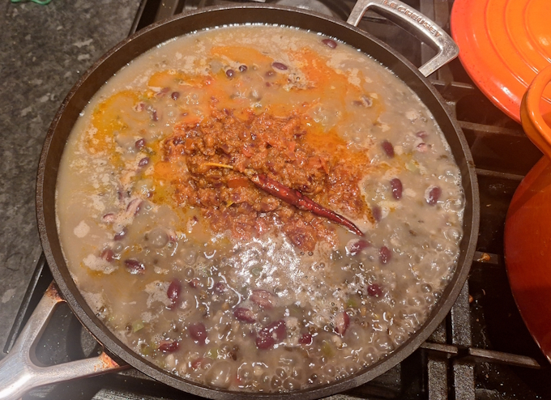
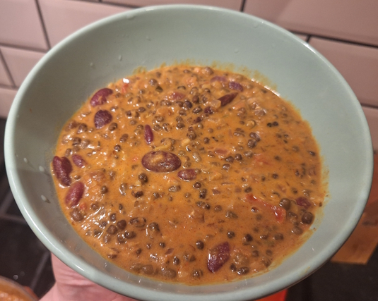
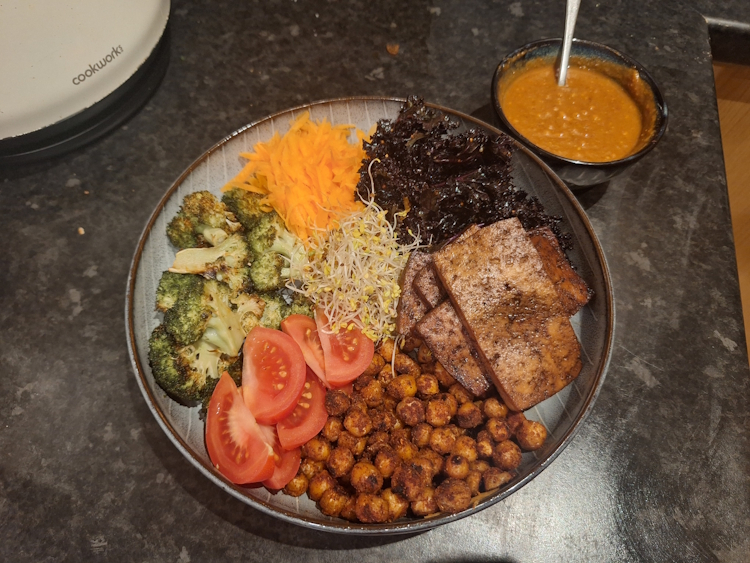
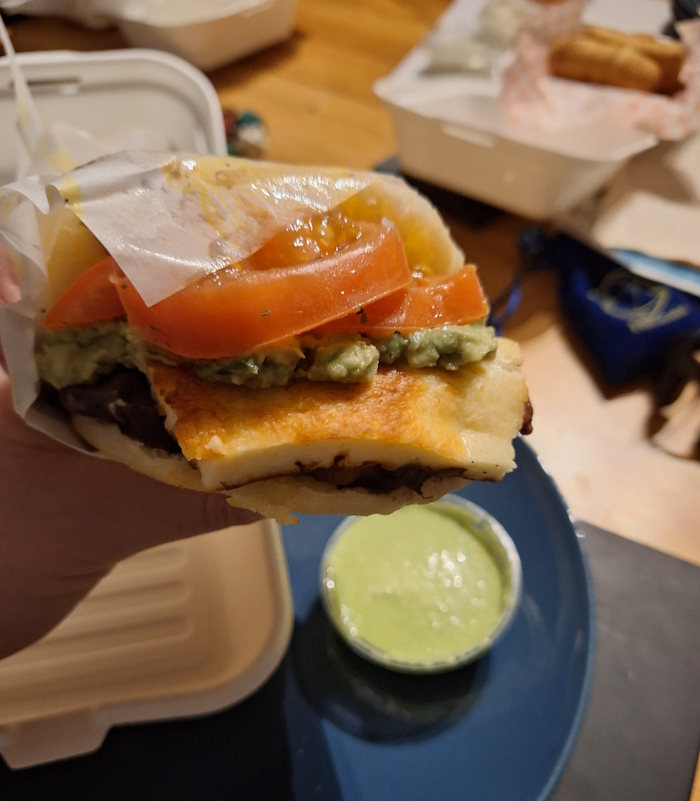

+++
date = '2026-03-08T10:13:01Z'
draft = false
title = "Week 10 - Dal fever"
description = "Another Fat Pats, four straight days of curry, and a bit of south american cuisine."
image = 'cover.jpg'
+++

# Week ten: Sunday Mar 1st - Saturday Mar 7th

* **Mar 1st**: Fat pats
* **Mar 2nd**: Dal Makhani
* **Mar 3rd**: leftover dal
* **Mar 4th**: leftover dal
* **Mar 5th**: leftover dal
* **Mar 6th**: Bowl of healthy stuff
* **Mar 7th**: Mia's Arepa

# Mar 1st: Aubergine Muffuletta from Fat Pats

Some friends of ours moved in round the corner (drawn in by the ... of Chorlton), so we went round to their new house to check it out. The afternoon devolved pretty quickly into talking about takeaway options for the area, so when we got back Andrew and I couldn't resist ordering another Fat Pats.

They're just so god damn delicious.

As always, went for the Aubergine Muffuletta (fried aubergine, grilled peppers, artichokes, tomatoes, pesto, balsamic glaze and parmesan), with a bag of ziggy fries.

# Mar 2nd: Dal Makhani

On monday I ended up making a massive batch of one of my favourite currys, Dal Makhani. Makhani is a punjabi word which means 'buttery', which probably tells you a little about why I like this one so much. I think it's pretty staple to northern Indian cooking, but this recipe comes from a youtube video I saw once. I've not been able to find the video again, so this is based on what I had saved in my notes app.

For anything particularly involved, it's best to get all the prep work done first. The base of this is Urad dal, which you're meant to leaving soaking overnight but I always forget to do that, so you can also just soak them for a few hours after pouring over boiling water.

* 200g dried Urad Dal, soaked for 8 hours
* 2 green chilli, diced
* 1 tin red kidney beans, drained
* 4 tablespoons ghee
* 2 tsp cumin seeds
* 2 dried red chillis (chill flakes are probably fine)
* bayleaf
* 3 red onions, finely dices
* 1/2 tablespoon each of garlic and ginger paste
* 3 tomatoes, diced
* 2 tsp ground coriander
* 1 tsp kashmiri chilli powder
* 1 tsp turmeric
* 1 tsp amchoor powder (it's powdered dried mango, adds a little bit of sourness)
* 150ml single cream
* 1 tsp garamasala
* 1 tsp methi leaves (also called fenugreek)

To start with, put the urad dal in a big pot, and cover with water until about an inch above. We soaked them but we still need to cook them. Also add your chopped green chilli. It's probably take a while, maybe around 50 minutes, need them to be tender. Add water if too much evaporates.

Meanwhile, do the rest of your prep, then melt the ghee (clarified butter) into a pan/pot and cook your whole spices (the two red chilli, the bay leaf, the cumin seeds) for a minute. Add your 3 diced onions and let it all cook down for a good 20 minutes. The key to a good curry apparently is making sure you properly cook the onions, reducing them right down until they're jammy, but being careful not to burn them. A pinch of salt can help here.

Once they're cooked down, add your garlic/ginger and cook for a minute to get rid of the rawness, then add in your tomatoes. Cook for another 5 minutes to break them down.

After that's all cooked you add the rest of your spices, the powdered ones this time (everything left except the garamasala and methi leaves). Turn up the heat and cook for a few minutes to get rid of any raw flavour in the spices.

Your urad dal is probably done around now. Lightly mash the dal (not too much, just enough to get a bit of starch in the water to thicken the curry), then tip it into your largest frying pan with the water it cooked in. add in the red kidney beans and heat them all through. 

It should look a little grey and disgusting at this point, not to worry. Scrape your spice/onion/tomato mix into the pan with the dal, and carefully mix it all together. It should bring a nice yellow colour to the curry.

Once it's all incorporated and cooked together for a minute, add in your garamasala, methi leaves, a couple of teaspoons of salt to tastee, and the cream.

This is a recipe that get's even better the next day, worth making a batch.

# Mar 6th: Bowl of healthy stuff

After eating curry for most of the week, I started craving a bit of veg and greenery. This isn't too complicated, I marinated the tofu in soy sauce, maple syrup and olive oil then baked it. Chickpeas are just fried and then covered in lemon juice and some spices. The rest is roast broccoli, grated carrot and kale.

Did a satay sauce with some peanut butter, siracha, squeeze of lemon juice and brown sugar.

# Mar 7th: Mia's arepa

Saturday was D&D night, meaning another takeaway. We went for a Colombian/Venezuelan  place in town called Mia's arepa. 

Arepa are a kind of corn flatbread, which get stuffed with things like cheese, black beans, guacamole.

I got greedy and ordered mine with a side of tequeños, which is sticks of cheese wrapped in dough. They can be dipped in this green sauce called Guasaca. And also I ordered an extra Empanada. What can I say, running D&D is hungry work.