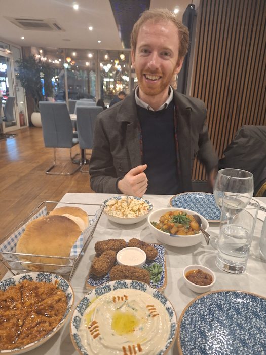
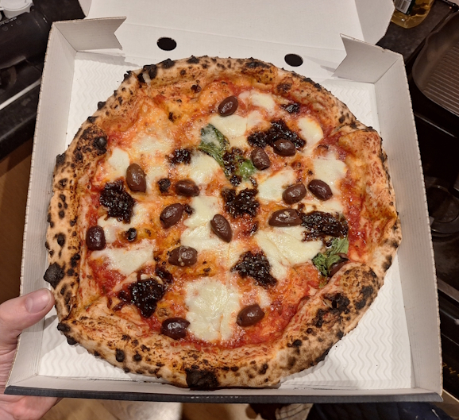
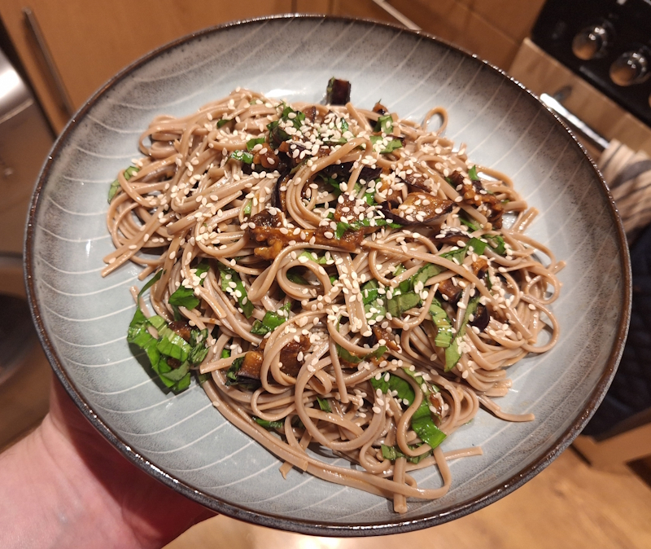
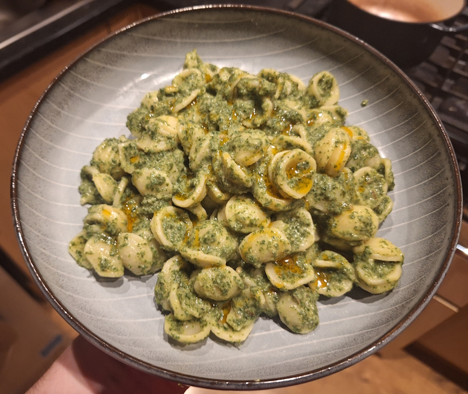
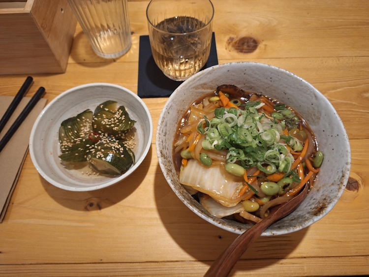
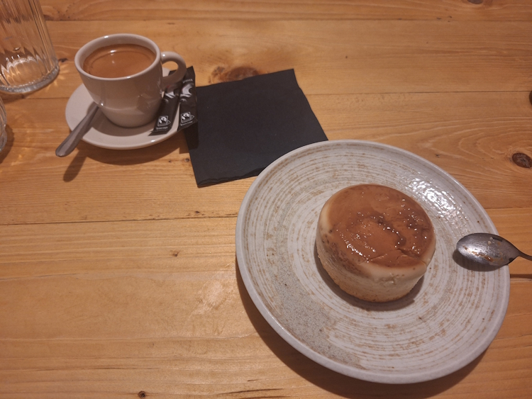
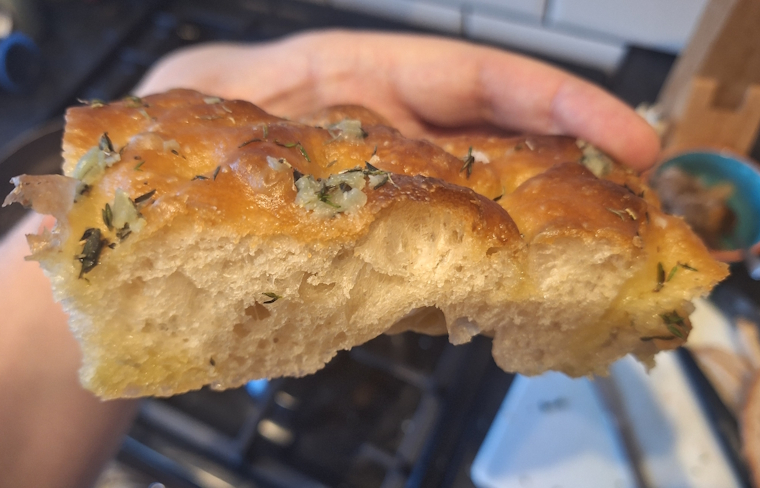

+++
date = '2026-03-15T18:13:01Z'
draft = false
title = "Week 11 - Homemade bread"
description = "I try making foccacia for the first time, and enjoy a couple of meals out this week."
image = 'cover.jpg'
+++

# Week eleven: Sunday Mar 8th - Saturday Mar 14th

* **Mar 8th**: Lebanese food at Jasmine
* **Mar 9th**: Pizza from Double zero
* **Mar 10th**: Aubergine noodles
* **Mar 11th**: Miso butter greens pasta
* **Mar 12th**: Japanese food at Yane
* **Mar 13th**: Leftover pasta
* **Mar 14th**: Focaccia

# Mar 8th: Lebanese food at Jasmine

Sunday night I caught up with Matt, who was in town to run a wildlife tour. Rick was recovering from a cold, so the two of us went out for a meal at Jasmine in Chorlton, a Lebanese restaurant.

This is my favourite kind of food, where you share lots of small plates. From what I can remember we ended up getting some Hummus, Baba ghanouj, Muhammara, some Batata Harra, falafel and some sort of cooked aubergine thing I've forgotten the name of. It's a BYOB place so Matt's dad very kindly gave us a bottle of nice white wine. 

Shamefully we didn't manage to finish all the food off, but to be fair to us we got close. Just a bit of the baba ghanouj left. Completely and utterly stuffed at the end of it though, could not eat another mouthful. 

We ended up heading back to mine to watch the opening of Alien on a laptop, which Matt had never seen before. We watched up to the chest burster scene, which felt appropriate. Coming up with an overeating joke is left as an exercise for the reader.

# Mar 9th: Pizza from Double zero

I felt lazy on Monday, and ordered in a pizza from Double zero. My usual, olives and caramelised onions.

I might start doing a running total of deliveroos, I think double zero is currently winning.

# Mar 10th: Grilled aubergine with soba noodles

Tuesday I made a quick midweek meal from one of Andrew's books: Thug kitchen. I'll be honest the writing in this book is pretty unbearable. For whatever reason they feel the need to write in what I can only describe as a middle class white person's understanding of 'gangster'. 

Don't get me wrong I like swearing as much as the next person. Fuck. Shit. etc. 

There's just something very cringe inducing about passages like this in a cookbook:

> Why is everyone so fucking afraid of tofu? That shit is just misunderstood. Yeah it can be bland and mushy, but that is because people don't know how the fuck to cook it right and that gives tofu a bad fucking name. It isn't hard; most motherfuckers are just lazy with it. We got this shit figured out, though. Throw it in a flavorful marinade and bake at a high heat, and tofu turns into something worth eating and not just some health food dare. Try it out and see how much better you can be at this tofuckery than everybody else.

Having said that they do have a good few recipes in there, the best of which is the grilled aubergine noodles. 

It's very simple: you slice your aubergine into thin rounds and marinade in 2 parts rice vinegar, 1 part soy sauce, 1 part water, and a bit of minced garlic and honey. Cook the soba noodles and then rinse in cold water, before tossing in sesame oil. Fry up your marinaded aubergine on a grill, then dice up and mix with the noodles, some leftover marinade, chopped basil and sesame seeds.

# Mar 11th: Miso butter greens pasta

Back with another Meera Sodha recipe. This one is very earthy and verdant, lots of good green stuff blitzed up with butter and white miso. It also uses orecchiette, and I always feel extra fancy when I'm not just using penne or spaghetti pasta.

With this one you melt butter in a saucepan, with some garlic, chilli flakes and fennel seeds. Then stir in some broccoli, and an absolute mountain of kale. I normally have to let the first batch of kale cook down a bit before I can fit more in the pot. Once that's all gone tender, blitz it in a food processor with the white miso and olive oil, and mix into your pasta. 

Works well with a little chilli oil drizzled on top.

It's a lot more vibrant in real life than I could capture on my phone camera. It's in her 'Dinner' book, but the recipe for it is online here:

https://www.theguardian.com/food/2023/jan/21/miso-butter-greens-pasta-vegan-recipe-meera-sodha

# Mar 12th: Japanese food at Yane

Thursday I met up with Josh and Rebecca for a meal at Yane, a Japanese place round the corner from us. For whatever reason I'd not tried this spot out yet, but it was great. They have some booths in the back of the restaurant where, with cords to pull to get the waiter to take your order.

The menu feels pretty authentic, as far as I can tell. It's more comfort food as opposed to fancy sushi dining. They had stuff like donburi, katsu curry, etc.

I went for the vegan chukadon, which is a chinese style vegetable stir-fry on rice, with a side order of their cucumber pickle. They had a whole section of the menu for 'tsukemono', aka home made pickles. I had a very delicious glass of the Umeshu (plum liqueur) with the meal as well.

For dessert we all ended up ordering the same thing, a crème brûlée cheesecake. Very light an fluffy, although I was expecting a crunchy top from the name.

# Mar 14th: Focaccia

It's mother day tomorrow, and I mentioned that I was going to put on an afternoon tea at my parents house for them. I'll go into that more next week, but as part of the prep I tried making my own focaccia for one of the sandwiches. 

I'm pretty sure I've never made it before, but it turned out pretty well. It's not a lot of work, but you do have to keep a bit of an eye on it, folding it over every half over. I hadn't realised just how much olive oil goes into it though, no wonder it tastes so good.

I made enough for sandwiches for tomorrow, and then for tea I ended up eating a load of the leftovers with some balsamic vinegar.
