+++
date = '2026-03-22T18:13:01Z'
draft = false
title = "Week 12 - Fancy sandwiches and a pickup truck"
description = "I make afternoon tea for my parents, eat a lot of indian food, and fly to Seattle."
image = 'cover.jpg'
+++

# Week Twelve: Sunday Mar 15th - Saturday Mar 21st

* **Mar 15th**: Mother's day afternoon tea
* **Mar 16th**: 'Whatever was in the fridge' pasta
* **Mar 17th**: Leftover pasta
* **Mar 18th**: Leftover pasta
* **Mar 19th**: Mahbub takeaway
* **Mar 20th**: Bundobust takeaway
* **Mar 21st**: Bellevue Vietnamese (and airplane food)

# Mar 15th: Mother's day afternoon tea
It was mothers day on the sunday, and also my dads 70th birthday that same weekend. We had originally planned to go out for a meal for his birthday but it all ended up falling through due to a medical appointment (which didn't happen in the end anyway). As a result I figured making some afternoon tea and taking it round to theirs was the best option.

As I mentioned last week, I'd made some focaccia the day before as prep. This went into the sandwiches, of which I did four: focaccia with pesto, mozzarella, tomato, rocket, diced artichoke and balsamic glaze; goats cheese, beetroot, toasted walnut and honey; cucumber, philadelphia cream cheese and dill; and cheddar and chutney. I put the most thought into the first two on that list, I'll admit, but you've got to have a cucumber sandwhich with an afternoon tea. 

I also nipped out to Bisous Bisous, the cute french patisserie near me, and picked up some cakes and a tart to fill out the spread. Andrew very kindly lent some of his fancy tea as well. I'm very happy with how it all ended up!

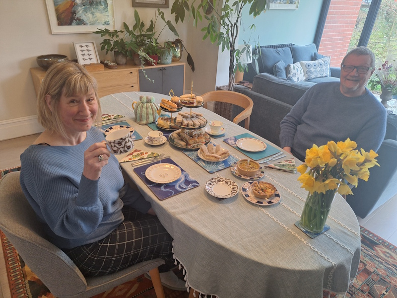

# Mar 16th: 'Whatever was in the fridge' pasta

I had a few jars of bits and bobs left over from the sandwiches, and also I'm off to Seattle next week, so I improvised a pasta to use up as much as possible.

Fried off some onions and garlic, chucked in a diced up jar of artichokes, sundried tomatoes, and half a jar of pesto. I made a 'crumb' out of some bread, the dregs of a bag of mixed nuts, some capers, and some various herbs.

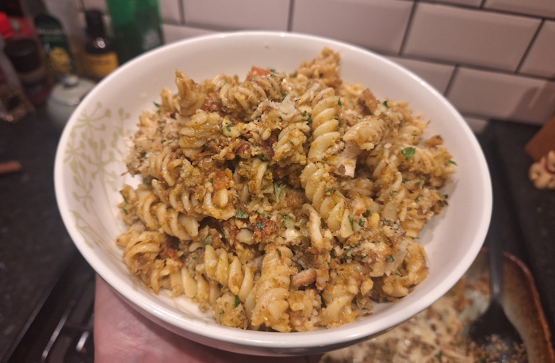

# Mar 19th: Mahbub takeaway

I met up with some friends for drinks in Chorlton after work, but as a result I couldn't resist the sirens call of the indian takeaway, shining through across the street from where we were sitting. 

Mahbub's not one I've been to before, but it's pretty typical BIR style indian food. I do have a lot of affection for places like this, the general trend seems to be more and more indian 'streetfood' style restaurants. I ended up going for a paneer rogan josh, which was always my order at the Great kathmandu.

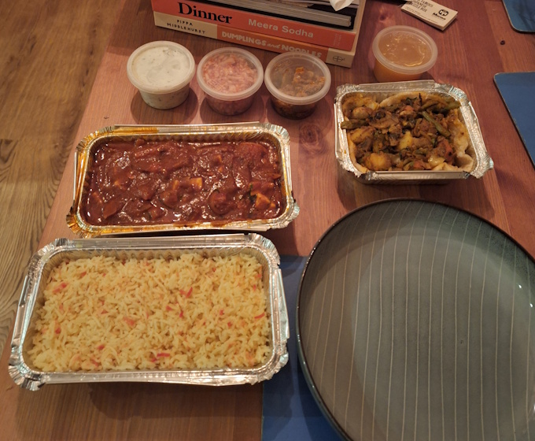

# Mar 20th: Bundobust takeaway
Having just said I appreciate a classic BIR indian restaurant, I decided to get indian streetfood from Bundobust the next day. And you know what, it was better.

They had a couple of interesting limited time indian-chinese fusion items on the menu, including 'Gobi Toast' which tasted a lot like a veggie prawn toast. Also got the Bundo chaat, of course, and a few other bits and bobs.

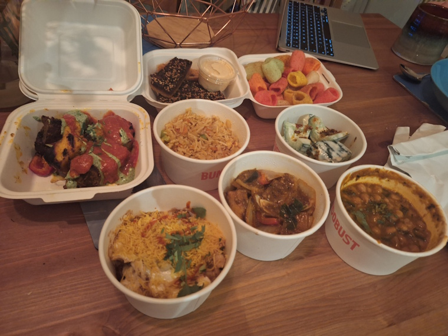

# Mar 21st: Bellevue Vietnamese (and airplane food)
This day was a bit of a weird one, as I spent most of it travelling to Seattle.

I woke up at 4AM to get a 6AM flight, and then didn't sleep until 9PM seattle time, which works out as being up for 24 hours. 

I had a meal on the plane which was fine. Air France isn't too bad with food, and it came with a complimentary glass of champagne as well. Veggie option was a pesto pasta, with a side of tomato grains, some cheese and bread, and a sweet tart.

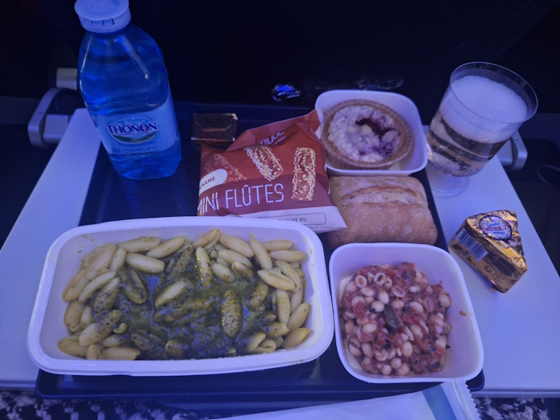

I landed in Seattle around 12:30, and the best thing to do with jetlag is just power through and try and stay awake until the evening to get your internal clock synced up. 

In the evening Bryn and I went out to a Vietnamese place in Bellevue, where we're staying, called Chay Concept. It's traditional vietnamese food, but all vegetarian.

I went with a Tamarind Pho, and a side of tropical rolls. The Pho was delicious, and the tropical rolls started off good but unfortunately they all stuck together and disintegrated a bit.

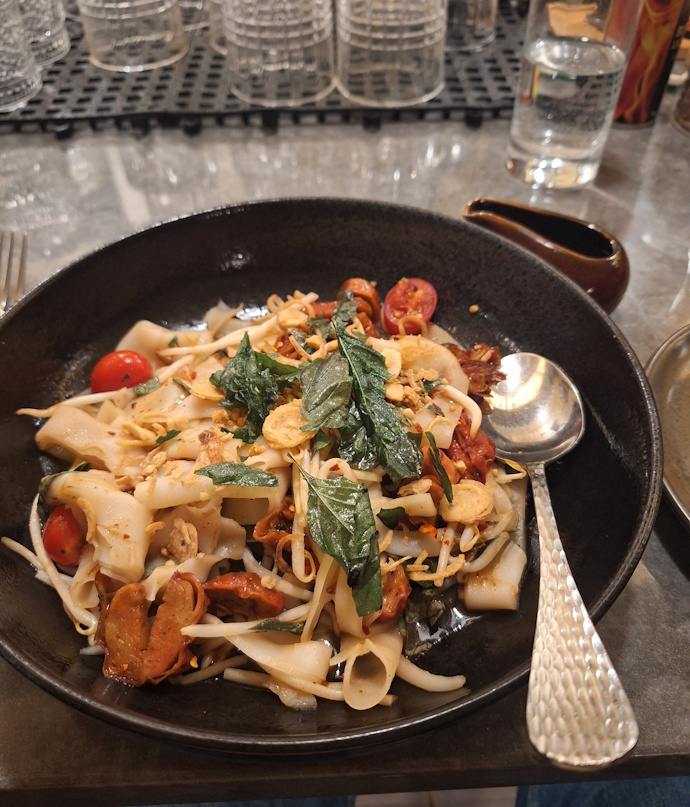
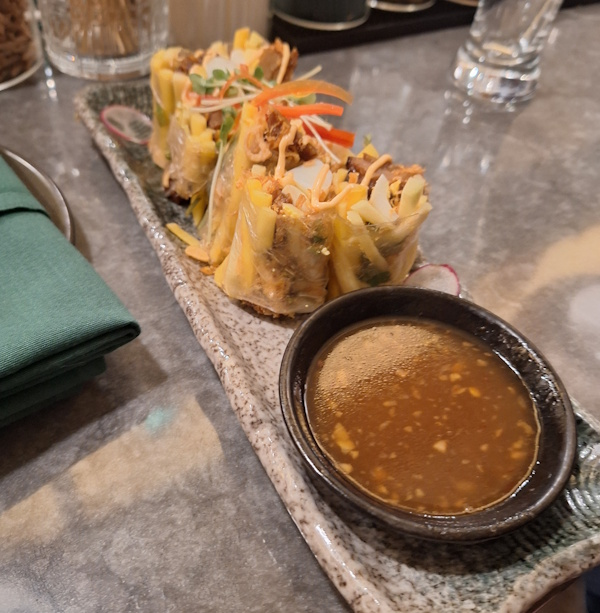

A pretty good start to my US meals. 

# Other than food

The car rental place were out of the car we had originally booked, a sensible sedan. Instead gave us a Toyota pickup truck, for the proper American experience. The thing is absolutely massive.

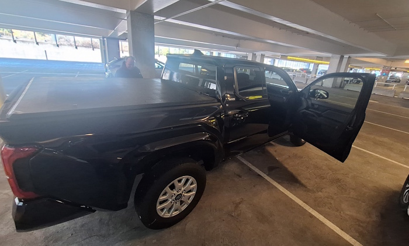

We had a bit of a pootle about in Seattle, getting a lay of the land. Bryn knew of an interesting used bookshop in the university district, called Magus books. I spent a good hour flicking through the various sections.

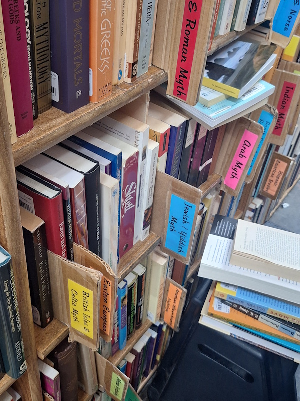

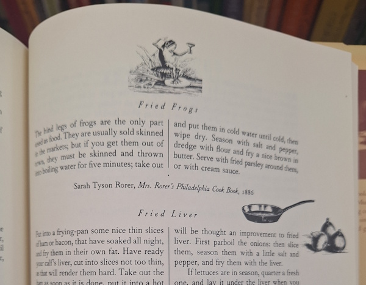

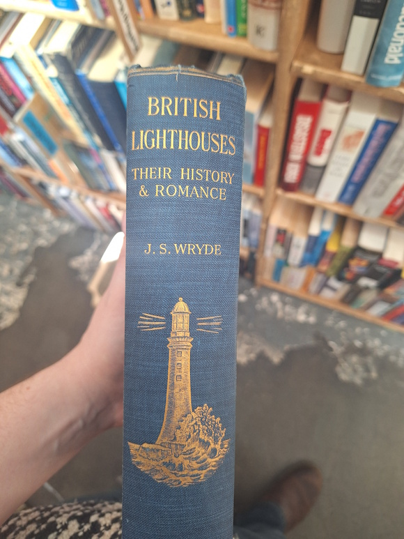

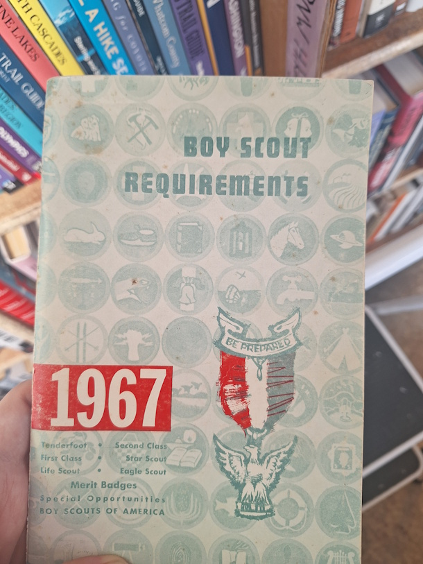

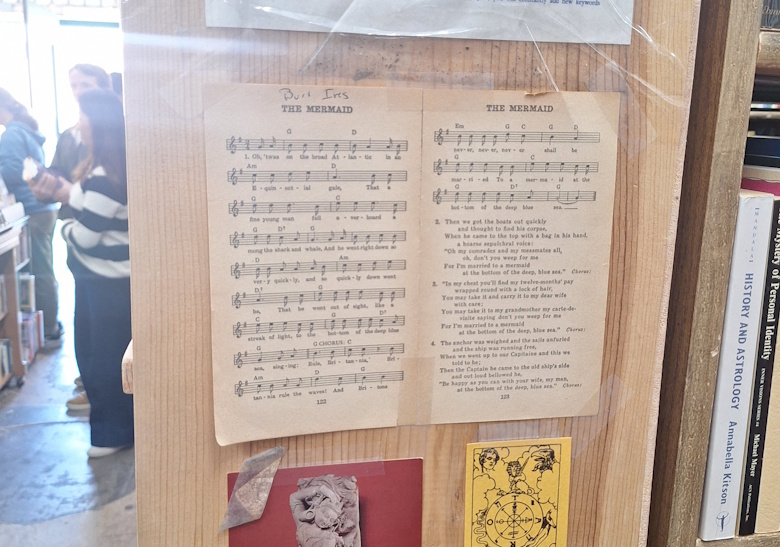