+++
date = '2026-03-29T22:11:31Z'
draft = false
title = "Week 13 - Exploring Seattle"
description = "A week in Seattle featuring Mexican food, donuts, the setting of Twin Peaks, and deeply average plane food."
image = 'cover.jpg'
+++

# Week Thirteen: Sunday Mar 22nd - Saturday Mar 28th

* **Mar 22nd**: Grilled Cheese + Jackfruit Burrita
* **Mar 23rd**: Poblano Chile Relleno + Tacos
* **Mar 24th**: Avocado curry
* **Mar 25th**: Black Bean Burger
* **Mar 26th**: 'Plant one on me' wrap
* **Mar 27th**: Airplane food
* **Mar 28th**: Curry from the Original Third Eye

# Mar 22nd: Grilled Cheese + Jackfruit Burrita

Sunday we were still adjusting to the time difference, so got an early start. The hotel has a breakfast buffet, but slightly worryingly they felt the need for a 'no guns' sign by the fresh fruit. I guess it's because in the evening they have a bar, but it's still very very American.

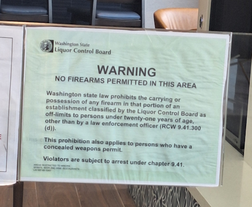

We ticked off most of the main Seattle tourist sights on Sunday. First stop was the Seattle museum of Pop culture, a very colourful building which features a fair amount on Seattle locals Kurt Cobain and Jimi Hendrix. Upstairs they had a 'Sound Lab', a cool hands on exhibition which teaches you how to play various instruments. I had the most fun trying to do the drum fills, which took me back to my Guitar Hero/Rockband days.

After that I went up the Space Needle, into the rotating glass floored restaurant. We hit it lucky with the weather and you get some great views out across Seattle. It's pretty terrifying stepping out onto the glass, until you spot the bored looking teenage staff casually walking across it to clean windows, and realise you've got nothing to worry about.

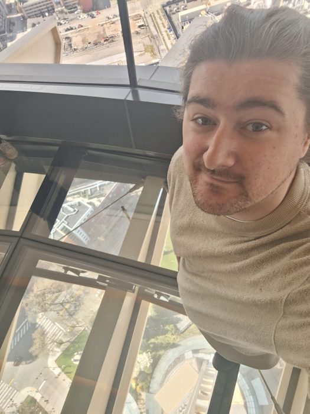

Next we caught the monorail to Pike's Place market. It's a very vertical maze of quirky stores and eateries, it reminds me of Aflecks palace back in Manchester. We picked up lunch at Sound View Cafe, which was on the top floor and has a nice view out across the bay. I went for a proper american comfort-food: grilled cheese with marinara filling, tomato basil soup to dunk it in, and a ginger ale. I have to say one of the things the american's do a lot better than us is their sandwiches. I had a few sandwiches at lunch over this week, and all of them blow a boots meal deal sandwich out of the water.

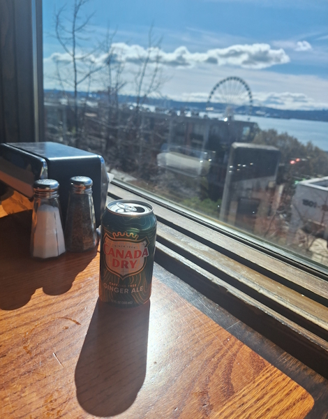
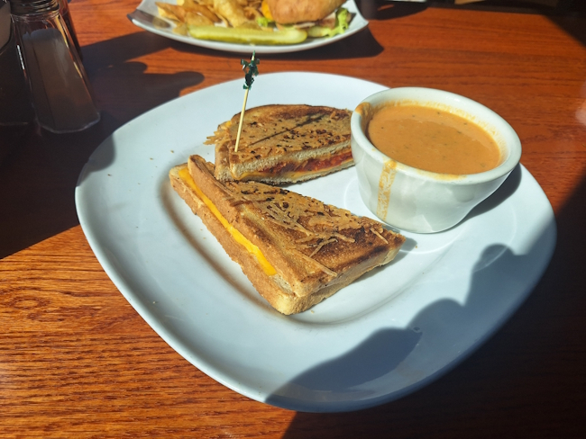

We spent a bit of time exploring Pike's Place. There's a few book, comic and record shops to poke about in, but most excitingly for me there's a shop selling old maps and charts. Spent some time poking about, looking at Victorian era city maps, and charts of the main domestic imports and exports. 

One that caught my eye was this chart, showing the tallest mountains of the world, listing Everest as the **second** tallest mountain after one called Mt. Hercules.

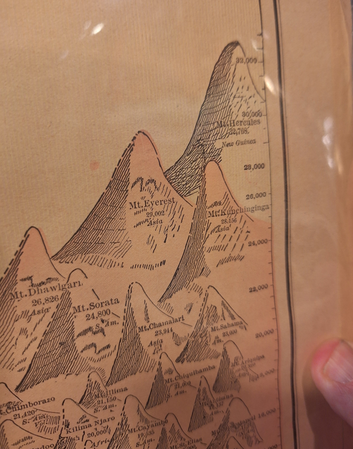

This led me down a bit of a wikipedia rabbit hole. Apparently in 1875, Chapman & Hall published in London a book titled *Wanderings in the Interior of New Guinea*, in which Captain John A. Lawson recounted his north-to-south crossing of the then largely unexplored island of New Guinea. It's punctuated by numerous adventures, fights with monkeys and discoveries of unknown animal species, including a giant brown and white striped tiger called the Moolah. He also claims in the book to have climbed a mountain 1000 meters taller than Everest, in a single day.

The book was a success, to the point that it influenced the creation of the above chart, however there were still some who were sceptical of the story. Captain Lawson responded sarcastically to his various detractors in several letters, notably stating that his:
> "ascent of Mount Hercules also caused more than astonishment in the minds of the delicate gentlemen and plump professors who are accustomed to climbing Mont Blanc, aided by sherry, sandwiches, and half a dozen fat, garlic-scented guides"

Even after it became apparent that Lawson had completely fabricated the story, Mount Hercules is still referenced by some encyclopedias as the highest mountain in the world until the end of the 19th century.

Getting back to food, Bryn and I met up with a colleague called Jason who we work a lot with for dinner, at a place called Cactus in Bellevue. It's a pretty fancy mexican food place, and I'd mentioned wanting to try some since we don't have great options in the UK. we got complimentary chips, guac and salsa, and for main I had the jackfruit burrita. I'll be honest I haven't found a good answer for the difference between a burrita and a burrito, maybe you eat one with a knife and fork? 

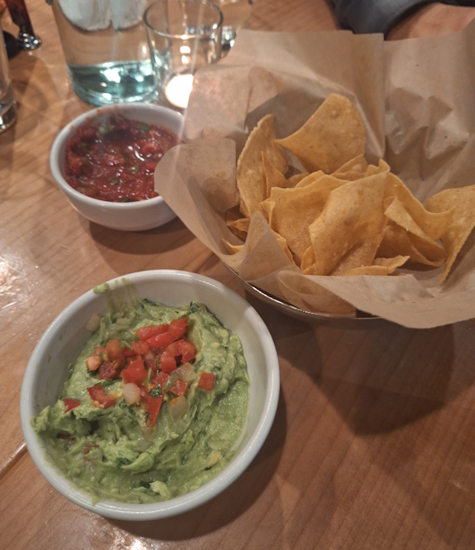
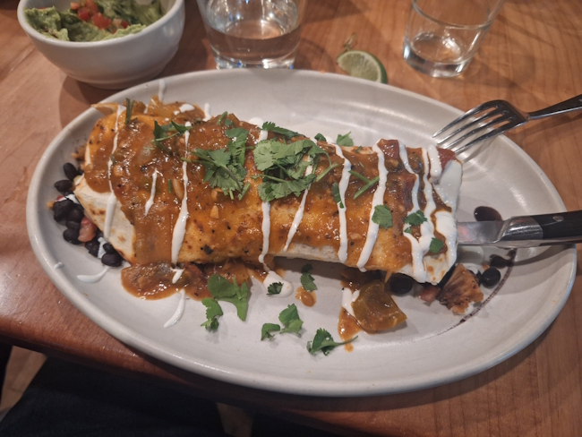

Either way, very delicious.

# Mar 23rd: Poblano Chile Relleno + Tacos

Monday saw us driving in to the Bellevue office, getting set up with desks, and spending most of the day meeting people I've only ever spoken to online. We went out with the fusion team, although due to some miscommunication and poor planning this was back to Cactus again, where we ate last night.

This time I went for something different, Chile Relleno. I'd never seen this on a menu before, but it's a traditional mexican dish where you stuff a poblano pepper with cheese, coat it in a fluffy egg batter and fry. It's served on pureed black beans, rice and a mole rojo sauce. 

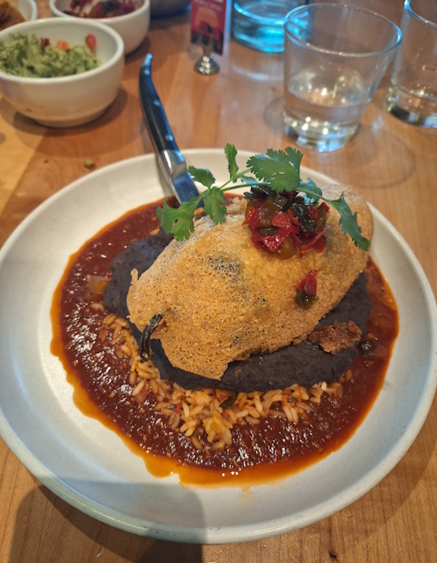

It was the best thing I ate all week. Genuinely impressive in its construction, they perfectly balanced the textures (gooey cheese in the middle to crispy batter shell), flavours, the right level of spice. I can't recommend this highly enough. Completely inappropriate as a lunch option though. I was comatose for the rest of the afternoon.

After work Bryn and I went down to check out Capitol Hill. It's a cool area, a lot of music venues, part of it's a gay village, it's right near the university of washington so quite studenty, and every other storefront is a bar. We found a place and enjoyed a few of Seattle's local beers, and people watched. I think I had a few beers from a brewery called Holy Mountain which were good.

We skipped dinner while we were getting drinks, as I was completely stuffed from the large lunch, however by the time I made it back to the hotel I was starting to feel a bit peckish again. I figured I'd eaten mexican food twice this trip, but both times from Cactus, so I gave myself a more representative view by ordering an uber-eats from California Burrito, a standard looking takeout joint. I got a couple of veggie tacos and a quesadilla. 

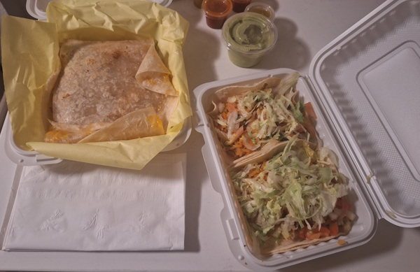

They don't photograph well, but they hit the spot. After this my taste for mexican food has been fully sated though.

# Mar 24th: Avocado curry

On tuesday I canvassed people in the office to see where they recommend going in Bellevue, where we're staying. Quite a few people mentioned somewhere called Araya's Place, a vegan Thai spot. I had the avocado green curry with a side of brown rice, and of deep-fried Brussel sprouts, broccoli, roasted garlic and lemon. Like most places in the US they were very generous with the portions, getting the sprouts was a mistake. It all tasted very good, but I ended up walking away with half of it in a doggy bag.

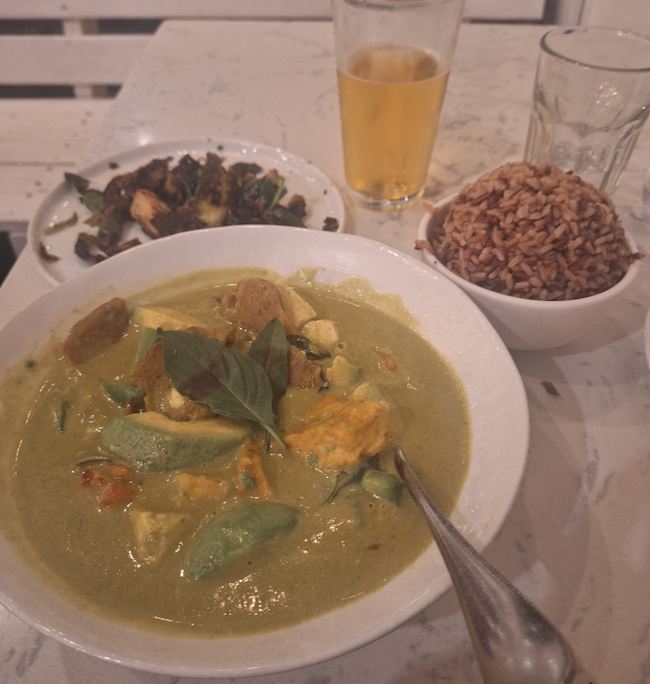

On my way back I passed by a place called Voodoo donuts, the neon pink glow of the interior cutting through the night, a bat signal for people with poor impulse control. I'd been to Voodoo donuts on my last trip to America seven years ago, although that had been in the original location in Portland.

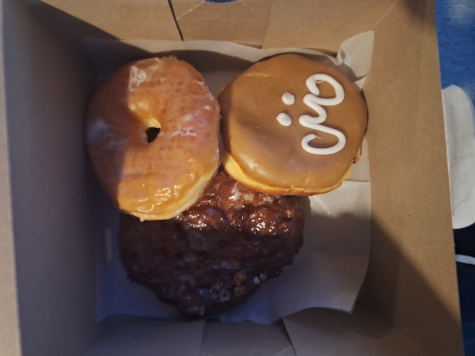

I simply refuse to learn any lessons, so I bought three donuts. Regular glazed, one filled with maple cream, and an apple fritter. I'm not sure if you can tell from the picture but they're about twice as big as a standard UK donut. I only ate one and a half tonight and kept the others in the hotel room fridge, but that was enough sugar to have me bouncing off the walls.

# Mar 25th: Black Bean Burger

A member of my team based in Seattle, a guy called Logan, grew up in the local area. His home town is a place called North Bend, to the east a bit in the foothills of the cascade mountains. It's also the place where they shot Twin Peaks, along with the nearby Snoqualmie. 

He very kindly drove me out to see Snoqualmie Falls, a large waterfall also featured in Twin Peaks. It was also central to the religious beliefs of the local native americans, said to be the place where "First Woman" and "First Man" were created by "Moon the Transformer", and where prayers were carried up to the Creator by great mists that rise from the powerful flow.

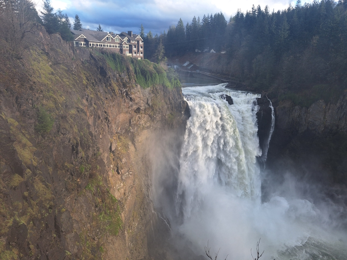

While we were in the area, we ate at Snoqualmie Falls Brewery. I had a black bean burger, and a side order of fries and 'beer cheese'. I'd never had it before, but it's a bit like cheese fondue, with beer and I think some mustard and chilli powder. Worked very well as a dip.

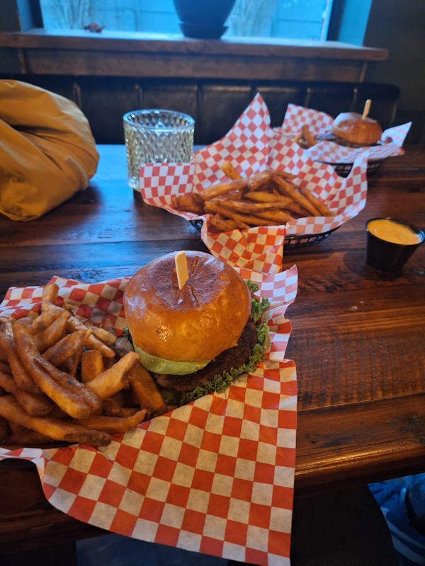

I also tried my first ever root beer. Still deciding how I feel about it, there is certainly a medicinal quality to it, which I've heard other people say, although the sweetness does make it a lot more drinkable than that would suggest. Apparently it's due to wintergreen, a flavour which in europe we only ever use in mouthwash and medication. This one was advertised as the 'Best-in-the-Universe' root beer, and made in the brewery.

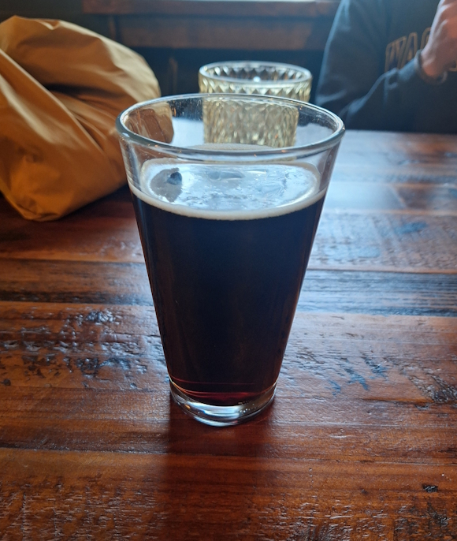

# Mar 26th: 'Plant one on me' wrap

Thursday was travel back home day. We had some final meetings and lunch in the office, before heading to the airport for a four pm flight. Perhaps predictably the flight got delayed by several hours, so they gave us a voucher for food to spend in the terminal. I grabbed a 'Plant One On Me' wrap from a place called Evergreens. Vegan chorizo, quinoa, spinach, carrots, olives, beets, pickled red onion.

Airport food is usually a bit of a gamble, but this one actually did the job.

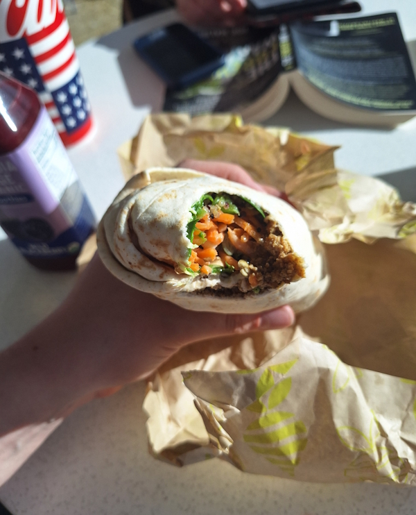

I also picked up a toasted cheese sandwich before the flight, from another store I forget the name of. I'm trying to think of anything interesting to say about it, but it was completely unremarkable. Just a very bland airport grilled cheese.

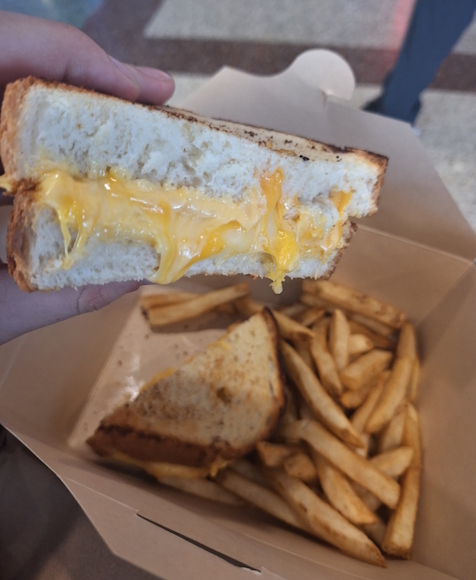

# Mar 27th: Airplane food

The timezones start getting a little wobbly here, so this was late March 26th Seattle time / early March 27th UK time. Either way it was the only food I ate today.

The food was noticeably worse on the way back than on the way in, on top of the delays. I flew out from the UK with Air France and the return was with Delta, and Delta definitely lost that comparison. 

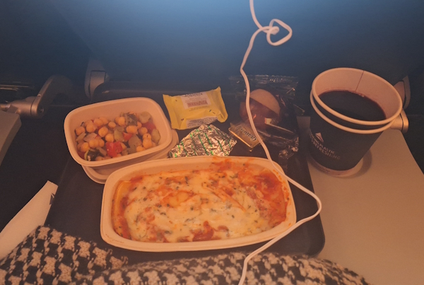

The meal was pretty dire (although I did have a few glasses of red wine which helped smooth things out). Gloopy veg lasagne, with a very gritty and salty chickpea salad.

# Mar 28th: Curry from the Original Third Eye

Saturday I was back in Manchester, with an empty fridge and no energy to cook, so I ordered from The Original Third Eye, a Didsbury classic.

Went for some onion pakoda, samosas, dal makhani and aubergine brinjal. 

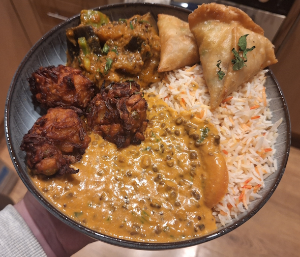

Next week I may have to go on a bit of a diet, I can't keep up this level of food.