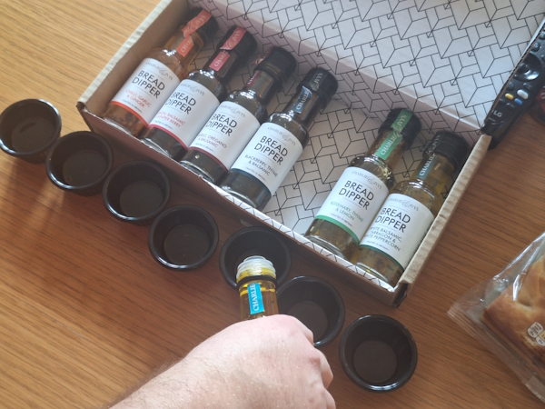
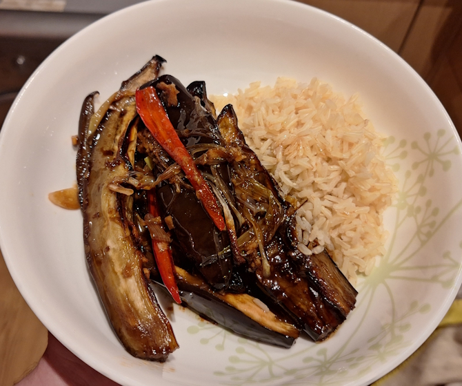
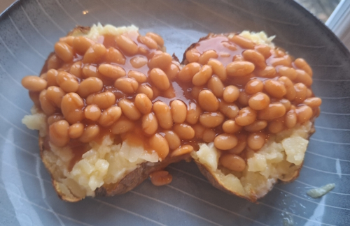
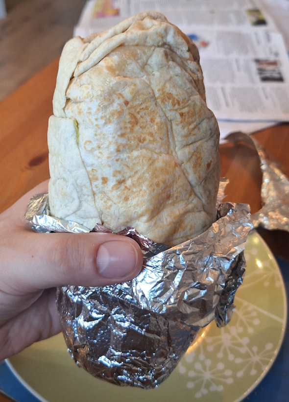
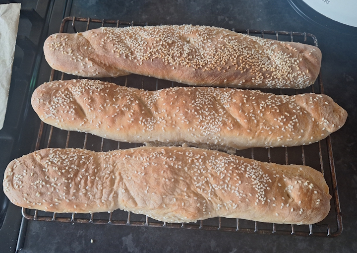
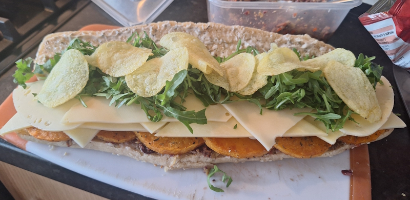
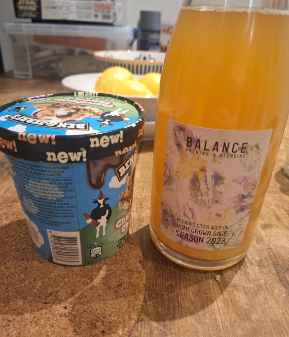

+++
date = '2026-04-12T10:00:27Z'
draft = false
title = "Week 14 - New York's finest (made in Manchester)"
description = "Back from Seattle (but clearly still dreaming of the states) I try my hand at a New York sandwich, there's another success from Meera Sodha, and I get a little drunk at a brewery."
image = 'cover.jpg'
+++

# Week Fourteen: Sunday Mar 29th - Saturday Apr 4th

* **Mar 29th**: Bread and fancy olive oils
* **Mar 30th**: Sake and sesame braised aubergines (*new*)
* **Mar 31st**: Leftover aubergines
* **Apr 1st**: Jacket potato and beans
* **Apr 2nd**: Burrito
* **Apr 3rd**: Homemade butternut squash, cheese and crisp sandwich (*new*)
* **Apr 4th**: Nachos

A very belated update!

# Mar 29th: Bread and fancy olive oils

This Sunday Rick was hosting a D&D game for me, River, and his younger cousin who's looking to try out the game. It's nice to be on the other side of the table, and to introduce the next generation to TTRPGs.

Just a light dinner, as I've been eating heavy recently. Rick and River had a christmas gift leftover of a bunch of different fancy olive oils, which we had with some focaccia. 

# Mar 30th: Sake and sesame braised aubergines

I tried out a new recipe, once again from Meera Sodha. This one was easy to make, although I couldn't find any sake in the supermarket near me, so I swapped it out for Chinese Shaoxing cooking wine, which was at the back of our cupboard. 

Roast the aubergines in the oven for 25 minutes. Meanwhile fry some ginger, garlic and chilli for a few minutes, then mix in spring onions, soy, cooking wine, brown sugar, rice vinegar and sesame oil.

Pour the mixture over the aubergines and cook for another 10 minutes.

Recipe here: https://www.theguardian.com/food/2025/may/24/vegan-recipe-aubergine-braised-soy-sauce-sake-sesame-oil-meera-sodha

# Apr 1st: Jacket potato and beans

Not much to say about this one, you know what jacket potato and beans are like.

# Apr 2nd: Burrito

I was heading out to Didsbury to see a friend at an open mike, so ordered a veggie burrito from a place called Zambrero. I believe it's an Australian chain, weirdly, but it's good enough. Very heavy on the black beans.

# Apr 3rd: Homemade butternut squash, cheese and crisp sandwich

I happened across an article, talking about the coveted title of best sandwich in New York: https://www.newyorker.com/culture/the-food-scene/-the-vegetalian-is-new-yorks-finest-sandwich

According to the article, it's the 'Vegitalian combo', from Court Street Grocers. A meatless Italian sub. I'm not sure how valid their claim is, I imagine there's a degree of wanting a provocative article title, but it did intrigue me.

Obviously, being in the UK, we don't have a lot of options when it comes to proper sandwiches. In Manchester at least we've got Fat Pats and Ad Maiora. There isn't really even a place to buy proper sub rolls, so step one was finding a recipe to make them myself. 

I followed this recipe for 'semolina hero rolls': https://boundedbybuns.com/recipes/r/sesame-semolina-hero-roll

I honestly don't know what the difference between a 'hero' roll is, and other types like hoagie, subs, etc. As far as I can make out it's just that different US cities call them different names. Either way, this roll is meant to have a slightly chewy 'crust' with a soft bready inside. 

I think I messed up a little on the rise, the house was pretty cold and so I should have left it longer or put the heating on. They turned out a little doughier on the inside, and not large enough for all the fillings I had planned.

Speaking of, from the article they mentioned that the sandwich used roast butternut squash or sweet potato, which was easy enough to do in the oven. It also has rocket (or 'arugula' as they call it), pecorino, fresh mozzarella, swiss cheese, something called 'hoagie spread', and mayo. I believe the hoagie spread is a mix of different finely chopped jarred veggies; for me I blitzed together pickled chillis, roast red peppers, olives, capers, sun dried tomato. Basically whatever we had jars of in the fridge.

I also went a bit maverick and added in some ready salted crisps, just to add a bit of texture to the whole thing.

As I said, the roll could have been a little larger and more sturdy, the bottom started to collapse a bit as I ate it. I don't do a lot of bread baking however, and it didn't go as badly as I thought it might. With this and the focaccia from a few weeks ago, I'm starting to think maybe I've been overestimating how hard baking is.

# Apr 4th: Nachos

Saturday I caught up with dan and Em, out a brewery tour for Balance brewery. I've had a few of their beers before, they were on the drinks flight when we went to Skof as well. They make a lot of wild beers, pretty funky tasting stuff. I really like one beer they made with marigolds, which had been left over from a restaurant in Manchester called higher Ground. The restaurant grows their own tomatoes, and you're supposed to grow marigolds alongside them to help the soil. They were left with a bunch of marigolds afterwards however, which they donated to Balance, who made them into beer. The whole vibe of Balance seemed very sweet, a lot of foraging (they had one using samphire) and making beer from what would otherwise be waste. The lady giving the tour told us about a beer they made with plums from a housing estate in north Manchester, for instance. 

We also had another bottle of the one they brewed for Skof.

Afterwards I caught up with Josh and Rebecca, who kindly made us some nachos and a quinoa salad. I was a little tipsy so I'm afraid I completely forgot to take a picture. I remember we did end the night with some Ben and Jerry's ice-cream, and a bottle of Cider I brought from the brewery, and watching the film Best in Show.

