+++
date = '2026-04-12T13:06:01Z'
draft = false
title = "Week 15 - Spätzle, Sodha, and Sodium Citrate"
description = "A fancy meal out at the spärrows for my birthday, Meera Sodha's chilli tofu, and I try my hand at a Michelin star recipe."
image = 'cover.jpg'
+++

# Week Fifteen: Sunday Apr 5th - Saturday Apr 11th

* **Apr 5th**: Birthday meal at The Spärrows
* **Apr 6th**: Curry Takeaway
* **Apr 7th**: Leftover takeaway
* **Apr 8th**: Chilli tofu
* **Apr 9th**: Leftover chilli tofu
* **Apr 10th**: Jacket potato and beans
* **Apr 11th**: Michelin star Mac and Cheese

# Apr 5th: Birthday meal at The Spärrows

On the Sunday my parents very kindly took me out to The Spärrows, in my opinion one of the best restaurants in Manchester. It's under a railway arch hidden away behind Victoria, with a painted black door. You have to ring a doorbell to be let in. To be honest, if you didn't already know it was there you'd never think to walk in. It's a testament to how good the food is that they're still in business. 

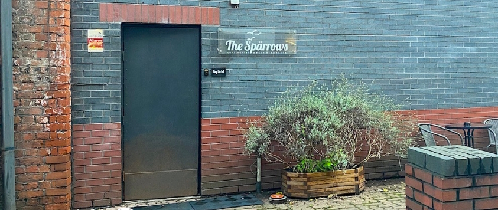

They specialise in Tyrolean food. Hearty, rustic Alpine cuisine from Northern Italy, through the Swiss and Austrian Alps. Their specialty is a type of German pasta called spätzle, but they also serve various dumplings, cheeses, smoked sausages. It's good if you're a vegetarian, but a Vegan would have a terrible time. Pretty much everything comes drenched in butter and cheese.

We ordered a lot to share between me and my parents: Kase and bolognese spätzles, spinach ravioli, butter and sage gnocchi, leek & courgette pelmeni (a type of Russian dumplings), sauerkraut and mushroom pierogi, burrata, a borlotti bean salad, their house fermented cucumbers, and some focaccia to mop it all up. 

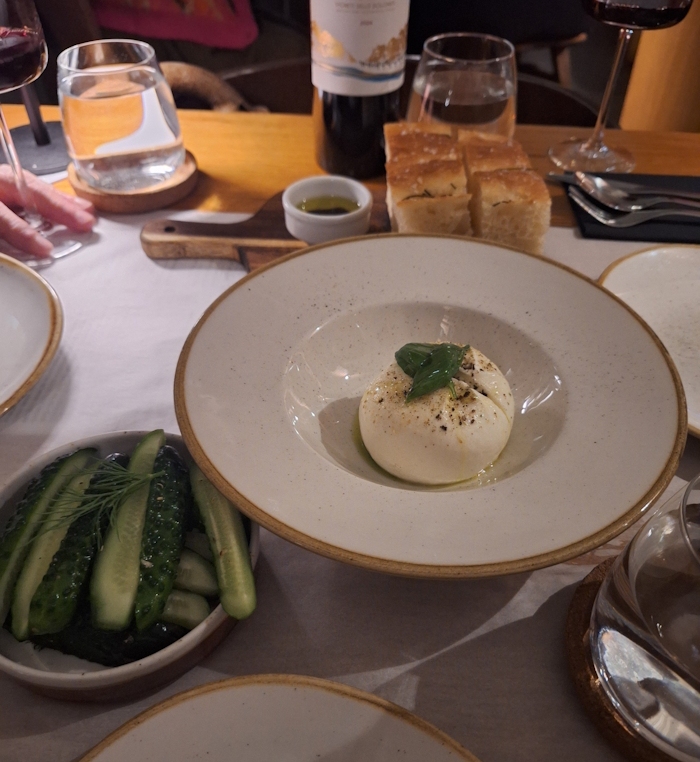
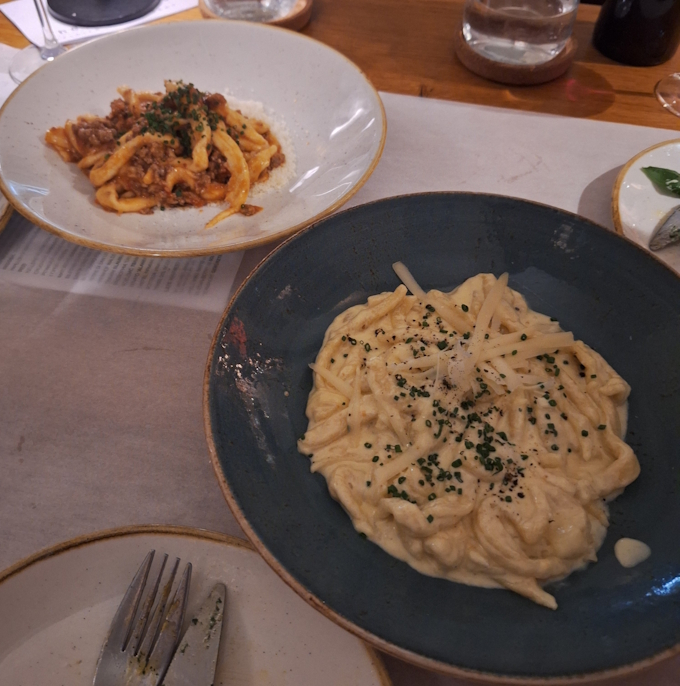

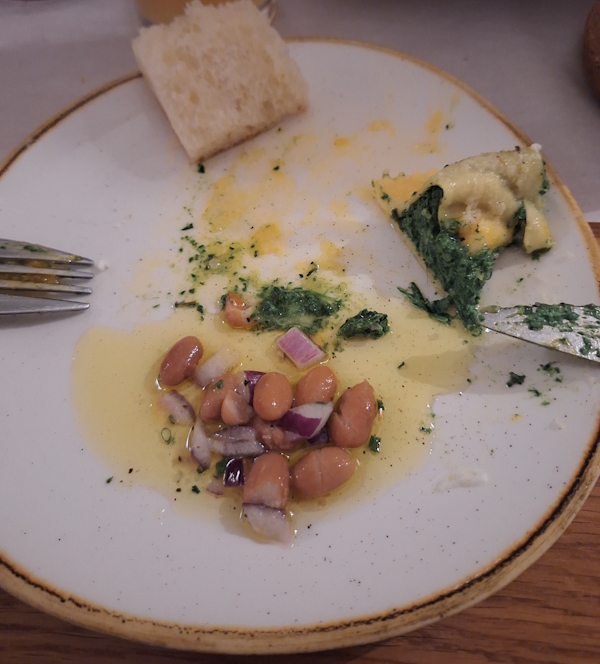
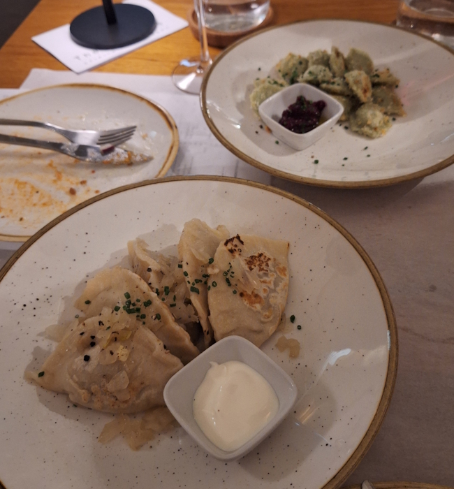

I think we managed to order the exactly correct amount of food. One more dish and we wouldn't have been able to finish it all off. To round it all out we ordered Tiramisu for dessert, with a glass of Umeshu, a Japanese plum liquor. That's the other, slightly strange, thing about The spärrows, they also specialise in japanese alcohol. Sakes, whiskeys, liquors. I'm not exactly sure what the connection is there, but it's a good accompaniment either way.

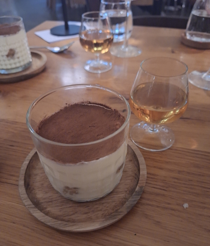

It's easter, so I managed to come away with a load of chocolate from hotel chocolat, courtesy of my parents (pictured at the top). Assume that through the week I'm making my way through it.

# Apr 6th: Curry Takeaway

Monday we went round to Gemma and Johnny's house for D&D. In typical fashion we got takeout, another curry, this time from Indique.

I got the Rogan-e-nishaat, a northern indian dish, with Samosa and Peshwari naan. It was all a little chaotic trying to eat and run D&D at the same time, especially with Chris connecting via a laptop after some car trouble, and some tech problems with the new Foundry system, so I failed to get a picture of the food.

I did manage to get a pic of the gang though, as we were wrapping up (including little Alex on the baby monitor).

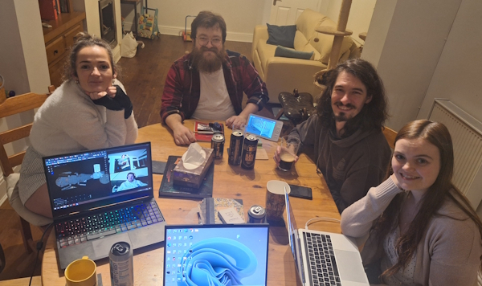

Also, hilariously, I got the same birthday present from both Rick and Katie, a smutty fantasy book called 'A court of thorns and roses'.

# Apr 8th: Chilli Tofu

A classic Meera Sodha recipe, I think one of the first I made of hers, and the one everyone I talk to seems to swear by. It's from East, and I have made this meal countless times.

Cube up your tofu, dust it in cornflour, and fry for a few minutes. Fry off the cumin and onions, add garlic, ginger and chillis, then tomato puree, soy sauce and sugar. Let it all cook for a bit, then add your chopped red and green peppers and some water, put a lid on leave for 10 minutes. Finally, add in the tofu.

It all comes together pretty quick once you know what you're doing, and it's incredibly hearty. You need to leave pretty big chunks of tofu for this to work, and go for extra firm if you can find it. Apparently it also works with paneer, although I haven't tried that.

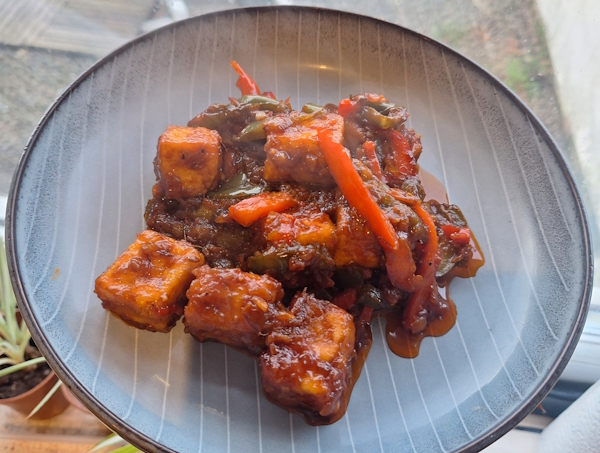

Online version of recipe here:
https://www.theguardian.com/lifeandstyle/2017/oct/21/chilli-tofu-recipe-vegan-meera-sodha

# Apr 10th: Jacket potato and beans

What is there to say about jacket potato and beans? It's good.

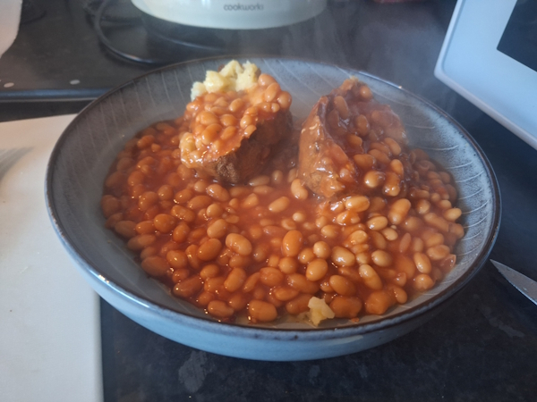

# Apr 11th: Michelin star Mac and Cheese

I've been watching a lot of food youtube recently, and one of the channels that pops up a lot is for a restaurant in London called Fallow. They've got a series where they recreate recipes from michelin star restaurants, most of them look incredible but completely unachievable at home. One that caught my eye recently however, was for a Mac and Cheese from one of Heston Blumenthal's restaurants called The Hinds Head. https://www.youtube.com/watch?v=KS4BJPINl5Q

It's a lot simpler than the others, and with a mostly free saturday to myself I decided to follow their recipe at home. 

Interestingly they don't start with a bechamel/mornay sauce, which is how I've always made it. Instead you steep some rosemary, thyme and peppercorns in stock for 25 minutes, while also reducing most of a bottle of white wine until there's only a third left.

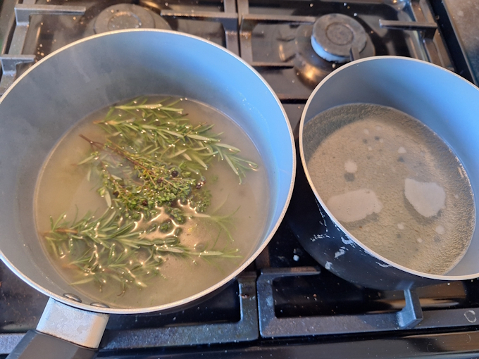

While that's reducing you grate up your cheese, then toss it in some cornflour. They have you chiffonade some american cheese slices, which is potentially the only recipe in the world which calls for that. I have actually seen a few other mac and cheese recipes call for some slices of american cheese, I believe it's because they contain an emulsifying salt called *sodium citrate*, which is what gives them such a smooth melt. By adding a few slices in, you should get a much smoother cheese sauce. To give it some actual good flavour, I also threw in a bunch of cheeses I could get off the shelf of our local coop; some smoked scamorza, gruyere, and some red leicester. 

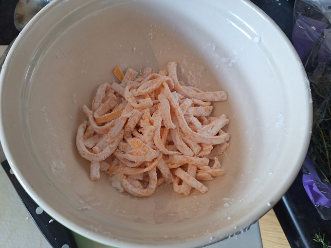

You then mix your reduced wine, stock, and cheeses, stirring continually for a few minutes to melt the cheese and cook out the cornflour. They cornflour and cheese starts to thicken the stock, creating a lovely cheese sauce. Pour it over your macaroni in a baking dish, adding a couple of cubes of gruyere for bonus cheese lumps. Next, they have you toast breadcrumbs and sage in a pan, before topping your macaroni, to give it a bit more interesting texture.

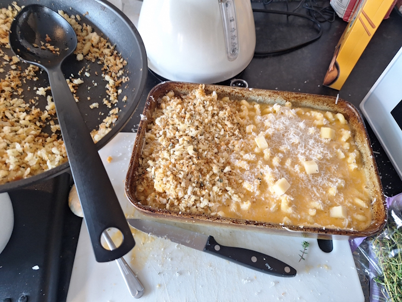

After that it just bakes in the oven for 15-20 minutes. 

Overall, I think it turned out pretty good. It wasn't too involved, just a few steps to it really. It's a more interesting take on a mac and cheese than I've had/made before. You've got the sweetness and acidity of the white wine which cuts through a lot of the heavy cheese. The herbiness of the stock and some more interesting notes, as well as the smoked cheese.

If I was to do it again, I'd try and add a bit more cornflour to the sauce to thicken it out. It was slightly too runny for my tastes. Also, the top got a little burned, but that's mostly due to our oven having terrible temperature regulation. It's basically always on max temp.

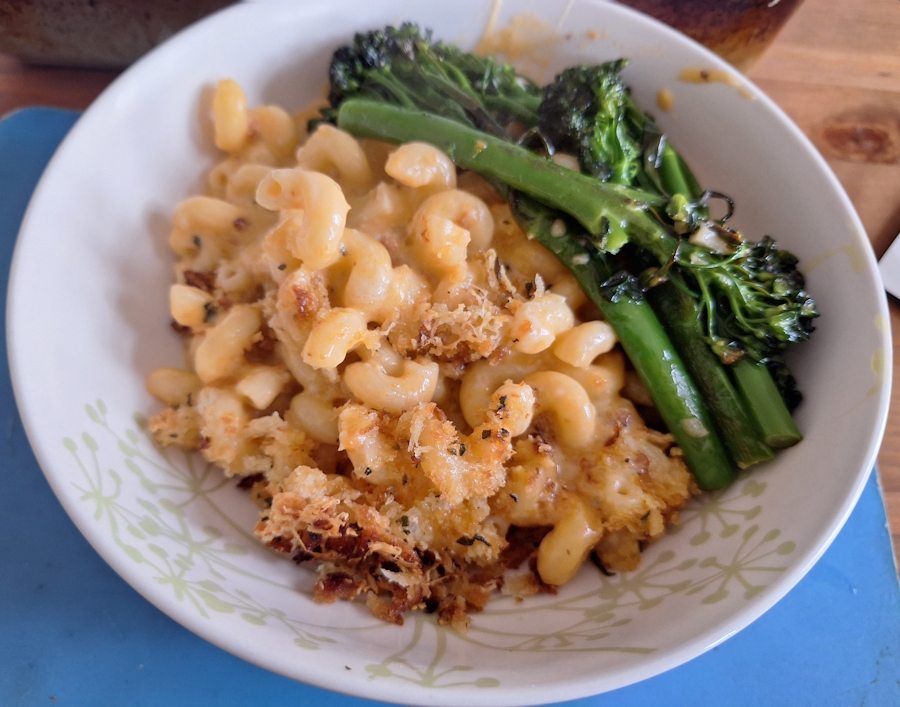