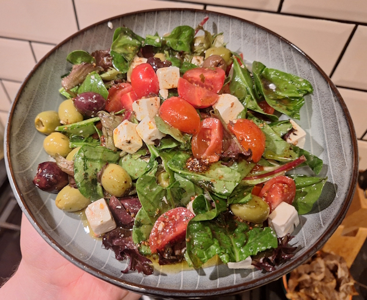
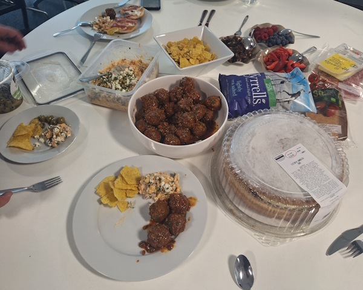
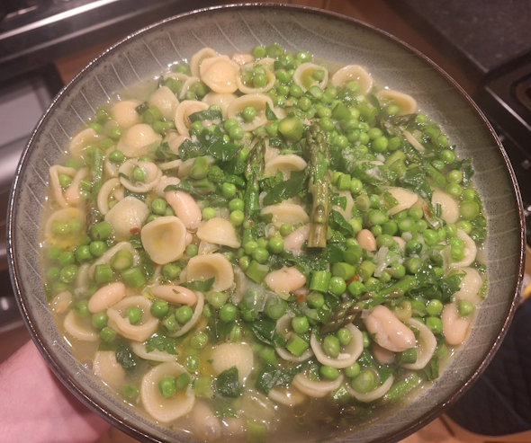
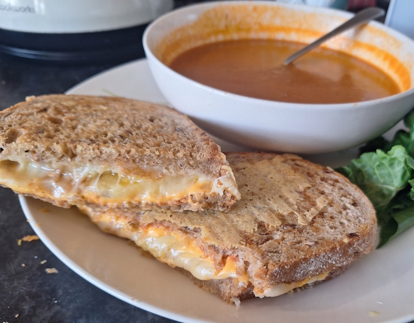
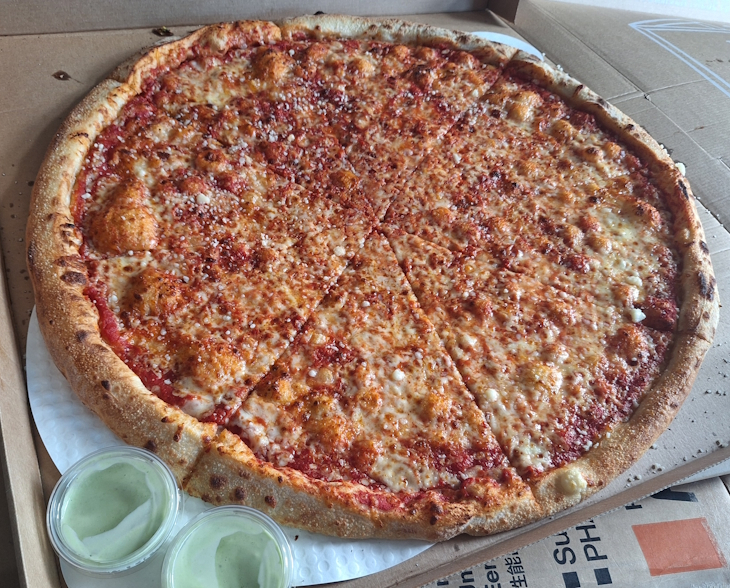
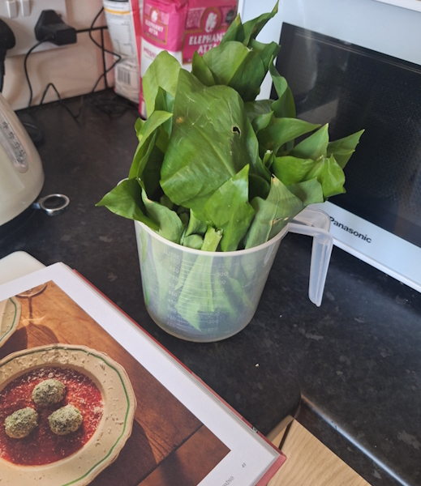
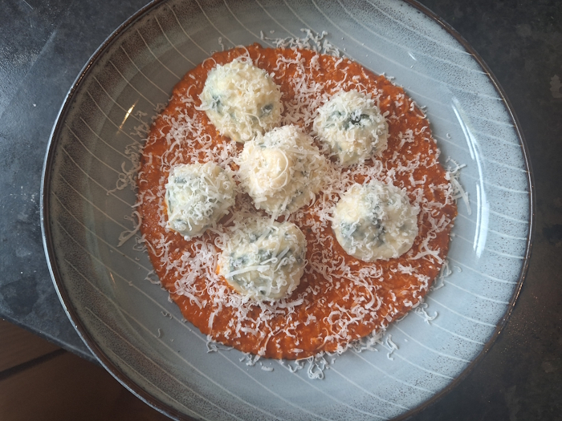

+++
date = '2026-04-18T14:10:41Z'
draft = false
title = "Week 16 - "
description = ""
image = 'cover.jpg'
+++

# Week Sixteen: Sunday Apr 12th - Saturday Apr 18th

* **Apr 12th**: Greek salad
* **Apr 13th**: Leftover salad
* **Apr 14th**: Spiced bulgur balls with pomegranate
* **Apr 15th**: Spring-estrone (*new*)
* **Apr 16th**: Cheese toastie and tomato soup
* **Apr 17th**: 22 inch pizza from Nells
* **Apr 18th**: Wild garlic Gnudi (*new*)

# Apr 12th: Greek salad

I felt like having something light and easy to make, so I went for a greek-ish salad. A nice palette cleanser after the previous few weeks of alpine dumplings and mac and cheese. Nothing too fancy, some olives, feta, tomatoes, cucumber. There's something about a simple salad that puts me in a spring mood.

I'm aware this is another fairly thin entry for a food blog. In my defence the salad was good, and sometimes that's all there is to say about it.

# Apr 14th: Spiced bulgur balls with pomegranate

It was a cook-off in the office on Tuesday, so the nigh before I re-made a recipe from earlier in the year, Sami Tamimi’s recipe for Kbeibat (spiced bulgur balls) with pomegranate molasses. 

https://www.theguardian.com/food/2026/feb/03/spiced-bulgur-balls-pomegranate-fennel-salad-recipe-sami-tamimi

It's a very very easy one to make, and it looks pretty impressive as well. You just mix the bulgur wheat and spices in a bowl, pour over boiling water and leave for 20 minutes. Then you roll them into balls and boil for another 3 minutes. The pomegranate sauce they're in is just a few things mixed together without any cooking.

Other people in the office mostly brought in cakes/tiffin. There were a couple of flans as well, but Caitlin in HR also brought in a very good mexican corn salad, which to be honest was the best dish there. 

# Apr 15th: Spring-estrone

This is another one from Georgie Mullen's "what to cook and when to cook it". I had a flip through the spring section and this one caught my eye, a spring minestrone soup.

Recipe was just cooking some green veggies in a stock, with pasta. Had some peas, asparagus, spring onions, mint and parsley. Honestly, it was fine but not one I'd make again. There's a bit of grated lemon in at the end to help lift it, but with it all being cooed in stock it's heavy and gloopier than I'd like from a dish with this much greenery in it.

# Apr 16th: Cheese toastie and tomato soup

I really enjoyed the grilled cheese and tomato soup I had in the states a few weeks ago, so I figured I'd recreate here. Soup was just shop-bought I'm afraid. The little hack I picked up from the one in Pikes Place is adding a little bit of grated cheese to the pan at the end, to melt into the outside of the sandwich. 

# Apr 17th: 22 inch pizza from Nells

On Friday I was heading out into town to catch Joshua Idehen, so andrew and I decided to split a pizza from Nells, round the corner from us. They don't deliver the massive 22 inch ones, but it's only a short walk away so I went round and picked it up, feeling faintly ridiculous on the way back with the massive box.

This always makes me think of being a kid and going to New York with my family. My little kid mind was blown at the size of the pizzas there, basically the same size as the table. 

We just went for the OG cheese from Nells (it's the classic for a reason), with the jalapeno crema dip. 

# Apr 18th: Wild garlic Gnudi

As I was flicking through "what to cook and when to cook it", I noticed that apparently now is the time for wild garlic. I've never been foraging before, but I remember seeing tons of wild garlic all around the Mersey. It smells so strong it's a hard plant to mix up.

It turned out finding some was very easy, not sure why I've never thought to do this before.

The actual recipe was for Gnudi, an italian 'dumpling' made from mostly riccota, mixed with wilted wild garlic, nutmeg, and parmesan. I think there's some relation to gnocchi, although I'm not sure given there's no potato. You roll the mixture into balls, cover in semolina, then boil for a few minutes.

This is served on a very basic tomato sauce, made from a tin of plum tomatoes, some butter and half an onion.

Finish it off with a bit more parmesan.

# Other than food

We had another session of D&D, run by Rick, for me River and his cousin. I'm enjoying being on this side of the table, only having to think about one character. A dwarven bard, inspiring his fellow heroes with the dulcet tones from his bagpipes.

Also, did a little sketch of him which I'm happy with:

