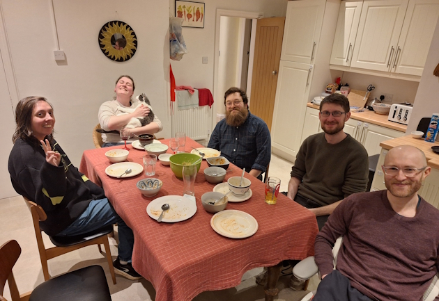
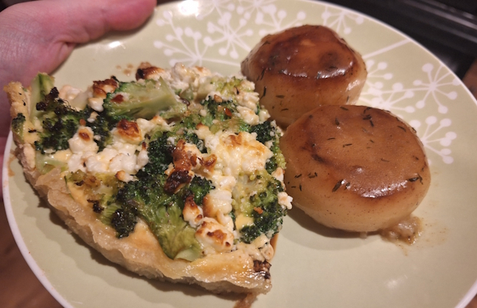
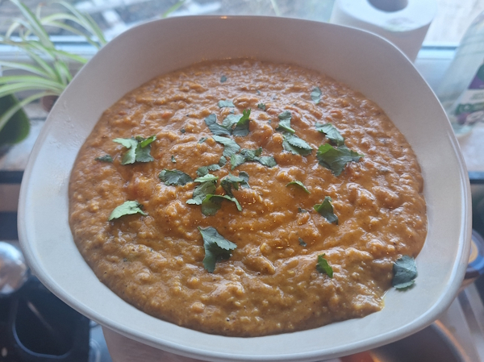
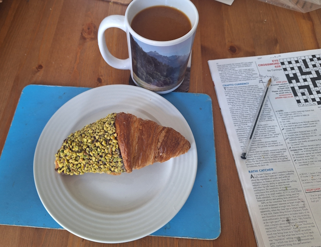
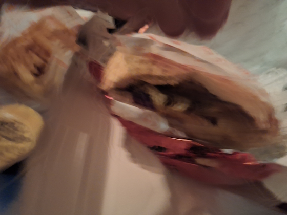

+++
date = '2026-05-02T00:14:41Z'
draft = false
title = "Week 17 - Lentils and Leftovers"
description = "A lighter week of shared meals and leftovers, with a standout red lentil curry"
image = 'cover.jpg'
+++

# Week Seventeen: Sunday Apr 19th - Saturday Apr 25th

* **Apr 19th**: Vegan Tagine 
* **Apr 20th**: Leftover Gnudi
* **Apr 21st**: Broccoli and feta tart with fondant potato
* **Apr 22nd**: Leftover tart
* **Apr 23rd**: Leftover tart
* **Apr 24th**: Red Lentil Curry
* **Apr 25th**: Drunken veggie kebab

# Apr 19th: Vegan Tagine from Rainbow Plant Life

This week it worked out so I didn't actually cook that much. Sunday we went round to Josh and Rebecca's house to play a Lord of the Rings boardgame with 1000 pieces, and Josh made us a very good Tagine and couscous from a food blog called Rainbow Plant Life: https://rainbowplantlife.com/vegan-tagine-with-chickpeas/

I've made some of her stuff before, she's got some very good curries on there, but the tagine was new to me.

Failed to get a pic of the food while we were eating, but clean plates means it must have been good!

# Apr 21st: Broccoli and feta tart with fondant potato

I've made this Broccoli and feta tart a few times before, but I always forget how crowded it get in our tin. It's from Dennis Cotter's For the love of food. You caramelise some red onions, which go in the bottom, then boil some broccoli which goes on top of that. Whisk together some eggs and cream and pour over, and crumble some feta over the top.

With our small tin all the ingredients are a bit too smushed together, so it needs longer to cook and is still a bit wet in the middle. It tastes good, but hopefully next time I'll remember to use less ingredients, or a bigger tin.

I tried cooking some fondant potatoes with this, which is new to me. You cut a bit off the top and bottom so they're sort of cylindrical shaped, then fry the two flat sides in a pan until they've browned. Then melt the butter in the pan, basting the potatoes, before adding some veggie stock and letting it come to the boil. They were absolutely delicious, not sure why I've never bothered making these before.

# Apr 24th: Red Lentil Curry

Inspired by Josh's tagine from Sunday, I made a dish from Rainbow Plant Life, her vegan red lentil curry. 

https://rainbowplantlife.com/vegan-red-lentil-curry/

For the most part it's what you'd expect, fry off your garlic, ginger, and spices, then mix in your lentils, tomatoes and broth. She finishes it with coconut milk, but also almond butter, which is really the secret ingredient. It makes it very filling, and adds a lot of richness and a faint nutty flavour which works surprisingly well. I guess other indian recipes use cashews so it's not that weird.

Strong recommend from me.

# Apr 25th: Drunken veggie kebab

Saturday started off very sophisticated, with a pistachio and chocolate croissant from the Barbakan bakery round the corner. I get my bread from their pretty religiously, but I've been neglecting their pastries and cakes. It's interesting seeing what they do have, most of it's not flaky french pastry like you'd get in Bisous Bisous. More hearty stuff like Strudels, chelsea buns, danish pastries.

In the evening Dan and I went out to see Dry Cleaning at New Century, then met up with Andrew for a few drinks at the Castle on Oldham street. I don't want to sound too much like a bitter old man, but the Northern Quarter has definitely changed, even over the last few years. In my head it's still kind of gritty and counter-culture, but the current night life is all stag and hen dos, pink neon signs, and photo-ready Instagram backdrops.

I don't know, I think I've just bored myself with that observation. Obviously things change and evolve. I'm sure the kids are all right, and anyone over the age of 50 would be rightly infuriated by a guy in his 30s reminiscing about the good ol' days.

Long story short I came home very drunk and ordered a veggie kebab.

