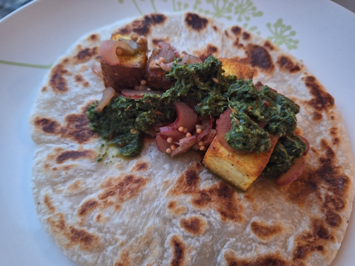
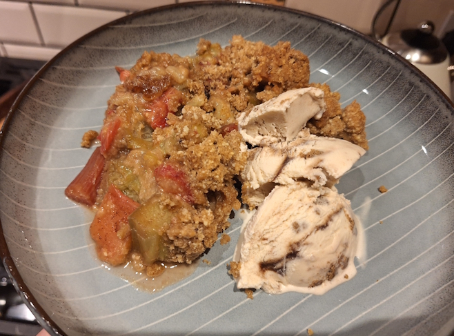
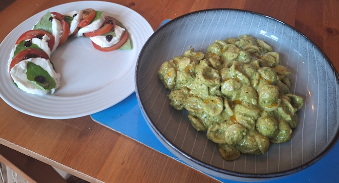
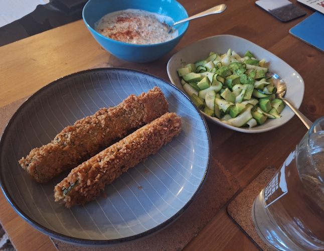
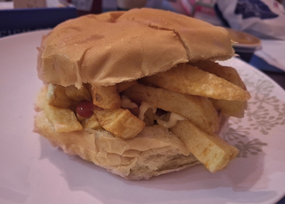
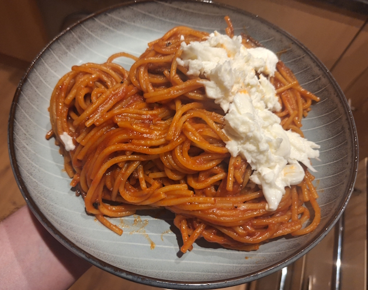
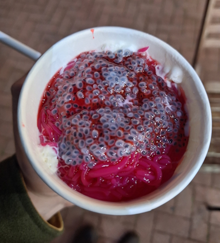

+++
date = '2026-05-03T08:14:41Z'
draft = false
title = "Week 18 - A good week for Rhubarb"
description = "Rhubarb and paneer wraps, crispy courgette schnitzels, chip barm, and a return to spaghetti all’assassina."
image = 'cover.jpg'
+++

# Week Eighteen: Sunday Apr 26th - Saturday May 2nd

* **Apr 26th**: Pickled rhubarb and paneer wraps, with rhubarb crumble
* **Apr 27th**: Pesto orecchiette and Caprese salad
* **Apr 28th**: Leftover pasta
* **Apr 29th**: Courgette schnitzels with courgette and avocado salad
* **Apr 30th**: Leftover schnitzels
* **May 1st**: Chip barm
* **May 2nd**: Spaghetti all'assassina

# Apr 26th: Pickled rhubarb and paneer, with rhubarb crumble

It was a bumper crop of rhubarb at the Unicorn on Sunday. "What to Cook and When to Cook it" had a whole section on spring rhubarb, but the one that stood out to me the most was an indian style wrap: Thinly sliced rhubarb given a quick pickle, a green chutney from blitzed chilli and herbs, and some fried paneer. 

Andrew and I made a bunch of this, with the plan to save some for the week, but it all ended up getting eaten on the Sunday. If you'll allow me to put on my pretentious food critic hat for a second, you get that sharp, bracing smack of acid from the quick-pickled rhubarb (and a satisfying crunchiness) right up front, which helps to cut straight through the heavy, rich saltiness of the fried paneer, and then the green chutney hits with a fresh grassy heat.

The recipe calls for paratha for the bread, which you can get frozen from any supermarket. It's not too hard to make, just a few minutes each side in a frying pan, but it's a bit like pancakes where you've got to keep them coming about as fast as you're eating them. Naan and roti get all the love, but paratha deserves it's time in the sun. It's laminated with ghee, a bit like a croissant, so it's flaky and delicious.

I followed up the wraps with a rhubarb crumble. I don't have a massive sweet tooth, I don't often bother to make puddings, but crumble is just so nostalgic and comforting. Didn't do anything fancy with this one, a bit of cinnamon and nutmeg but that's about it. 

# Apr 27th: Pesto orecchiette and Caprese salad

The monday meal was a bit of a fridge raid, and borne out of wanting to make something nice and easy. I blitzed a pesto in the food processor, using what ever green herbs were left in the fridge, some walnuts, olive oil, garlic, and some pecorino. Nutritionists might argue with me, but there is a definite psychological health benefit to eating something that vivid and green (even if it is full of cheese and olive oil).

I had a little Caprese side salad (artfully arranged) using some of the leftover basil, mozzarella, and tomato.

# Apr 29th: Courgette schnitzels with courgette and avocado salad

Wednesday I decided to try a Guardian recipe which caught my eye: https://www.theguardian.com/lifeandstyle/2026/feb/26/alice-zaslavsky-zucchini-marrow-schnitzel-recipe

It's a marrow schnitzel (although I couldn't find marrow so I used courgette), with avocado and courgette salad, and minty yoghurt. I've been trying to get the breading process down right this year, and this turned out a lot better than some of my other attempts (see [crispy artichokes from week 8]()). This one uses three dips, first a mix of flour and paprika, then beaten eggs, and finally panko breadcrumbs. I was a bit worried about whether the batter would stick to the courgette, since it's so wet and smooth, but it did a surprisingly good job.

Schnitzels are fried in shallow oil, and then you make a salad out of thin strips of courgette (made with a peeler) and avocado, tossed in lemon juice and sugar. Yoghurt is mixed with lemon zest and mint, and a little bit of grated garlic.

It turned out well, the batter was nice and crispy, although I'm not sure about the shape. The recipes says: 

> If using zucchini, slice in half lengthways, then lengthways again.

Which makes me think you're supposed to quarter it length ways, but maybe I misinterpreted that. It'd be better sliced into rounds, I reckon. Salad and yoghurt work well with the schnitzel, and balance out the flavours and textures, so worth making all three.

# May 1st: Chip barm

It was Josh's birthday on Friday, so we went out and played some shuffleboard at a place in town. They've digitised it, a bit like Flight Club, so you play various shuffleboard mini-games. Turns out it might be my secret skill, because I managed to come out on top.

Dinner when we got back was a northern classic, chip barm from the chippy round the corner. Yes, granted, it's carbs on carbs, but there's some ketchup in there, which counts as a vegetable right?

# May 2nd: Spaghetti all'assassina

I've come back to this recipe a few times this year now, I think partly because it's so easy to make. Spaghetti, fried in a pan with chilli, garlic, and passata. 

The mozzarella is very necessary to help cut through the spaghetti, so don't miss it out.

# Honourable munch-ion

I met up with Rick on the thursday, for a few drinks in Chorlton. I had some leftover Schnitzels for dinner, but the place we were drinking is right opposite the ice cream parlour I used to work in when I was a teenager. They do your standard ice-cream flavours, but they also served an asian dessert called falooda. It's very very floral, made with milk and rosewater syrup, with rose-soaked noodles, ice-cream and chia seeds which have been soaked until they look a bit like tiny eyeballs.

It's open late, so I picked one up for old time's sake. I quite like it, but as I said it's very floral. If you don't like sweets turkish delights or parma violets you probably won't like this.

