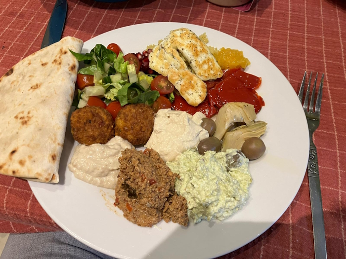
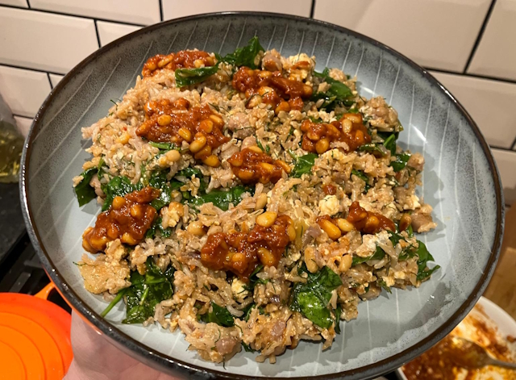
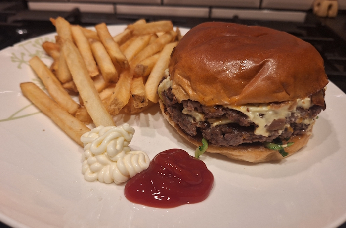
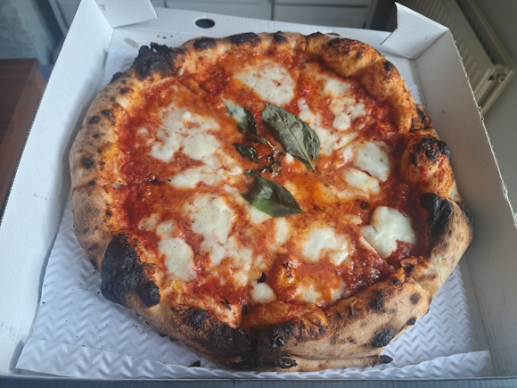
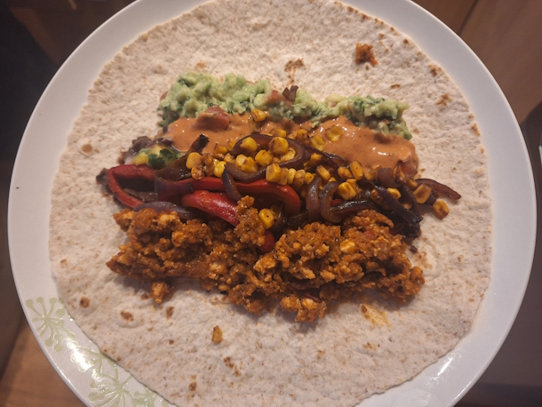
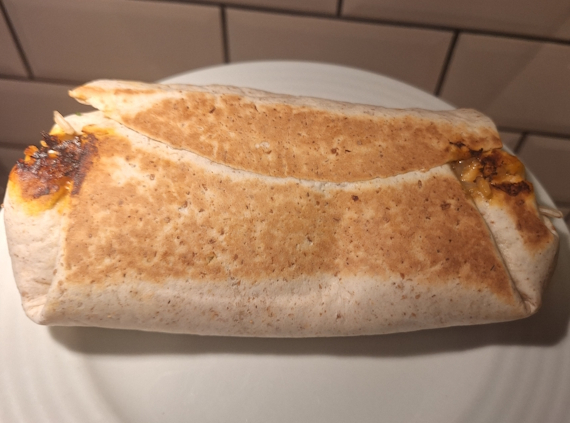
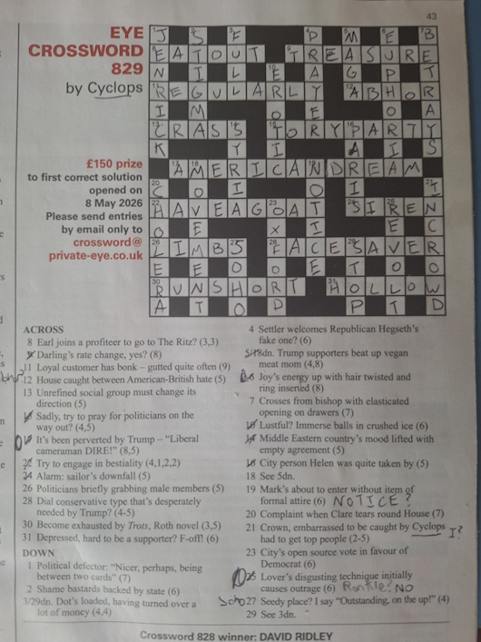

+++
date = '2026-05-10T11:14:41Z'
draft = false
title = "Week 19 - Mezze feasts and hospital visits"
description = "Spring rice, Shatta, rainbow plant life burrito, takeaway burger and pizza."
image = 'cover.jpg'
+++

# Week Nineteen: Sunday May 3rd - Saturday May 9th

* **May 3rd**: Mezze platter
* **May 4th**: Leftover spaghetti
* **May 5th**: Spring rice with feta, harissa and pine nut sauce (*new*)
* **May 6th**: Leftover spring rice
* **May 7th**: Veggie Burger from PLNT
* **May 8th**: Pizza from Double Zero
* **May 9th**: Burritos

# May 3rd: Mezze platter

Josh and Rebecca invited us and Matt and Jess (and baby Kit), round on Sunday for a mezze feast. We're talking couscous, falafel, grilled halloumi, olives, artichokes, roasted red peppers, hummus, baba ganoush. They also had a Palestinian sauce called Shatta, which is a bright yellow fermented chilli dip that's incredibly spicy. Kind of funky tasting in a good way, you only need a little bit of it. Andrew brought a couple of dips along as well, from the mediterranean cookbook he has. Muhammara (red pepper and walnut) and one made by blitzing green pepper and feta.

I had to head off early to run D&D. Half the party was sick, so we just did it remotely online, which all worked surprisingly well.

# May 5th: Spring rice with feta, harissa and pine nut sauce

Tuesday I dipped back into Meera Sodha, picking up her spring rice recipe from The Guardian. You make the pinenut sauce by toasting the nuts and mixing with harrisa, tomato paste and lemon juice. For the rice you cook off some onions, then mix in lemon peel, garlic, chickpeas and allspice. Then add the rice and boiling water and cook. Finally fold in spinach, feta, and a load of dill, and dot with the pinenut sauce.

Really really good. You get a good kick from the harrisa, with citrus from the lemon and the lightness of the dill. Very comforting, strong recommend. 

Recipe: https://www.theguardian.com/food/2026/may/02/spring-rice-feta-harissa-pine-nut-sauce-recipe-meera-sodha

# May 7th: Veggie burger from PLNT

Unfortunately Rick ended up having to go to hospital this week for some observation and tests. Nothing too serious, but I popped round on Thursday afternoon to see how he was getting on, and he was in good spirits, all things considered.

I got back quite late though, so I didn't fancy cooking. There's a dark kitchen somewhere nearby called PLNT that does vegan burgers, so I ordered one of those and some chips. 

It was ok, they did a decent job of replicating meat flavour, but I've yet to have an imitation meat burger that's gotten the texture right. Honestly I prefer if they go a different direction and make it obviously veggie, like the meera sodha onion bhaji burgers. https://www.theguardian.com/food/2021/aug/07/meera-sodha-vegan-recipe-onion-potato-bhaji-burgers

# May 8th: Margherita pizza

FFriday was another take away day, this time I got Margherita pizza from Double Zero. I'm sure I've waxed lyrical about them on this before. We really are spoilt for choice when it comes to pizza in Manchester. Not pictured, I only got a cheesy garlic bread.

# May 9th: Burritos

Saturday Andrew and I decided to celebrate feierabend with burritos. I found a recipe from rainbow plant life for a 'burrito bowl', which we used. It's a fair amount fo prep to get all the little bits sorted. We made guacamole, refried beans, a mango salsa, grilled red onion and pepper and charred sweetcorn. Also something called tofu sofritas, which was made by crumbling tofu into a pan, and pouring over a spicy blitzed up mix of roast pepper, spices, red wine vinegar, tomato paste, whole tomatoes and chipotle paste.

# Other than food

I managed to finish off my first ever cryptic crossword on saturday, with lots of help from Andrew and some googling of common substitions and rules. There's a bunch of specific ones for private eye, often based on decades old in jokes which you just have to learn. For instance in this weeks you have to know that they frequently swap out BALLS for ROT (as in a load of balls, a load of rot/nonsense) https://www.sparrowdove.com/2017/02/secrets-of-the-private-eye-crossword/

It's interesting that even at my amateur level, some of the puzzles are more satisfying than others.