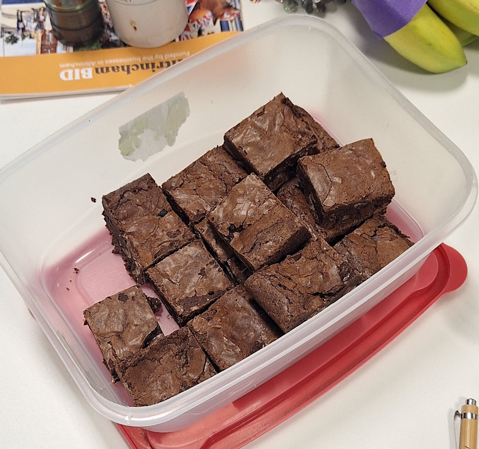
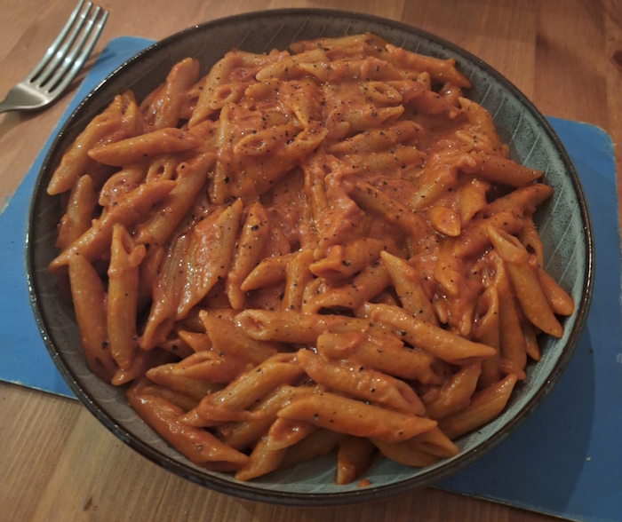
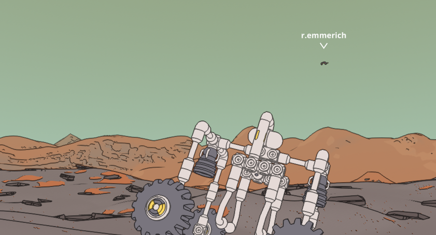

+++
date = '2026-01-11T17:32:16Z'
draft = false
title = "Week 02 - Gochujang & Terry's Chocolate Orange"
description = 'Breaking the pumpkin streak with some brownies and gochujang pastas.'
image = 'chocolate-oranges.jpg'
+++

# Week Two: Sunday Jan 4th - Saturday Jan 10th

* **Jan 4th**: Leftover Roast Pumpkin Soup/curry (and brownies)
* **Jan 5th**: Leftover Roast Pumpkin Soup/curry
* **Jan 6th**: Leftover Roast Pumpkin Soup/curry
* **Jan 7th**: Vodka Gochujang pasta
* **Jan 8th**: Leftover Vodka Gochujang pasta
* **Jan 9th**: Parsnip gnocchi (*new*)
* **Jan 10th**: Bean Confit (*new*)

I'd underestimated how many meals you can make out of a single pumpkin. By mid-week I was growing sick of the stuff. 

# Jan 4th: Terry's chocolate orange brownies

I managed to come away from the christmas holidays with two Terry's chocolate oranges, which are delicious, but again way to much for one person to get through. I ended up looking up a recipe for chocolate orange brownies, which I palmed off to the rest of my office on Tuesday.

# Jan 7th: Vodka Gochujang pasta

This is a recipe I've made a lot before, by Meera Sodha. I fancied something with a bit of a kick after the comforting but mild pumpkin soup and curry. I can't imagine gochujang is particularly authentic to Italian cooking, but it fits in very well. 
A very quick one to make; cook down some sliced onions, stir in garlic, passata, gochujang and vodka, finish with a bit of cream. 

A lot of Meera Sodha's recipes also get published in the guardian: 

https://www.theguardian.com/food/2023/mar/11/vegan-recipe-vodka-gochujang-rigatoni-meera-sodha

# Jan 9th: Parsnip gnocchi

This is a new one for me, but another Meera Sodha gochujang pasta recipe. It's my first time making gnocchi as well, much easier than I would have thought although does take a bit of time.

Boil your potato and parsnips then mash them up. Mix in flour to make a dough, roll out into a long sausage shape and cut it up to make your gnocchi. Boil them again for a couple of minutes, then fry on each side to make them crispy.

The hard bit is making the gnocchi, the sauce is just gochujang, white miso, sesame oil and lemon juice mixed together in a bowl then poured over the cooked gnocchi. Could probably make this a lazy weeknight meal by just buying pre-made gnocchi.

https://www.theguardian.com/food/2019/nov/23/meera-sodha-vegan-recipe-parsnip-potato-gnocchi-gochujang-hazelnuts 

# Jan 10th: Bean Confit

Final meal this week was another new one, bean confit. It's from my newest cookbook 'What to Cook & When to Cook It', although it's one Andrew managed to make before I did. 
It's another super easy one, you just cover beans, un-chopped garlic and tomatoes in olive oil and bake in the oven. 

# Other than food

Continuing to zone out playing megabonk, but I've also started playing a fun new game with Rick called [Mars First Logistics](https://store.steampowered.com/app/1532200/Mars_First_Logistics/). 

You build machines to transport awkwardly shaped parcels around the surface of Mars. The building has a very lego/mechano feel to it, but it's also a very slapstick game. There was a bit where I was trying to get an umbrella through a doorway with a massively over-engineered robot for about 30 minutes. Worth playing with a friend even if it's just to get them to help right you once your robot falls over.

