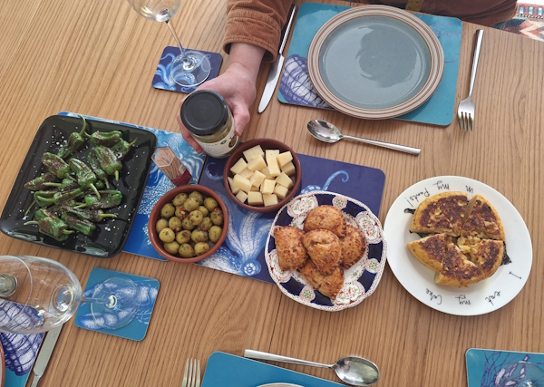
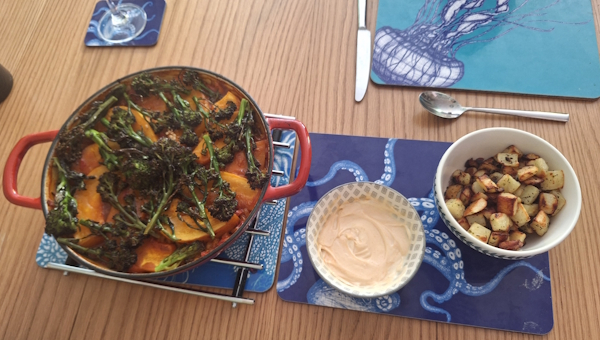
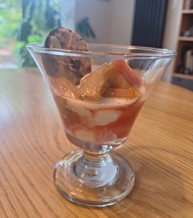
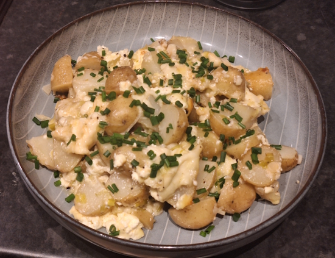
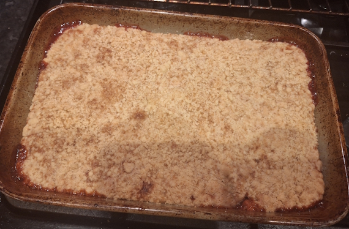
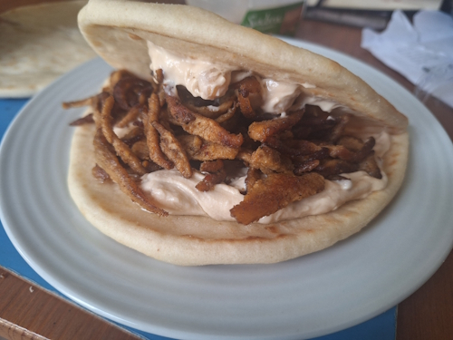
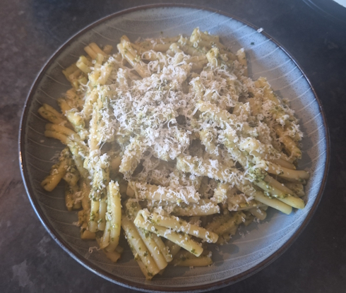
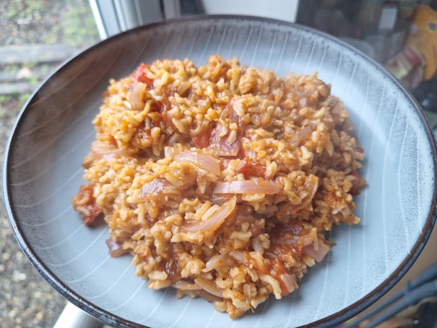
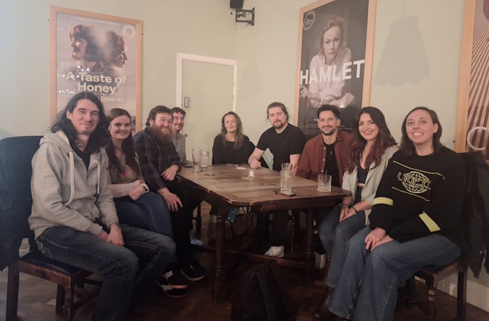

+++
date = '2026-05-18T11:00:27Z'
draft = false
title = "Week 20 - Food from my parents allotment"
description = "Spanish dinner at my parents', tartiflette, vegan shawarma, lovage pesto pasta, and jollof rice."
image = 'cover.jpg'
+++

# Week Twenty: Sunday May 10th - Saturday May 16th

* **May 10th**: Spanish dinner at my parents
* **May 11th**: Tartiflette (*new*)
* **May 12th**: Leftover tartiflette
* **May 13th**: Vegan shawarma 
* **May 14th**: Leftover tartiflette
* **May 15th**: Lovage pesto pasta
* **May 16th**: Jollof rice

It's getting a little harder to keep up with these entries. This is my latest one yet, over a week ago now. 

# May 10th: Spanish dinner at my parents

I was catching up with my parents on the sunday, and they put on a multi-course feast. I'm going to have to level up my cooking to try and match.

Starter was roasted padron peppers, manchego, empanadas, olives, and Spanish omelette. 
Main was pumpkin and broccoli Spanish rice, with potatoes and a chipotle mayo dip. My parents were typically effacing about about the rice, but I loved it. It reminded me of a dish me had growing up (in my meat eating phase), with chorizo, chicken, and saffron. It's up there in the canon with aubergine pasta, spicy prawns, and lemony chicken. The pumpkin was one of theirs from the allotment as well.
Dessert was gin-stewed rhubarb with ice cream and a Florentine. Tart, boozy, creamy; but enough about me, the pudding was good too. Phnarr phnarr.

I also came away with some rhubarb from their allotment, and some homemade lovage pesto, so all in all a pretty food heavy visit.

# May 11th: Tartiflette, and rhubarb and strawberry crumble

Tartiflette is another recipe from What to Eat and When to Cook It. It's basically just potatoes, cheese, spring onions, wine and crème fraîche, so not exactly light. From what I understand it's an après-ski meal from the alps.

I also used the rhubarb from my parents' allotment to make another crumble, this time with strawberries. It was a lot sweeter than the pure rhubarb crumble I made earlier in the year, which isn't bar per se, but I think I prefer the purity of a straight rhubarb crumble.

# May 13th: Vegan shawarma 

Bit of a cheat meal, this is just packaged Vivera shawarma strips (I think they're soy protein?) fried for a few minutes and stuffed into a pita with hummus. I used to eat this a lot as it was always a good one for when I was feeling lazy, although I'm a little wary of fake meat products (presumably it's ultra-processed) so I try not to go overboard.

# May 15th: Lovage pesto pasta

My parents grow lovage, and my dad generously gave me a jar of their homemade lovage pesto. If you've not had lovage before, it's a very bold flavour, somewhere between celery and anise, and definitely not shy about announcing itself. I'm a big fan, but it's hard to come by lovage if you don't grow your own. Very, very occasionally I'll see it for sale in the unicorn.

# May 16th: Jollof rice

Made a veggie jollof rice, which came out nicely smoky and tomatoey. Afraid I used a jar of pre-made jollof paste, mixed with some tomatoes, onion, veggie stock, and the rice.

I'll have to try properly making it sometime this year.

# Other than food

Went to see River in their performance at the Royal Exchange theatre on the friday, which was very exciting. It's a play called Even these things, about Manchester, the people who live here, and how it's changed over time. I really don't go to the theatre enough, I mostly just see music gigs. The tickets really weren't that expensive, will have to try and make more of an effort.

