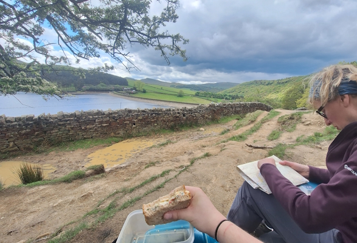
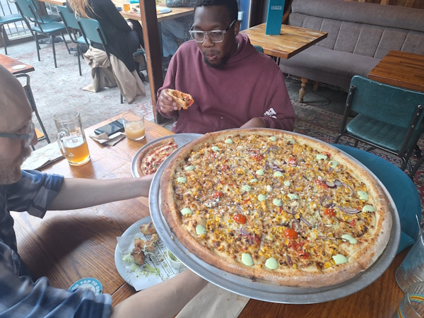
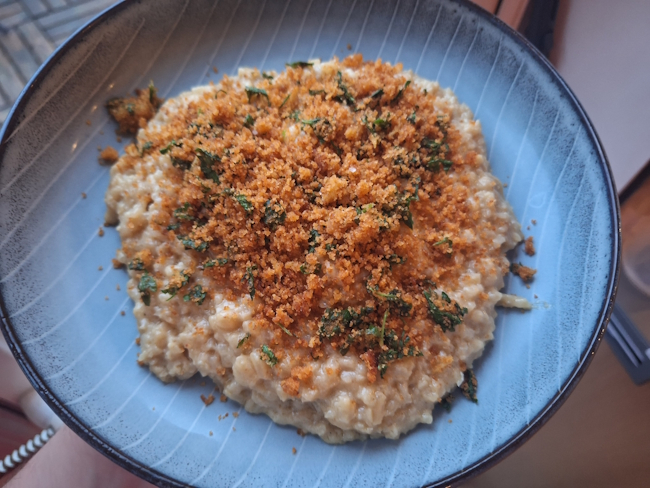
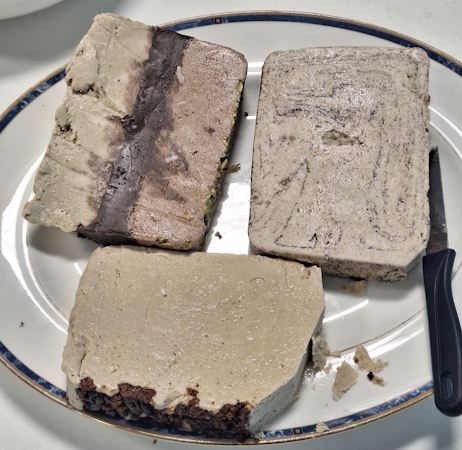
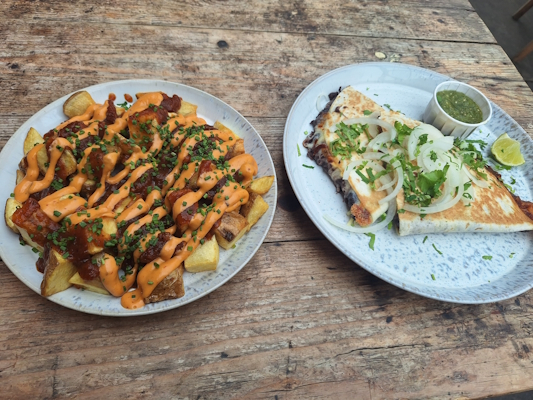
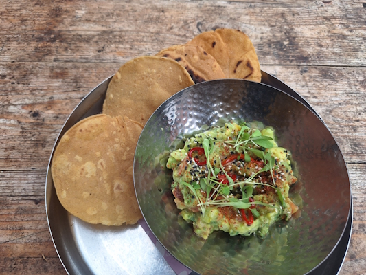
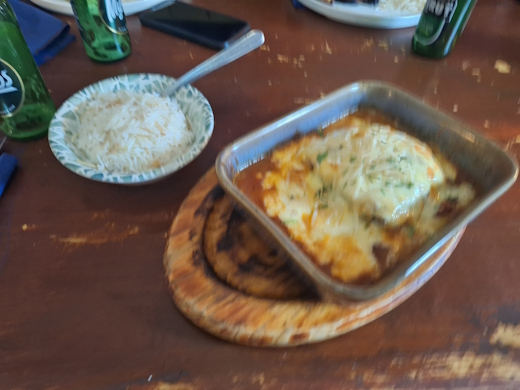
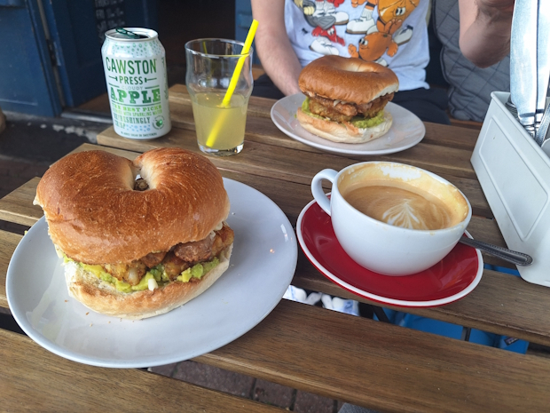

+++
date = '2026-05-26T11:00:27Z'
draft = false
title = "Week 21 - A sandwich in the peaks"
description = "A training hike around Kinder reservoir, miso corn pizza at Nells, Meera Sodha's cauliflower and parmesan risotto, and a moussaka at a work offsite."
image = 'cover.jpg'
+++

# Week Twenty-one: Sunday May 17th - Saturday May 23rd

* **May 17th**: Sandwich by Kinder reservoir
* **May 18th**: Pizza from Nells
* **May 19th**: cauliflower and parmesan risotto with lemon breadcrumbs
* **May 20th**: Black bean quasadilla and patatas bravas, with guacamole
* **May 21st**: Moussaka
* **May 22nd**: Leftover risotto
* **May 23rd**: Leftover risotto

# May 17th: Sandwich by Kinder reservoir

Sunday I went out for a training hike with mum around the peak district. It's not a walk I've done before, starting in edale and up Jacob's ladder, but then splitting off from the penine way to head west to go round Kinder reservoir. There were a few scrambles up and down, and a sketchy moment where we got a little lost picking our way through a bog in the thunder storm (ok, one clap of thunder, but it was still scary). 

It was a beautiful hike though, got me looking forward to climbing the alps later in the year. I didn't have much of an appetite after the walk, so I skipped dinner. Instead here's a picture from lunch, where I had a well deserved a cheese and tomato sandwich by the reservoir.

# May 18th: Pizza from Nells

On monday, one of Andrew's friends chris from work was up in manchester, so we took him out to the old perennial, Nells pizza.
Andrew and I shared a 22 inch miso corn pizza, while Chris had a Hawaiian. Apparently, while it's a controversial choice here, in Zimbabwe where he's from it's basically the default option, pretty universally beloved.

# May 19th: cauliflower and parmesan risotto with lemon breadcrumbs

This one's a real winner from Meera Sodha, cauliflower risotto. You blitz florets of a cauliflower to a fine mince and fry it with butter and garlic, add a bit of white wine, some risotto rice and mustard, and then slowly add in the stock like a regular risotto, and a load of veg parmesan at the end. There's also a lemon breadcrumb topping which gives it a nice bit of crunch. 

As Meera says in the recipe, it's light from you replacing a chunk of the rice with cauliflower, but then a lot of richness from the wine and cheese, and zesty lemon from the breadcrumbs. Very well balanced.

https://www.theguardian.com/food/2026/may/16/cauliflower-parmesan-risotto-recipe-lemon-breadcrumbs-meera-sodha

# May 20th: Black bean quesadilla and patatas bravas, with guacamole

Wednesday we had a few visitors (Jesse, Uri and Mark) from other INRIX offices. One of them, Uri, always makes a point of bringing halva. I think it's a mix of sugar and tahini, with some nuts and stuff as well. Incredibly sweet, but very more-ish. I think it's the tahini, it's just a very unique taste. Got to hold back a little since it's basically a solid block of sugar.

Lunch I pigged out and had a large meal from the market in altrincham. Black bean quesadilla, patatas bravas, and a side of guacamole. Very delicious, but like most things in the market very pricey. Filling enough that I didn't need a dinner later though.

# May 21st: Moussaka

Thursday was an 'offsite' in the office, so all day in meetings. We went out for a meal after work to entertain Jesse, Uri and Mark, at a place I've not been to before in Goose green. It's a pan mediterranean place, so a lot of lamb chops and meat skewers, but also a pretty good moussaka. Very generous on the portions. Apologies for the slight blurriness of the photo, work was paying for drinks.

# honorable munch-on

I met up with Josh for lunch on the friday at a place called 99 reasons, just round the corner from us. I don't know why but there's a little parade of cafes there that I've left criminally unexplored. I went for a veggie breakfast bagel; guac, hashbrowns, and veggie sausages in a bagel.

This won't be the end of my forays into the cafe's of chorlton.