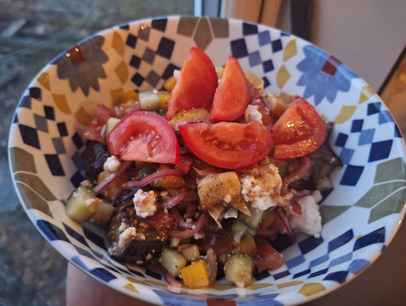
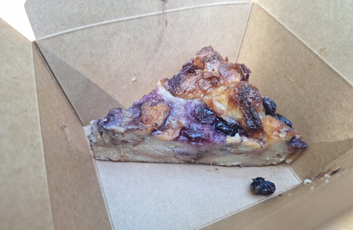
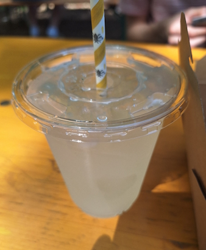
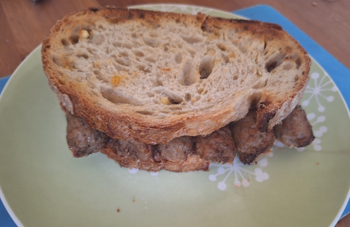
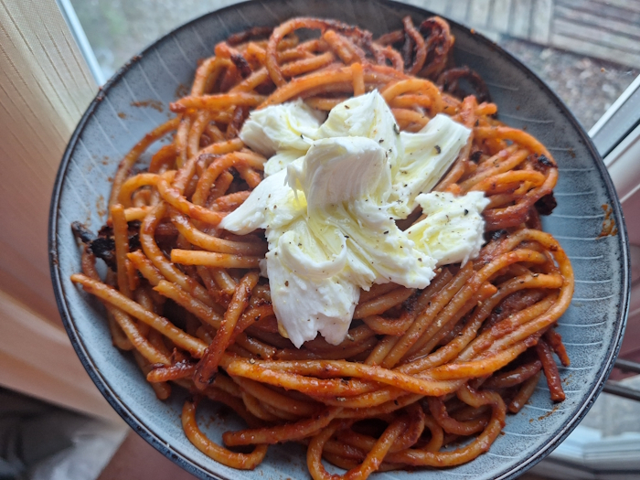
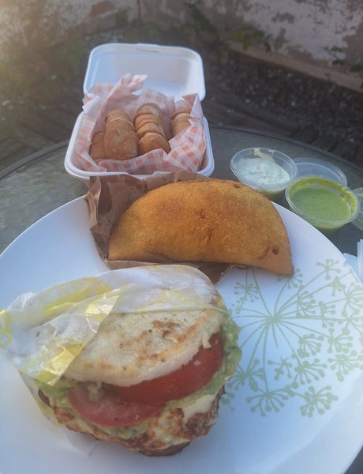
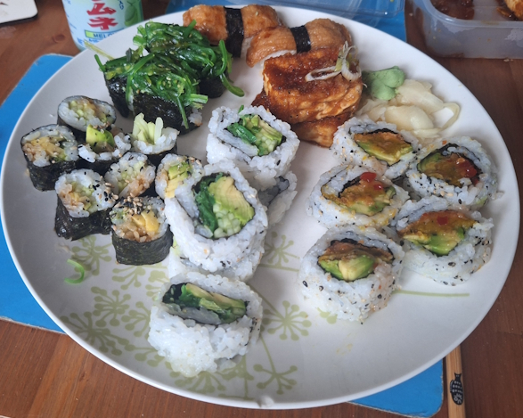

+++
date = '2026-06-06T11:00:27Z'
draft = false
title = "Week 22 - Surviving the heatwave"
description = "A sunny bank-holiday mix of kitchen-sink salad, park cake, sausage sandwiches, spicy gochujang all’assassina, Venezuelan snacks and veggie sushi."
image = 'cover.jpg'
+++

# Week Twenty-two: Sunday May 24th - Saturday May 30th

* **May 24th**: Bits and pieces salad
* **May 25th**: Leftover salad 
* **May 26th**: Veggie sausage sandwich
* **May 27th**: Gochujang spaghetti all’assassina
* **May 28th**: Leftover spaghetti
* **May 29th**: Arepa, empanada and tequeños
* **May 30th**: Veggie sushi

# May 24th: Bits and pieces salad

Had a very enjoyable, lazy threeday weekend, blessed by the sun. On the Sunday I tried out a new cafe in chorlton, one called Smoak, which do a tofu reuben (pictured top). It works well, the tofu is sliced pretty thin and marinated in something smoky, plus the sourness of the sauerkraut. I doesn't taste like meat, but it does taste good. We really are spoiled for choice when it comes to bagels in Chorlton.

It was absolutely baking hot, so I couldn't face anything hot. Decided to go a bit mad with a salad, throwing various odds and ends in there. I had an aubergine I roasted and left to cool with a bit of soy sauce, plus some tomatoes, cucumber, yellow pepper, pickled red onion, artichokes, olives, and feta. 

It sort of all worked together, a bit of balsamic dressing helped to unify it.

# May 25th: Cake in the park

Monday I met up with Josh and Philip to play a bit of golf frisbee in Longford park, since it's such lovely weather. Philip apparently does it pretty seriously, so Josh and I got our arses handed to us. All worth it though because we stopped off at the cafe in the park. It's been bought out by Blanchflower and completely re-done. Very bougie now, I had a homemade lemonade and a slice of croissant bread and butter pudding.

Had some more of the salad from yesterday for dinner.

# May 26th: Veggie sausage sandwich

We were talking at work about missing meats after turning veggie. I don't really miss much to be honest, maybe fish because it's so hard to find a good veggie alternative, but all the talk got me hankering for a sausage sandwich.

I picked up a pack of linda mccartney sausages on the way back from work, and damn did it hit the spot. Had it with some barbican bread, and a good squirt of hp sauce. I'm not sure if it's the best brand of veggie sausages, I feel like I should try and do a proper taste test. I just don't by them frequently enough to have any brand loyalty. 

# May 27th: Gochujang spaghetti all’assassina

I know I've made spaghetti all’assassina quite a bit this year, but it felt like the star's aligned when Meera Sodha put out a recipe for one: https://www.theguardian.com/food/2026/may/23/crispy-one-pan-spaghetti-gochujang-mozzarella-vegetarian-recipe-meera-sodha

It's pretty similar to the ones I've been making so far, i.e. frying spaghetti and slowly pouring on a stock, however she adds gochujang which is a spicy korean red chilli paste.

The heat works very well, there's a couple of other pasta recipes of her's I've made this year which also use gochujang:
- [Jan 7th: Vodka Gochujang pasta](#jan-7th-vodka-gochujang-pasta)
- [Jan 9th: Parsnip gnocchi](#jan-9th-parsnip-gnocchi)

# May 29th: Arepa, empanada and tequeños

Friday I just felt like eating a takeaway in the last of the sun, so I ordered from Mia's arepas again, which do Venezuelan food. Pictured below are the arepa (corn bread stuffed with guac, tomato, black beans and halloumi); a black bean and veggie empanada; and Tequeños, a popular Venezuelan snack of salty white cheese wrapped in a slightly sweet, buttery wheat dough and fried until golden and crispy. The usually come with a green sauce called Guasacaca, which is very tangy avocado and herb dip.

# May 30th: 

Another takeaway on the saturday, Andrew talked me into it. It was still very hot, so we went with a japanese place, so I could get some sushi. I went with a platter or various things, mostly different combinations of rice, tofu, cucumber, and avocado. Standout was some very good tofu marinated in a sweet and spicy sauce.

