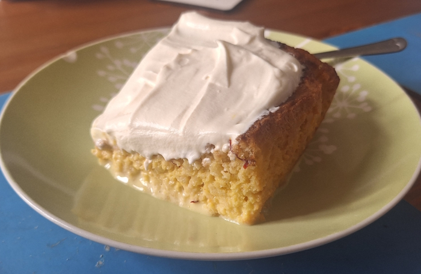
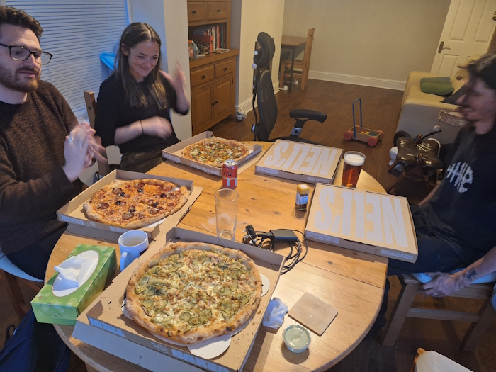
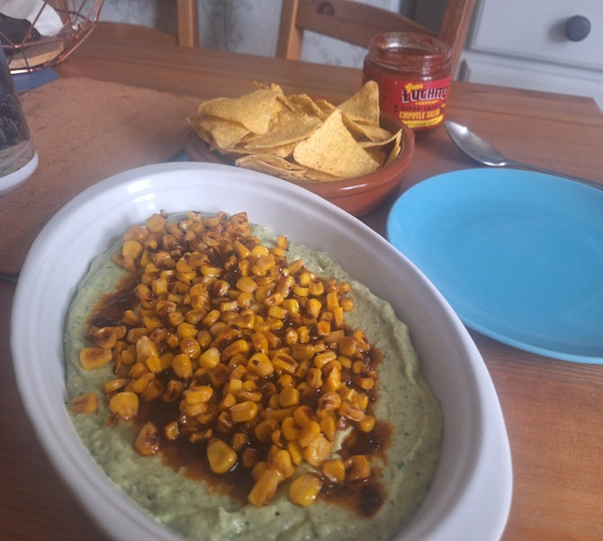
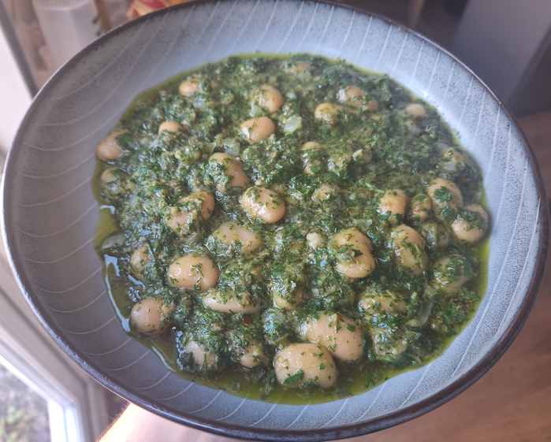
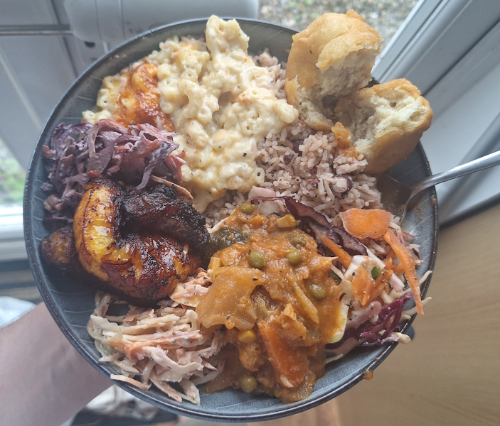

+++
date = '2026-06-10T11:00:27Z'
draft = false
title = "Week 23 - Wet cake and the first of the summer recipes"
description = "Saffron milk cake, pickle-loaded pizza, avocado and jalapeno dip with charred corn, trusty butter beans in salsa verde."
image = 'cover.jpg'
+++

# Week Twenty-three: Sunday May 31st - Saturday June 6th

* **May 31st**: Pickle pizza and saffron milk cake
* **June 1st**: Charred corn, avocado and jalapeno dip
* **June 2nd**: leftover avocado
* **June 3rd**: Butter beans in salsa verde
* **June 4th**: Last of the lovage pesto
* **June 5th**: Leftover butter beans
* **June 6th**: Caribbean food from drop bar cafe

# May 31st: Pickle pizza and saffron milk cake

I did a rare bit of sweet baking this week, following one of Meera Sodha's recipes for saffron milk cake. https://www.theguardian.com/food/2026/may/30/saffron-milk-cake-recipe-meera-sodha

> Margot Henderson once described herself as a “wet” over a “dry” food person, and the world, seen in those terms, suddenly made more sense to me. - **Meera Sodha**

It's an interesting one. First you make a sponge out of eggs, sugar and flour, bake it in the oven. Meanwhile you make the saffron milk by steeping a load of saffron in whole milk, double cream, and condensed milk, with a bit of cardamom and salt. You poke a load of holes in your sponge and pour over the saffron milk, so the sponge soaks it all up, and leave overnight. 
Topping is whipped cream and more of the condensed milk.

If you told me you were serving me wet cake, my initial reaction would honestly be disgust. Texturally it doesn't seem like it should work. But something about this is just so satisfying. It's not a strong taste, but there is a deep and subtle flavour from the saffron. Managed to polish the whole tray off (with some help from andrew) in a couple of days.

We were playing D&D once again so my meal on the sunday was a takeaway pizza from Nell. They had a new pizza on the menu, which I went for after katie's recommendation: The PCKLD. 

It's garlic cream, mustard, lots of pickles, red onion, smoked cheese, crispy onion, and chives. Not for the faint of heart, it's pretty far from your bog standard margherita. Kind of sour and punchy as you'd expect from being loaded with pickles, but one I'll be getting again. It's nice to have a pizza place which seems to be having fun with their menu.

# June 1st: Charred corn, avocado and jalapeno dip

The cookbook I've been using a bunch this year, 'what to eat and when to eat it', is divided up into seasons, with recipes from each using seasonal veg. Monday June 1st, I made my first official meal from the summer section.

This one's an avocado dip (which isn't guacamole). It's a mixture of cannellini beans, avocado, yoghurt, lime juice, pickled jalapenos, and coriander, blitzed in a processor. I also charred some corn in a frying pan and sprinkled that over the top, with some chipotle paste and agave.

It's creamy and a little spicy from the jalapenos, and a little sweet from the corn. Enjoyed this with some tortilla chips and a disappointingly bland jar of salsa.

# June 3rd: Butter beans in salsa verde

One of the heavy rotations, this is just so easy to make. There wasn't any mint on the shelves in the Unicorn, so this time I went with parsley, basil and dill. You can basically throw anything in and it's still good.

You pulse the herbs, capers, garlic clove, red wine vinegar and olive oil in a food processor. Fry off some onion, garlic and chilli, add in your butter beans (with the liquid from the tins), and cook for 10 minutes. Mix in your blitzed herb mixture.

# June 4th: Last of the lovage pesto

No picture of this one. I was down to the final third of the homegrown lovage pesto from my parents, so I decided to use it up for a meal on the Thursday. As I've said before, the flavour of lovage is pretty unique, somewhere between celery and anise. You basically never see it sold anywhere, except for brief windows in fancy grocers like the unicorn when it's in season.

# June 6th: Caribbean food from drop bar cafe

I gave blood for the first time on the saturday morning, so I decided to treat myself by ordering in.

One of the nice things about dropbar cafe is they absolutely do not skimp on the portions. I got a 'hench box' which is a load of different veggie stuff. Rice and peas, three different coleslaws, roast veg curry, mac and cheese, fried plantain, and dumplings. It barely fits in the bowl (There was more of the curry but I had to leave it for a midnight snack)

