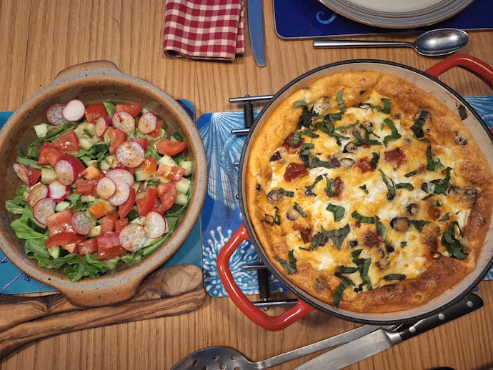
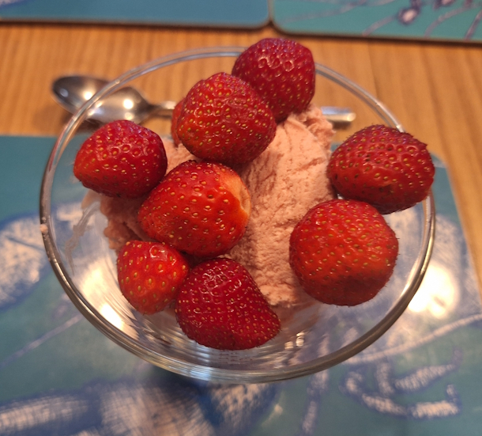
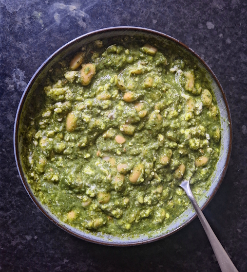
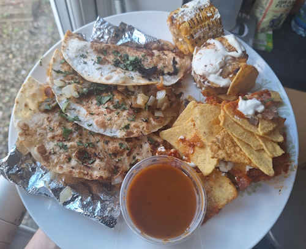
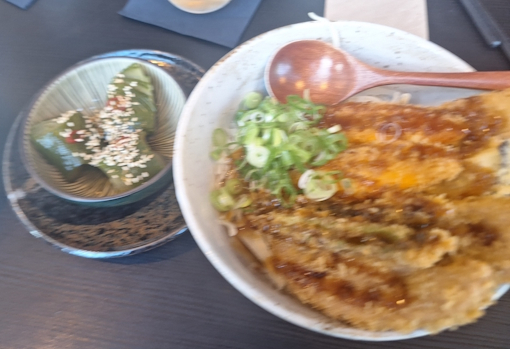
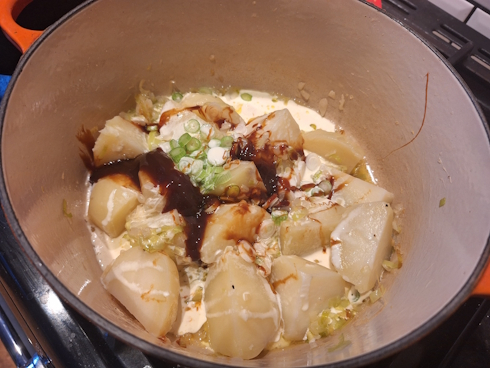
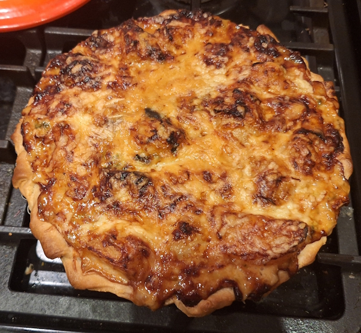

+++
date = '2026-06-12T11:00:27Z'
draft = false
title = "Week 24 - France, Greece, Mexico, Japan, Britain"
description = "This week I eat my way around the world, starting with savoury clafoutis at my parents', a new Greek-inspired bean dish, veggie birria tacos, a night out at Yane, and a very British pie"
image = 'cover.jpg'
+++

# Week Twenty-four: Sunday June 7th - Saturday June 13th

* **June 7th**: Savoury Clafoutis with strawberry icecream
* **June 8th**: Spanakopita beans (*new*)
* **June 9th**: Leftover beans
* **June 10th**: Veggie 'birria' tacos
* **June 11th**: Leftover beans
* **June 12th**: Tempura vegetables with kyurizuke pickles from Yane
* **June 13th**: Marmite and leek homity pie

# June 7th: Savoury Clafoutis with strawberry icecream

I was with my parents on the sunday, and they cooked a dish I don't think I've had before, Clafoutis. It's normally a sweet dish with cherries, from France, almost like a big pancake or omelette. This one was savoury, with cheese, olives tomatoes, etc. It looked quite dense but the batter was surprisingly light, might see if I can make one of these myself.

Also, my parents have been celebrating their strawberry harvest recently, so we had some allotment grown strawberry icecream for dessert. Growing up I always went mad for strawberries, we had a tiny little patch of wild strawberries in the garden when I was little, which I'd sit and pick at.

# June 8th: Spanakopita beans

Cooked a new meal from 'What to cook and when to cook it", Spanakopita beans. Normally Spanakopita is a greek filo pastry, but she's taken the flavours and just mixed them in with some butter beans instead. It's all very similar to the Meera Sodha herby beans, which is a win in my book. Main difference is this one uses spinach, which you need to cook and then quickly blanch in ice water to make sure it stays a nice vibrant green. It's less vinegary then the Sodha beans, and you crumble over feta at the end as well.

# June 10th: Veggie 'birria' tacos

I ordered from don tacos on the Wednesday, getting some veggie 'birria' tacos, some nachos and corn. Birria is meant to be a slow cooked meat stew, so I never really know what the veggie version of a birria taco is meant to contain. It was fine, nothing to right home about. I'm still chasing the highs of the mexican food I had in the states tbh. 

It also never photographs great, apologies for the slightly anaemic looking tacos:

# June 12th: Tempura vegetables with kyurizuke pickles from Yane

Met up with Matt and Rick on the Friday for a meal at a Japanese place round the corner from my house called Yane. I've been there once before this year, with Andrew, Josh, and Rebecca.

[See march 12th on week 11](/posts/week-11/)

As I said last time, the menu is more comfort food as opposed to fancy sushi dining. They had stuff like donburi, katsu curry, etc. and no sushi, or ramen. It's nice to have a place that makes an under represented side of Japanese cooking. It's all pretty reasonable price as as well, a strong reccomend from me, I want them to keep going.

We also split a bottle of plum wine, which is very sweet and delicious, but also pretty alcholic, so apologies for the blurry photo.

# June 13th: Marmite and leek homity pie

This is one I've made before, a guardian recipe for homity pie: https://www.theguardian.com/food/2025/nov/06/homty-pie-marmite-leek-recipe-jimi-famurewa

Homity pie is a traditional, hearty UK vegetable pie. It's apparently also sometimes called a Devon pie, because that's where it might of originally come from. Also, it's mainstream popularity came from Cranks Vegetarian Restaurant, which opened in London in 1961, when vegetarianism gained support from the hippie subculture. Can you tell I've been at the wikipedia?

This recipe is less traditional because of the marmite, but they usually have a mixture of potatoes, onions, leeks, covered in cheese.

It's a very easy one to make, and the ingredients are all pretty cheap, which makes sense for a recipe made during rationing. It's nice enough, might make this one again when I'm feeling in a patriotic mood.

# Honorable munch-ion

To celebrate the official start of the World cup, we had an office lunch, where people had to bring in some food from the country they drew in the sweepstakes. Mine was Scotland, so obviously I brought in some Irn-bru, and some cheese and oatcakes.

