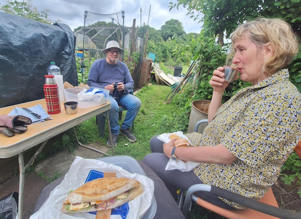
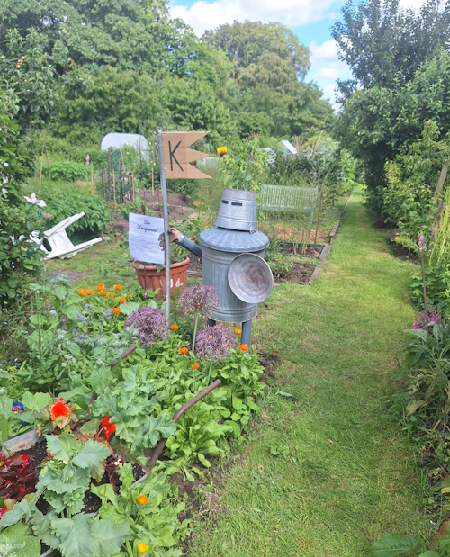
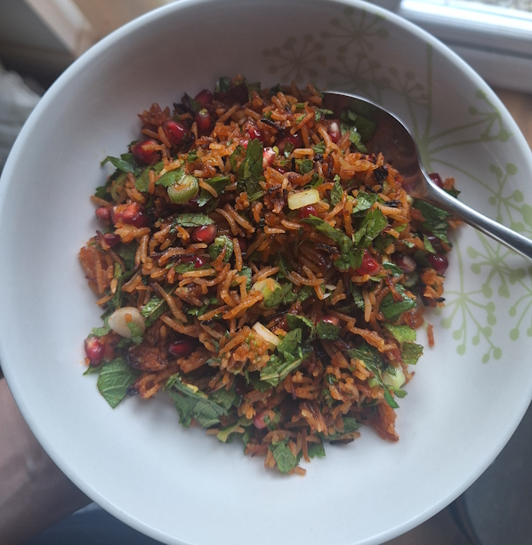
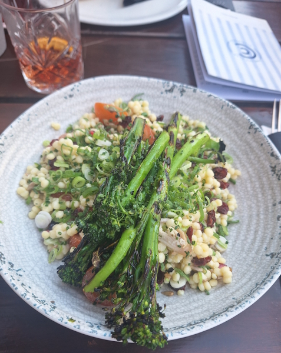
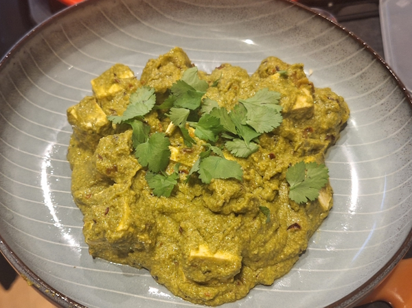
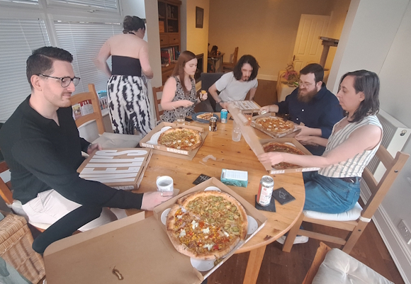

+++
date = '2026-06-21T10:00:27Z'
draft = false
title = "Week 25 - A sandwich at the allotment, some salads and another Nells"
description = "I try out two new recipes this week, a crispy rice salad and a palak tofu, as well as more nells pizza and some drinks after work."
image = 'cover.jpg'
+++

# Week Twenty-five: Sunday June 14th - Saturday June 20th

* **June 14th**: Leftover homity pie
* **June 15th**: Leftover pie
* **June 16th**: Gochujang crispy rice and avocado salad (*new*)
* **June 17th**: Leftover salad
* **June 18th**: Couscous Superfood Salad
* **June 19th**: Palak tofu (*new*)
* **June 20th**: Nell's pizza

# Honorable munch-ion

The homity pie (see last post) is making a continued appearance this week, which I ate for tea again on the sunday and monday. A special shout-out, however, to the sandwich from Sunday lunch. Cheese and salad from La Chouquette in Didsbury, not a particularly fancy one, but I scoffed it down with a kind of deep, animal satisfaction. We'd spent the afternoon at the allotment, digging trenches and replacing the greenhouse cover, sweating away in the sun. It won't come as a shock to the few readers of this blog that I don't engage in a lot of manual labour. There's something very satisfying about enjoying a hard earned lunch, which I don't usually experience in my day to day clacking away on a computer. There's a German word Entfremdung, which is pretty appropriate. I need more of the tactile in my life or I write long and needlessly introspective blog entries. 

On the subject of manual labour, one of the neighbouring plots is owned by a retired engineer, who's built one the best scarecrows I've ever seen.

# June 16th: Gochujang crispy rice and avocado salad

Found a very quick and easy recipe in the guardian for a crispy rice salad: https://www.theguardian.com/food/2026/jun/15/gochujang-crispy-rice-avocado-salad-quick-easy-recipe-georgina-hayden

It uses packages of precooked rice, which saved a bunch of time. The idea is you mix the rice with gochujang, sesame oil, soy sauce and honey, then roast in the oven for about 20 minutes until it all goes slightly charred and crispy. Then just mix it through with the rest of your salad ingredients, in this case spring onions, avocado, coriander and mint. I added some pomegranate seeds as well which worked with the rest of the ingredients. 

If I did it again I might try adding some chilli oil or something, just to add a little heat to it.

# June 18th: Couscous Superfood Salad

On the thursday we went for some after work drinks and a meal at a place in Altrincham called the Con Club. It's honestly not something we do a lot in our office, I think because a few of the people have to get home to kids, or have a long drive, so it's nice on the rare occasions to catch up with everyone. 

I had a negroni and the Couscous superfood salad, which I think had dried cranberries, some tomatoes, toasted pumpkin seeds, various healthy shit like that, with some couscous and broccoli. Washed down with a guinness, the most photogenic pint you can get.

# June 19th: Palak tofu

Friday I was feeling like a curry, so I tried a new recipe from the old stalwart Rainbow Plant Life: https://rainbowplantlife.com/vegan-palak-paneer-with-tofu/

It's for a palak paneer, but swapping out the cheese for tofu. I didn't actually know what the difference was between a palak and a saag, apparently saags are made with lots of different leafy greens (mustard leaves, fenugreek leaves, etc), while palak is just spinach. Also, palak tends to be a smoother and creamier sauce.

The recipe gives a couple of different ways to cook the tofu. One of them is to fry it in spices so it's crunchier, but I opted for the boiling approach, as it's closer to the texture of paneer, and a lot quicker. They use blitzed up cashews to get the creamy flavour, so it ends up pretty protein heavy.

It didn't end up quite as vibrant green as I would have liked. I went through the effort of blanching the spinach in ice water after cooking, but it still turned up kind of yellow looking. I think that might be because I let it simmer too much at the end, or maybe too much acidity from the tomato and lemon juice?

Either way it tasted delicious, will be making this one again. And like most curries, it's better the next day.

# June 20th: Nells pizza

As is becoming a tradition at this point, on the saturday we were at Gemma and Milton's house for his birthday, and we ordered in some Nell's pizza. They just are the best. Spoiler for next weeks blog post, but I went out the day after this and got Nell's again.

I managed to do some swapping so I ended up with half a PCKLD, and half a corn supremacy. 

