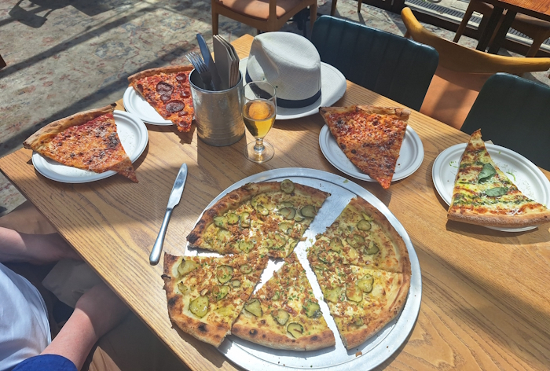
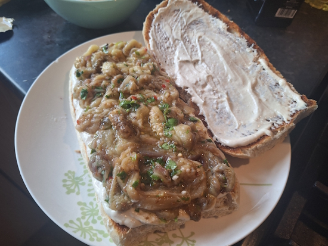
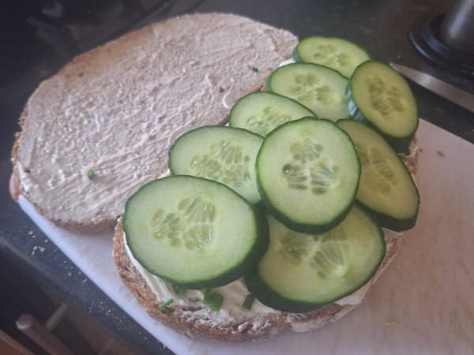
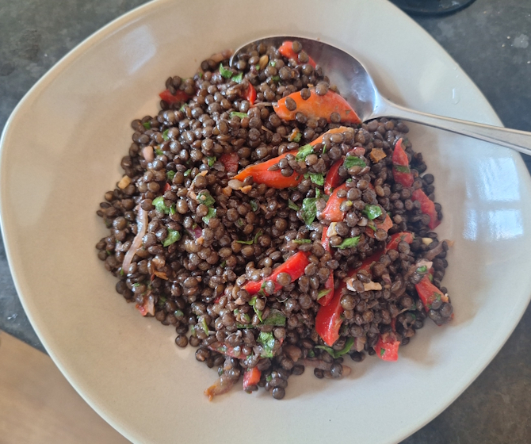
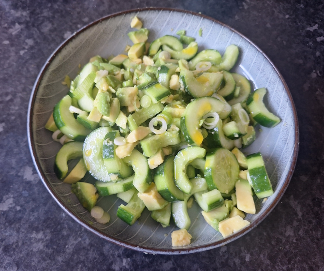
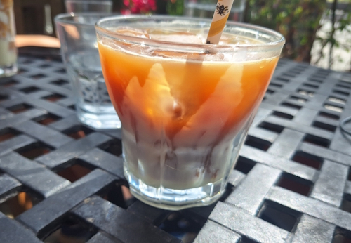
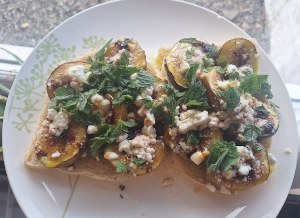
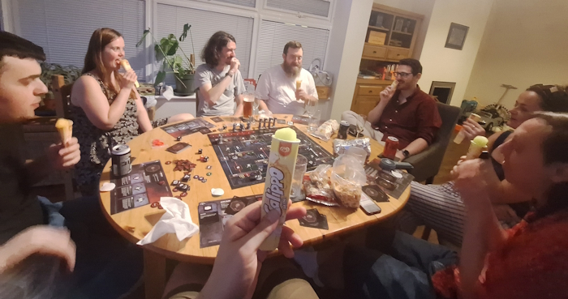

+++
date = '2026-06-27T22:00:27Z'
draft = false
title = "Week 26 - Escaping the heat"
description = "I try to keep it simple and light with some salads, some roast figs, a Yemeni sandwich, and father's day pizzas."
image = 'cover.jpg'
+++

# Week Twenty-six: Sunday June 21st - Saturday June 27th

* **June 21st**: Nell's pizza
* **June 22nd**: Nothing, too hot
* **June 23rd**: Zhoug and smoky aubergine sandwich (*new*)
* **June 24th**: Cucumber sandwich
* **June 25th**: Red pepper and lentil salad
* **June 26th**: Cucumber and avocado salad 
* **June 27th**: Roast figs and feta

It's been a tough week. Our house is red brick and terraced, very good at holding the heat through a drizzly october, but completely inadequate at keeping it out when it's pushing past the mid 30s. The upstairs has been a kiln this whole week, I've had to keep an ice pack on my poor laptop to stop it frying. Every year I edge a little closer to just buying an air conditioning unit, I think once the rush is off this time I'll finally do it. All of this to say, I have been trying to avoid the hob this week. 

# June 21st: Nell's pizza

The sunday was Father's day, so I took my dad out to Nells for some pizza and a beer. Those of you with good memory might remember I had pizza the day before this. Sue me.

One of the benefits of going in person is you can pick up some individual slices. We went for a pickle pizza (brilliant, rivalling the corn supremacy as my favourite), a few slices of their OG cheese, a magic number (vodka sauce and salsa verde), and a pepperoni for my dad.

# June 23rd: Zhoug and smoky aubergine sandwich

On the tuesday I tried out a new recipe from 'What to cook and when to cook it'. It does involve roasting some aubergines, but I let them cool down before eating. Zhoug is a spicy green Yemeni sauce, you make it from combining some ground cardamom and cumin with coriander, green chillies, garlic, lemon juice, and olive oil. I made some tahini yogurt, by mixing tahini, yoghurt, lemon juice, honey and some more olive oil. Then just roast the aubergines until charred, cool them off and peel, shred the insides and mix in with the zhoug. Then spread the aubergines, and leftover zhoug, and the tahini yoghurt on a ciabatta.

This is hands down the messiest sandwich I've ever tried to eat. There's just so much liquid in an aubergine, and then you combine that with yoghurt. I definitely could have done with a bib. Delicious though.

# June 24th: Cucumber sandwich

Wednesday is right in the middle of the heatwave, and there's no way in hell I'm cooking anything. Went for an old british classic, cream cheese, cucumber, and chive sandwich.

Not really sure what else to say about this one, I feel like this entry should be longer. Here's some info I pasted from the internet: Cucumbers cool the body. Because they are roughly 95% water, eating them helps naturally hydrate your system and replenish fluids lost to sweating. Additionally, cucumbers are rich in electrolytes like potassium and beneficial polyphenols, which help regulate internal body temperature and calm heat-related inflammation. 

# June 25th: Red pepper and lentil salad

This one came from the Unicorn. They have pre-made salads they sell near the tills, a few different types. I went with the red pepper and lentils. It's simple, there's some red onion and herbs in there as well, but the lentils have a bunch of protein so they're quite filling.

# June 26th: Cucumber and avocado salad 

This is a very very simple salad. I was going for a green theme: cucumber, avocado, spring onions, and then a dressing of chilli oil and a squeeze of lemon. I tell you what though, at this point in the week I was on three showers a day, this was perfect for keeping cool.

# June 27th: Roast figs and feta

I started up with parkrun again after a long absence. The weather had turned so there was a bit of a cool breeze saturday morning. It's easy to think of it as just another Saturday morning obligation when you're in the habit of going every week (especially in the winter months), but I'd forgotten how nice the atmosphere was. No one takes it too seriously, because no matter how good you are you'll inevitably be humbled by a runner dashing past you while pushing a pram.

Plus, now that I'd done my fitness for the day, I could use that as an excuse for coffee and a cake. There's a cafe round the corner from my house called tea hive which I've been into a couple of times, but I noticed they had an Iced Vietnamese coffee on the menu. In case you don't know, what makes a coffee vietnamese is that they use **condensed milk** instead of normal milk. Incredibly decadent. I had it with a slice of guinness cake on the side.

I popped into the unicorn and they had a bunch of figs for sale. Apparently it's the first 'breba' crop, which develop on previous years shoots, before the main crop starts in August. I figured I'd pick some up and have another simple-ish dinner, by roasting them in the oven with olive oil, balsamic vinegar, garlic, and feta. I tossed them with mint leaves and ate on toast.

Final shout out to the calippo I had saturday night, cooling down while playing the dead by daylight boardgame, laughing with friends, and listening to England reach a boring victory against Panama.

