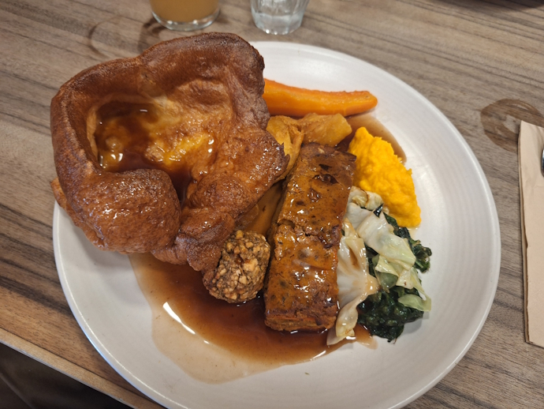
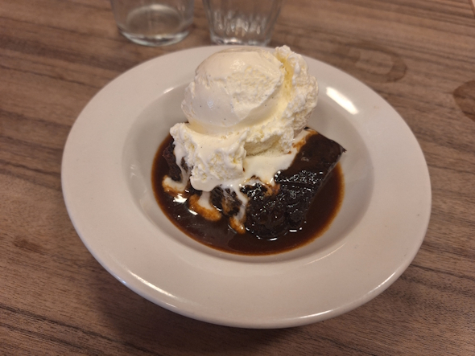
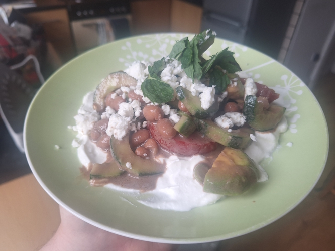
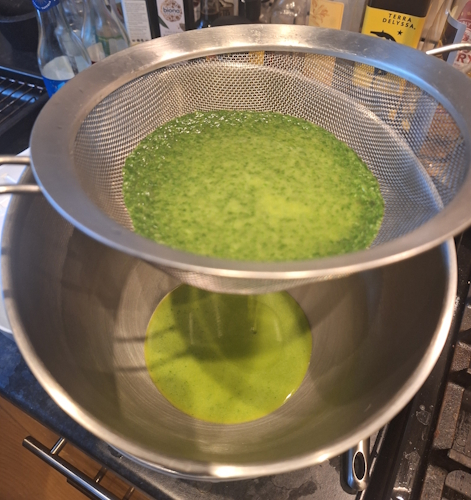
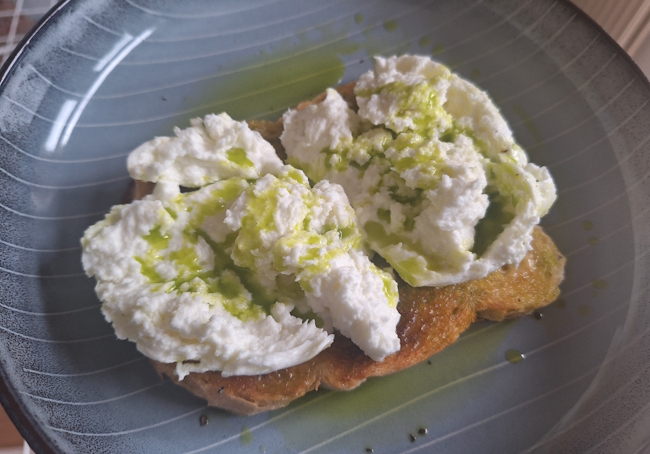
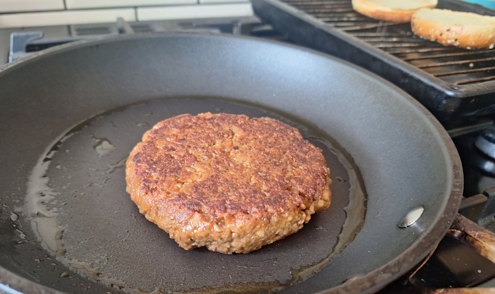
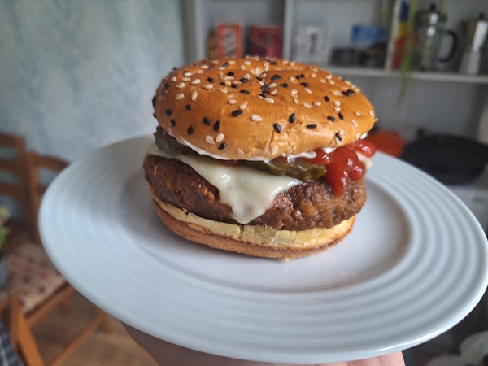
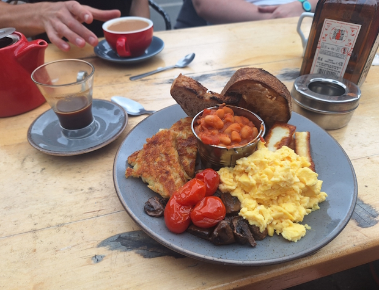
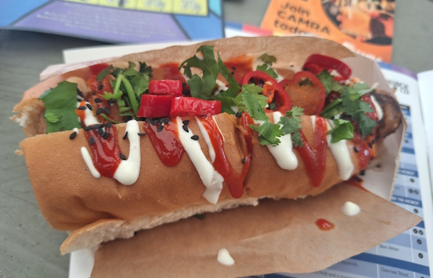
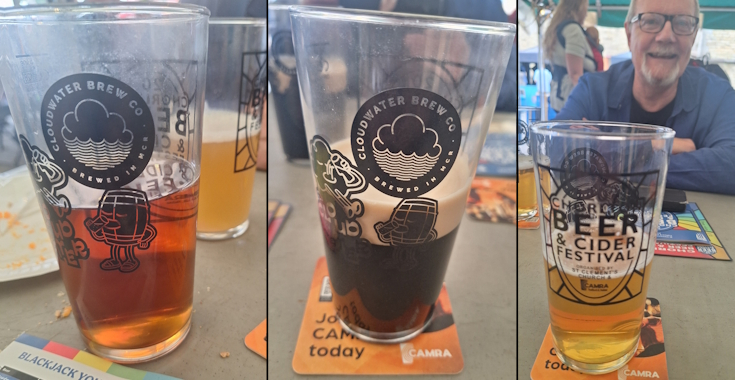

+++
date = '2026-07-06T13:25:01Z'
draft = false
title = "Week 27 - Burgers and beerfest"
description = "A nut roast sunday dinner, a very ugly salad, homemade basil oil, TVP veggie burgers, and getting pretty drunk at the annual Chorlton beer festival."
image = 'cover.jpg'
+++

# Week Twenty-seven: Sunday June 28th - Saturday July 4th

* **June 28th**: Nut roast dinner with sticky toffee pudding
* **June 29th**: Ugly salad 
* **June 30th**: Leftover salad
* **July 1st**: Burrata and basil oil
* **July 2nd**: More burrata
* **July 3rd**: Veggie burgers
* **July 4th**: Full english + hotdogs

# June 28th: Nut roast dinner with sticky toffee pudding

I'm not sure if it's a consequence of me being vegetarian, or that it's just too much faff unless you're cooking for a full family, but I don't eat a lot of roast dinners. I've been getting a bit of a hankering to have a proper sunday dinner for a while now, so I got the gang together and organised a trip to the Jane Eyre on Beech Road. 

Got to say, they didn't disappoint. There was only one veggie option on the menu but it was damn good. A nut roast (pretty typical for veggie roast dinners), served with roast potatoes, roast carrots, a mash (not sure what root vegetable it was, it was orange coloured though), some stuffing, yorkshire pudding, I think some spinach or other greenery, and a load of gravy. 

Also ordered a side of cauliflower cheese (not pictured), which we shared.

Of course, had to go for the pudding as well, and what other option is there instead of sticky toffee pudding, with vanilla ice cream.

# June 29th: Ugly salad 

On the monday I was feeling a little experimental, so I tried to make a dressing with some of the stuff left over from cooking Ottolenghi recipes. From what I remember it was a mix of tahini and pomegranate molasses, with a splash of balsamic vinegar and chilli flakes. I tossed tomatoes, cucumber, avocado, and borlotti beans in the dressing, then ate it on yoghurt, with some mint and feta crumbled over the top.

I had failed to account for the colour of the dressing making all my vibrant veggies look an unappetising muddy brown.

Taste-wise it was pretty good. Maybe a little too busy, I ended up throwing some stuff in there like borlotti beans just because I had them. Definitely one of the ugliest salads I've made though.

# July 1st: Burrata and basil oil

I got served a youtube video about making flavoured oils. Most of them were a bit involved, but one for basil oil looked incredibly doable.

First you have to source a load of basil. By weight you use about twice the oil to basil, so you don't get a massive amount out this. After that you boil the basil for two minutes before blanching it in ice water to stop the enzymes breaking down and ruining the green colour.

After it's all cooled down, squeeze out all the liquid you can to get it as dry as possible, before putting your oil (rapeseed) and the basil into a blender and blitzing for a long time until completely smooth and incorporated. Then, you're supposed to pass the oil through a cheese cloth to get rid of the solids, but I couldn't find any for love nor toffee. As you can see I used a thin wire sieve which did a decent job.

After that, I gave it a test run on a little bit of burrata. The colour held up really well, it's a very vibrant green colour, even more so than I could properly capture on camera. It's got a strong basil taste as well, as you'd hope.

 It makes me feel very chefy making this, but to be honest if I'm just cooking for myself I'm not sure if I'd bother again. Burrata is quite a lazy meal, and you can always just rip up some basil leaves and get a pretty similar taste.

# July 3rd: Veggie burgers 

I found a big bag of something called TVP on one of the back shelves of the unicorn. It stands for Textured Vegetable Protein. It doesn't look appetising, I think partly because it's shelf stable so it's just sitting there in a clear plastic bag. You expect meat substitute to need to be carefully refrigerated like meat. Apparently the stuff is like 50% protein. From what I can gather it's just soy that has had the oil removed.

I was looking up how you're actually supposed to use the stuff, and came across this guy who has a recipe for burgers: https://theeburgerdude.com/vegan-burger-patties/

There's a bunch of ingredients: You rehydrate the TVP in vegetable stock, and at the same time rehydrate linseed (called flaxseed in the US) in water. Whisk together a paste made of miso paste, nutritional yeast, onion and garlic powder, mayo, blackstrap molasses, Henderson's Relish (vegan version of Worcestershire sauce, from Sheffield). Combine your TVP, linseed and paste and mix well, then add flour and breadcrumbs.

I'll be honest I was sceptical the entire process, it looked nothing like a burger until it was actually in the pan.

I reckon it looks pretty convincing. With fake meat burgers you buy in a supermarket, like impossible burger, part of me is always a little worried that they're going to have a load of crap in them. Not sure how true that is in reality, but I'm a little wary of ultra processed foods.

It was cool to be able to make my own from scratch, without any particularly weird ingredients. Granted, if you don't live next to the unicorn I don't know how easy it is to source TVP, but the stuff was very cheap. £5 for a big bag I only used a bit of.

I had it pretty simply, with cheese, ketchup and pickles. It doesn't taste exactly like meat, but then veggie burgers basically never do. Texture wise it was reasonably similar, although it fell apart a bit more readily than an actual meat burger.

It's better than a black bean burger, which I rate the lowest on the veggie burger scale. It gets points for it's simplicity to make (you basically just mix everything together in a bowl), and also it's cheapness. Plus if you were so inclined you can make it vegan by using a vegan mayo. I think my favourite is still a burger that tries to be something completely different instead of a meat imitation, like meera sodhas onion bhaji burgers, but if I'm in the mood for something more traditional I'll go for these again. I reckon you could do some pretty convincing meatballs with this stuff as well.

# July 4th: Full english + hotdogs

Honourable mention for the 'vegetarian full english' after park run on saturday. Very non-traditional, they didn't attempt and veggie susages and went for fried halloumi instead. Homemade baked beans though.

That big breakfast was to guard my stomach for the Chorlton beer festival, later on the saturday. As has now become a yearly tradition, dad and I rocked up around 13:00, got another pint glass for the collection, and staked out a spot. 

Food options were pretty typical festival grub. Burgers, pizzas, a curry tent, etc. I got a hotdog from one of the stalls, as the had veggie versions of all the options. Can't remember what it was called but something spicy and south-east asian-y (based on the coriander and sesame)

Log off now if you don't care about beer.

I started with 'Twice as precious', a bitter, and a collab between Cloudwater and Burton Bridge. Apparently Burton Bridge is now run by a couple of ex-Cloudwater people. It was a pretty solid bitter, nice one to start out on.

Next, had a session blonde from Dunham Massey called 'Bridgewater blonde'. It was fine, a little boring.

My brother had mentioned that a London brewery called Anspach & Hobday is the one all the brewers want to work at, due to how well they treat the staff, so we picked up a porter called 'London Black'. It's the cut-down (only 4.4%) nitro version of their standard Porter. I thought it was great, could give guinness a run for their money.

Went back to cloudwater, this time for a cask-only one-off hazy pale ale (as is their specialty) called 'A room is still a room'.

Next went in for the classic, 'Sonoma' by Track. Classic for a reason.

Finished with a couple of pints of a bitter by Fell brewery, called 'Crag'. Fell are a little outfit up in cumbria, round Cartmel way.

