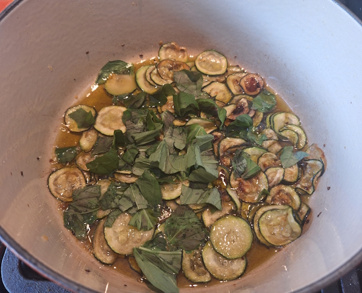
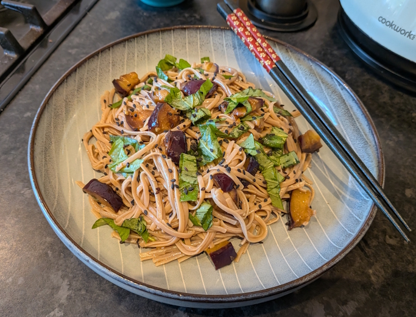
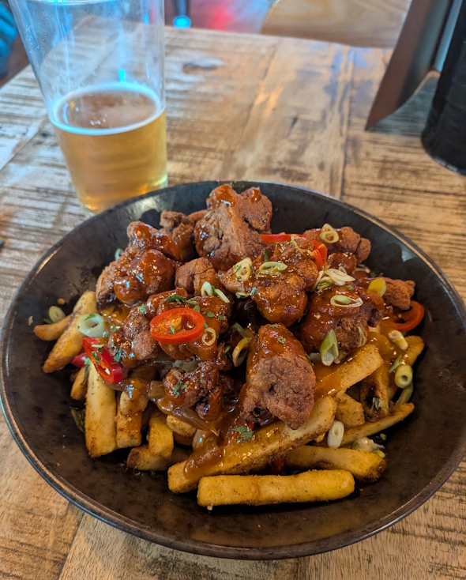
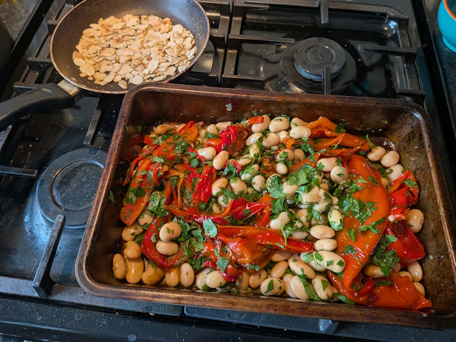
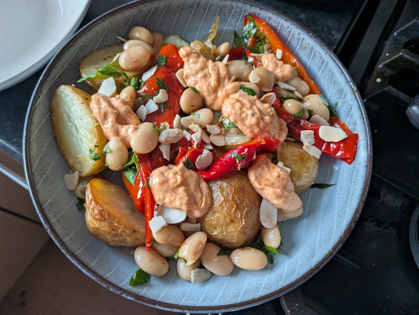
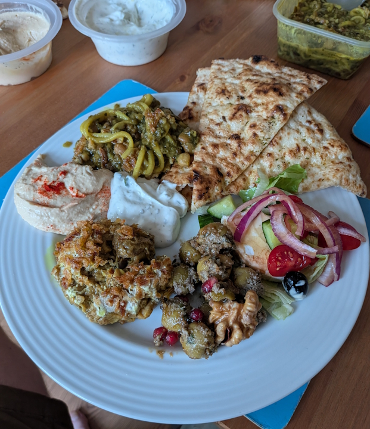
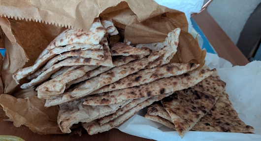

+++
date = '2026-07-12T23:15:56Z'
draft = false
title = "Week 28 - Noodles from the Amalfi coast to Tehran"
description = "Courgette spaghetti, aubergine noodles, Ashe Reshteh. Plus some poutine and a spanish-adjacent roasted potato and red pepper dish."
image = 'cover.jpg'
+++

# Week Twenty-eight: Sunday July 5th - Saturday July 11th

* **July 5th**: Leftover veggie burgers
* **July 6th**: Spaghetti alla Nerano (*new*)
* **July 7th**: Leftover spaghetti
* **July 8th**: Aubergine soba noodles
* **July 9th**: Fried cauliflower poutine
* **July 10th**: Potatoes, peppers & roasted garlic aioli (*new*)
* **July 11th**: Persian takeaway

# July 6th: Spaghetti alla Nerano

Really, this should be called spaghetti with courgettes and cheese, *inspired* by Spaghetti alla Nerano. The "True" recipe is a secret, and can only be eaten at [Ristorante Maria Grazia](https://www.ristorantemariagrazia.com/en/) in Nerano. 

The one I made is from a guardian recipe from a couple of years ago: https://www.theguardian.com/food/article/2024/jul/15/spaghetti-with-courgettes-basil-and-cheese-recipe-alla-nerano-rachel-roddy

You start by frying thinly sliced courgette until golden, then once you've removed the courgettes fry a whole garlic clove. It's just there to flavour the oil, so remove and chuck the garlic once it's fried for a bit, add the courgette back in along with a handful of ripped basil to soak up the flavours for a bit.

While that's happening, cook and drain the spaghetti, then stir into the courgettes with a few different hard cheeses, and mix until the cheese melts into the garlic oil and a little bit of the pasta water, making a sauce. That's basically it, easy peasy, although I'm sure my technique is lacking.

# July 8th: Aubergine soba noodles

Spiritually pretty similar to the Spaghetti alla Nerano. This one is basil and aubergine with noodles instead.

First make a marinade from garlic, soy sauce, sesame oil, and marinade rounds of aubergine for an hour. Then fry them on a griddle pan, a few minutes each side, basting in more of the marinade if they start to dry out.

Dice the aubergine up, then cook the soba noodles, toss them in more sesame oil and some of the marinade. Add the aubergine, sliced basil, and sesame seeds, and serve.

# July 9th: Fried cauliflower poutine

The thursday was way too hot and I couldn't face cooking something in the kitchen, so after work I went out in search of a restaurant with air conditioning. I ended up at a place in chorlton called Brewski. 

It's menu is very meat forward. I think it falls in the 'dirty' restaurant trend, meaning unapologetically decadent, high-calorie food with a lot of extra toppings. A lot of pulled pork burgers, steaks, that kind of thing, but they did have vegetarian poutine, which caught my eye. 

Normally I'd avoid cheese, chips and gravy on a hot day, but the air con in the restaurant was going full blast, and I had a cool beer on hand to wash it all down. They were really delicious, You can't see because of the cauliflower on top, but they weren't stingy on the cheese curds and gravy. 

# July 10th: Potatoes, peppers & roasted garlic aioli

After some pretty basic meals this week I wanted to try my hand at something a bit more involved, a new recipe once again from "What to eat and when to eat it", from the summer section. 

For this you par-boil and then roast new potatoes along with a whole head of garlic, and a lot of olive oil. While that's cooking, halve some long red peppers, and roast in the oven in a separate tray with deseeded chillis until starting to go black around the edges. Once they're done, mix the peppers with a splash of red wine vinegar, chopped up capers, parsley and butter beans. 

Lightly toast some flaked almonds and leave to cool. Start making your garlic aioli, by squeezing the flesh of the roast garlic into a bowl with mayo, smoked paprika, and a load of salt and pepper, and mixing until it's all combined. Garlic should basically be mush after the roast in the oven.

Layer up the roast potatoes, marinated roast peppers, some globs of the aioli and the almond and eat. I absolutely love this one. It's very hearty with the beans and potatoes, with some good acidity from the marinated peppers and capers, and the herby parsley. 100% making this one again.

# July 11th: Persian Takeaway

Went for a takeaway on the Saturday, from a restaurant I've not tried before called Walnut. It does a variety of different persian food, so I over ordered slightly and got a few things.

First off I went for three dips. Hummus (of course), along with one called Kashk-E-Badenjan which is made from aubergines and similar to Baba Ghanoush but with caramelised onions and a fermented yoghurt called kashk. I also picked up a dip called Mast-O-Khair, which is made from yoghurt and cucumber.

On top of the dips I ordered some fermented olives, which were interesting. Less like typical olives than I was expecting, they come with a paste made of crushed walnuts, herbs, garlic, and pomegranate molasses. Very sweet and tart.

Finally, I also ordered a dish called Ashe Reshteh. It's a thick soup with noodles (Reshteh), kidney beans, chickpeas, and various herbs and spices. It was an interesting one to try, thick from all the carbs in the pulses, very flavourful. Not had anything like it before, would probably be satisfied with just that to be honest.

Needless to say there was at least a day's leftovers from this meal. They were generous with the amount of bread they gave me for the food, which also endeared me to them a lot.

