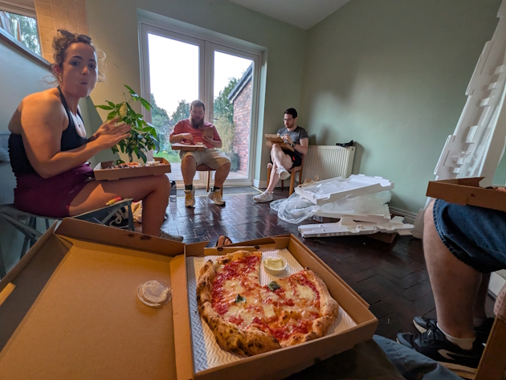
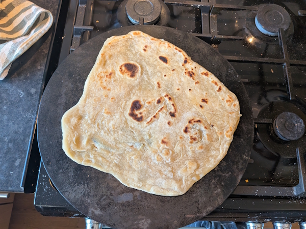
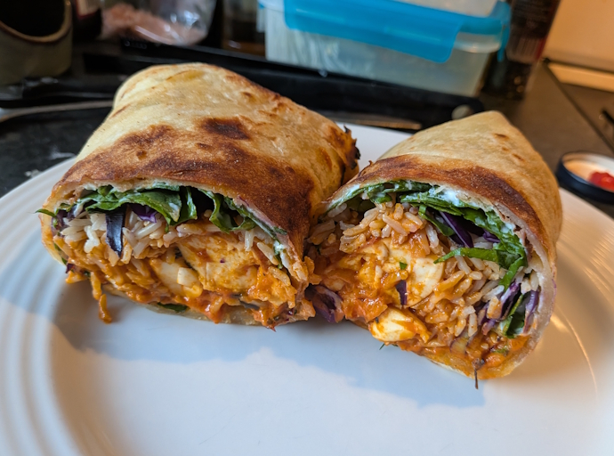
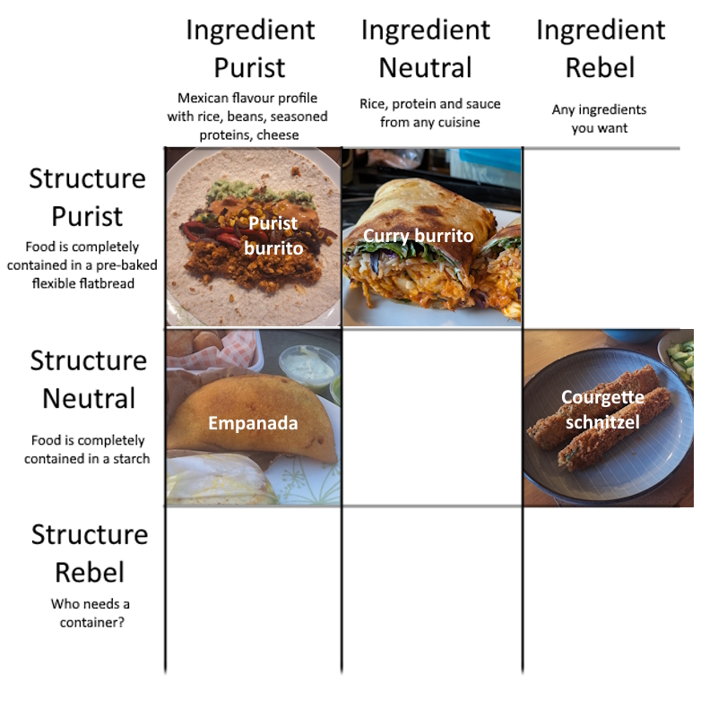
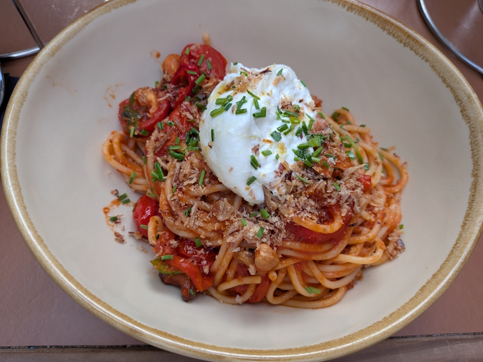
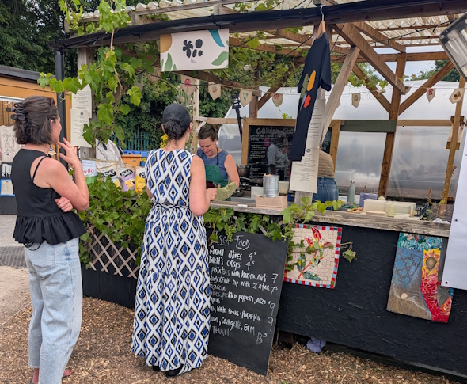
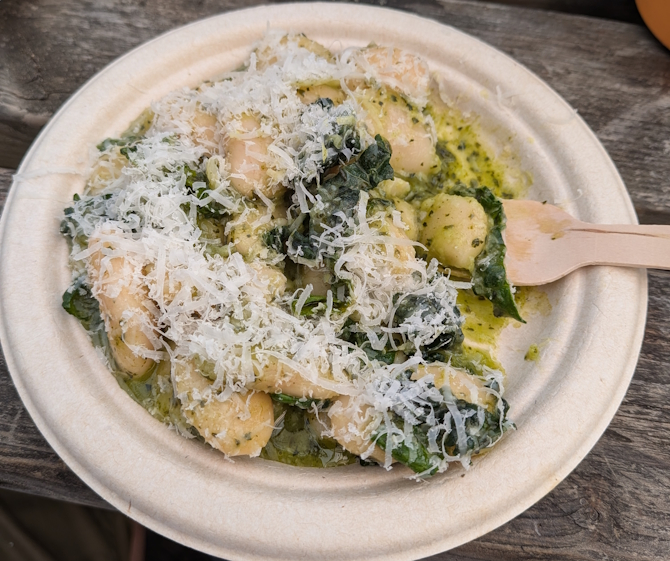
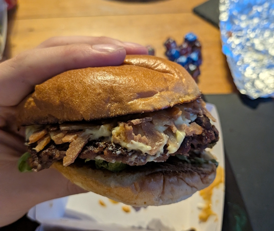

+++
date = '2026-07-19T01:00:56Z'
draft = false
title = "Week 29 - The Curry Burrito Experiment"
description = "A day smashing up wardrobes, another beer festival, experiments in burrito, and an after work Italian."
image = 'cover.jpg'
+++

# Week Twenty-nine: Sunday July 12th - Saturday July 18th

* **July 12th**: Takeaway pizza
* **July 13th**: Leftover Persian takeaway
* **July 14th**: Curry burrito
* **July 15th**: Leftover Curry burrito
* **July 16th**: Pasta
* **July 17th**: Leftover Curry burrito
* **July 18th**: Cavolo nero and white beans + Takeaway burger

# July 12th: Takeaway pizza

Had a very productive sunday helping out with some DIY at Rick's new place in Macclesfield, tearing down built in wardrobes and scraping off wallpaper.  We ended up working up an appetite, so in the evening we ordered in some pizzas from a place local to them which I've forgotten the name of.

# July 14th: Curry burrito

I've been hankering for a curry burrito I had last year at a place called Pukht in Congleton. Had a go at putting one together myself, starting with the wraps. I am constantly frustrated with the crappy flour tortillas they sell in UK supermarkets, pain in the ass to wrap anything substantial in them without it tearing. 

I've got a pizza steel, which is ultimately just a large slab of metal, so I came up with the idea of heating it up on the hob to act as a massive frying pan. I made a wet dough with flour, ghee and water, then spread it out as thin as I could and cooked it on the steel for a couple of minutes each side.

It worked out very well! It's hard to get the scale in the above picture, but it ended up bigger than store bought, and nice and stretchy as I didn't have to put in a load of stuff to make it shelf stable.

For the fillings I made a Cucumber Raita with yoghurt, grated cucumber and mint. Some shredded lettuce on top of that, then a very basic slaw made of red cabbage and mango chutney, and then rice cooked with cardamon and cumin. Finally, for the filling I improvised a paneer masala by frying onions in ghee with some garlic and ginger, adding a load of passata and cooking down until thick, then adding some fried cubes of paneer, cinnamon, cloves, fenugreek, and kashmiri chilli powder.

Got to say, these really hit the spot, one of my finer creations. Not quite as good as I remember the Pukht one's being, I think they had some pickled stuff in there maybe for a bit of sourness? Also I'd do more to liven the rice up, maybe a proper biryani or something. Either way, spent an enjoyable few days finishing these off.

Also, I've been calling these burritos but I don't actually know what the requirements are for something actually be a 'burrito'. I mean the components are there right? It's rice, a spiced sauce with some protein, wrapped up in a flour flatbread. Maybe I can fill out a burrito alignment chart, with meals I eat this year:

# July 16th: Spaghetti Romana at Tre Chiccio

We had one of the Americans visiting the office this week, so we went for some drinks and a meal after work on the thursday. The meal was at a nice place called Tre Chiccio in Altrincham. From the outside it looks tiny, but you go down a stairwell and it's massive, with a whole covered outside seating area. Menu was a good selection of pastas and pizzas, but also Italian style roast chicken and potatoes. 

I had the 'Spaghetti Romana', which has roasted red peppers, tomatoes, cashew nuts & crispy shallots, with half a burrata on top.

# July 18th: Cavolo nero and white beans + Takeaway burger

I was out at another beer festival on the saturday, this time in Platt fields park. It was a very wholesome day out, the vibes of this one were incredibly middle class (Where The Light Gets In had a food stall serving oysters and hotdogs). Lots of families with kids hanging out in the community garden. 

Lunch was quite light, from a stall by isca wines in Stockport. It was all french food, I went for Cavolo nero and white beans which were simple but delicious. 

Met up with the D&D gang in the evening, still a little drunk from the beer festival, and played through a new RPG called Traveller. We went for a veggie burger place called PLNT for the takeaway, and I'll be honest it was pretty disappointing. Not particularly bad, just bland and boring, and it all turned to much pretty quickly.

