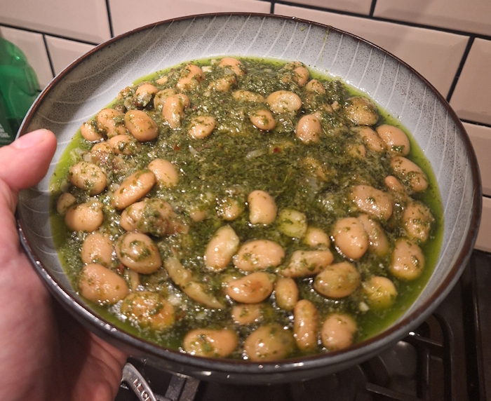
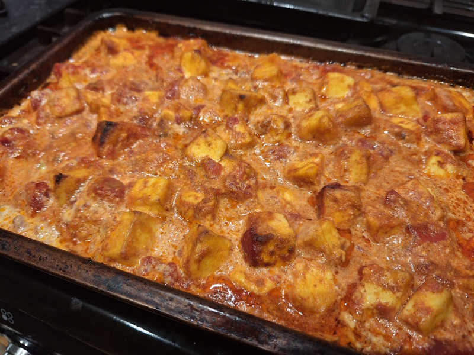
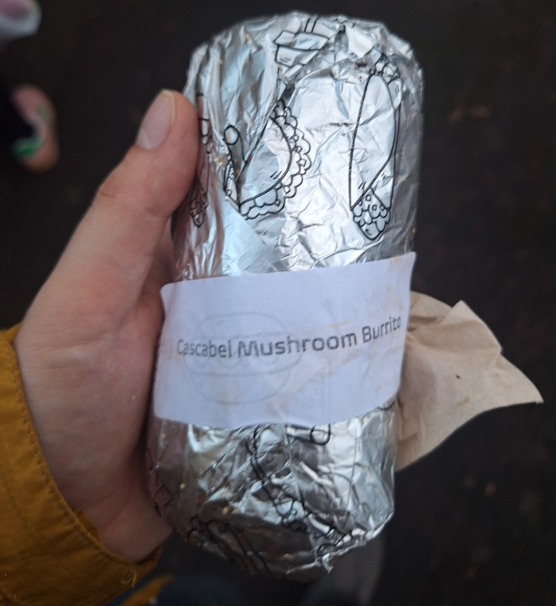
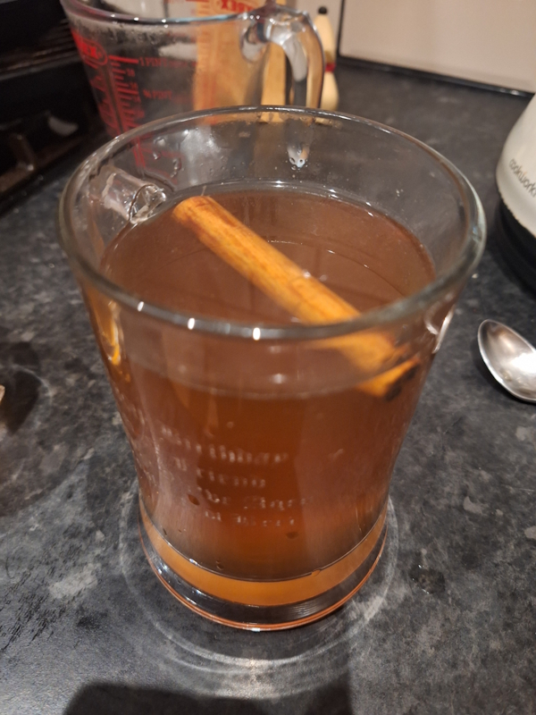

+++
date = '2026-01-18T19:08:55Z'
draft = false
title = "Week 03 - WASSAIL!"
description = 'Getting boozy for a (slightly belated) twelfth night.'
image = 'wassailing.jpg'
+++

# Week Three: Sunday Jan 11th - Saturday Jan 17th

* **Jan 11th**: Beyond meat cheeseburger (from navarro lounge)
* **Jan 12th**: Butter beans in salsa verde
* **Jan 13th**: Leftover beans
* **Jan 14th**: Shitty morrisons oven pizza
* **Jan 15th**: Tray baked butter paneer curry (*new*)
* **Jan 16th**: Leftover curry
* **Jan 17th**: Mushroom burrito (WASSAIL!)

# Jan 11th: Beyond meat cheeseburger

I've officially broken the seal on restaurant meals now, first one was at Navarro lounge. All in all had a nice Cultural™ Sunday out. We visited the Whitworth art gallery, the had a free performance by some students from the RNCM, a trombone quartet. I hadn't appreciated how much spit playing the trombone generates, there was a small puddle around them by the end.

# Jan 12th: Butter beans in salsa verde

One of my favourite Meera Sodha dishes. A bunch of herbs blitzed together caper, vinegar, and garlic. Very easy to make, and hit's you round the mouth with flavour. It get's better as leftovers as well, once the beans have had time to marinate in the salsa verde. It's worth getting a nice jar of butter beans rather than a cheap tin as well.

> Hannah, my recipe tester, has a good poker face. Her job involves bullet-proofing them by inserting comments such as “250g net prepared weight”, which would leave no cook in doubt. Rarely does she break from this and use exclamation marks and excitable phrases – with the exception of this recipe, which came back to me with the note: “The whole family is obsessed!!!” 
-*Meera Sodha*

https://www.theguardian.com/food/2020/jul/18/meera-sodha-vegan-recipe-butter-beans-with-salsa-verde

# Jan 14th: Shitty morrisons pizza
I was out at a boardgame cafe this night, and didn't get back until after most takeaways has shut. It's been a while since I've had an oven pizza, so I made the slightly drunken decision to pick one up from Morrisons on the way back to the flat.

I've been spoilt by all the good pizza restaurants in Manchester, this was terrible.

# Jan 15th: Tray baked butter paneer curry

I swear I do make recipes from people other than Meera Sodha. This one, however, is another of hers. This is the first curry I've ever made where it's all done in a baking tray, with the ingredients going in at different stages. It takes a while to cook the different bits, but you can basically just leave it once it's in the oven. 
It's nice, but I probably won't bother with this one again. There are other Sodha curry's which are much better.

Also, no guardian article for this one that I can see.

# Jan 16th: Mushroom burrito & Wassail!

Wassailing is a Twelfth Night tradition with pagan roots and has been practised in Britain for centuries, although admittedly not so much in Manchester. The purpose is to encourage the spirits into ensuring a good harvest the following season. It takes place in the weeks after Christmas, usually twelfth night, and involves visiting an orchard for singing, dancing, drinking and general merrymaking. You bring pots and pans to bang and make a hulabaloo, hang toast in the trees for the robins, and splash some of last years cider round the base of the trees to encourage growth.

Manchester Urban Diggers having been putting one on for a few years now in the community garden at Platt Fields. It's nice to get together with friends and do something silly. And sing tunelessly. 



There's also a growing of the monarch of the trees, a competition amongst the kids over who can pretend to be an apple the hardest, which is adorable.

I got a mushroom burrito on the way back, from Chorlton market. Pretty good, I haven't made enough use of the market considering it's so close to where I live.

I also was inspired to make wassail the drink. Traditionally it's a hot, mulled cider made with sugar, cinnamon, ginger, nutmeg, brandy or sherry, topped with pieces of toast, and drunk out of a communal bowl.

I skipped out on the bowl and the toast, and fortified it with some whisky instead of brandy or sherry (It was what we had in the house), but it came out pretty good all the same. Andrew and I got a little drunk getting through it.

