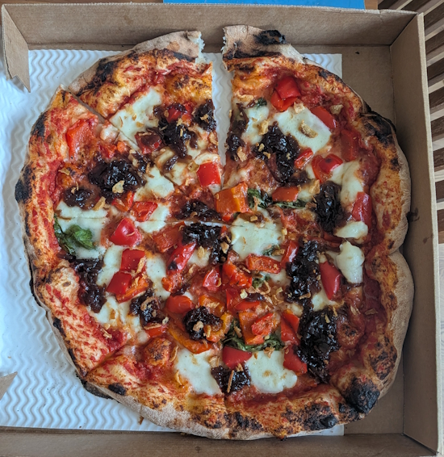
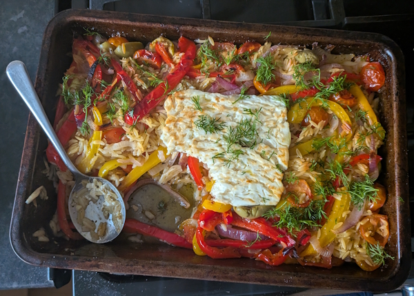
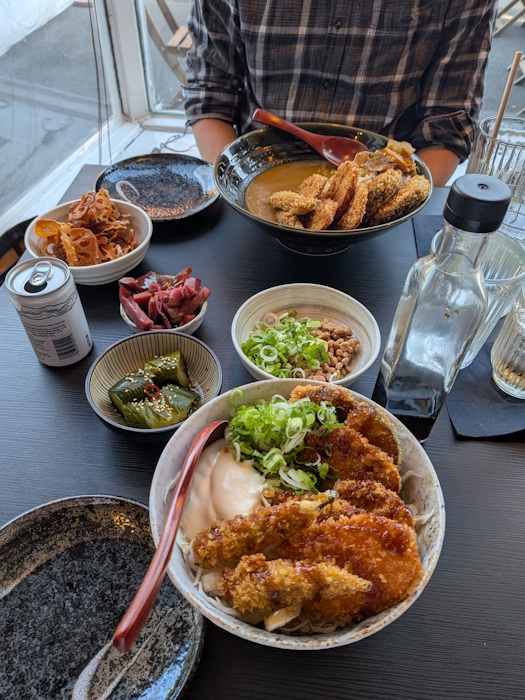
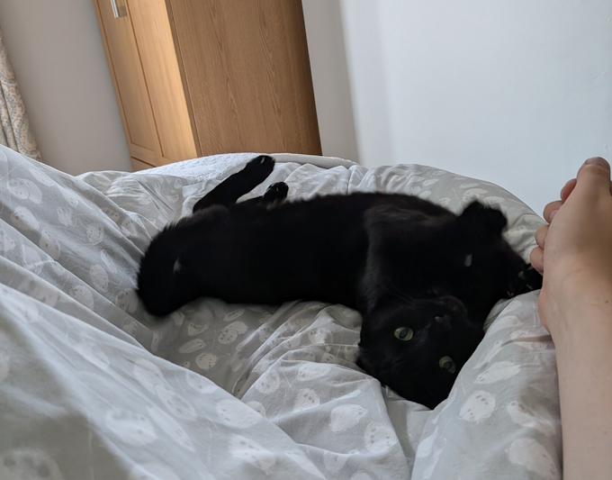

+++
date = '2026-08-15T01:00:56Z'
draft = false
title = "Week 30 - Eating Mediterranean"
description = "A Meera Sodha roasted Greek orzo, a trip to Yane for natto and lotus root crisps, rogue pizza options and olive oil-braised leeks with harissa."
image = 'cover.jpg'
+++

# Week Thirty: Sunday July 19th - Saturday July 25th

* **July 19th**: Pizza
* **July 20th**: Roasted Greek salad with orzo
* **July 21st**: leftover salad
* **July 22nd**: leftover salad
* **July 23rd**: Meal out at Yane
* **July 24th**: Olive oil-braised leeks with harissa and dill
* **July 25th**: Leftover leeks

Apologies for the very long delay on this post, expect to see several weeks worth of entries pop up this weekend as I get through the backlog. Also this was almost a month ago now so some of the details escape me a little.

# July 19th: Takeaway pizza, with onion two-ways

I ordered for the old faithful double zero pizza on the sunday, although I went a little rogue with custom ingredients. Caramelised onion, crispy onion and roast red peppers.

# July 20th: Roasted Greek salad with orzo

It was very warm on the monday, so I decided to make a meera sodha recipe I could just whack in the oven and leave alone. It all came together very easily; you roast red onions, red and yellow peppers, cherry tomatoes, and olives in a tray in the oven for half an hour with some olive oil and oregano until soft and start to turn caramelised. Then mix in a splash of red wine vinegar, boiling water and the orzo, sit a block of feta on top and roast again for another half hour. Easy Peasy.

https://www.theguardian.com/food/2026/jul/18/roasted-greek-salad-orzo-recipe-meera-sodha

# July 23th: Yane

We came to the shocking realisation that Andrew hadn't been to the Japanese restaurant around the corner from us, Yane. Obviously we had to rectify that immediately, but all must bear our cross.

Went for a few interesting side dished this time, including a fermented soybean called natto. They've got a strong funky smell, but all their texture is bizarre, if you mix them round with chopsticks it starts to break down into a sticky, stringy web not too far from melted mozzarella. Also went for a two of their homemade pickles, and lotus root crisps. Main was a hearty dish of tempura vegetables, rice and salad.

# July 24th: Olive oil-braised leeks with harissa and dill

My parents were away over the weekend, and their neighbours were all busy, so I was on cat-sitting duty in their absence. For the friday I went round with a bunch of shopping from the unicorn, and made a recipe from one of their recipe books: How to Eat a Peach by Diana Henry. 

The recipe was for Olive oil-braised leeks with harissa and dill. First you saute leeks and potatoes in olive oil until starting to colour, then add garlic, ginger and cook for a couple more minutes. Pour in boiling stock and harrisa and cook until the potatoes are soft and the liquid has reduced. Add in chopped olives, preserved lemons and dill.

I forgot to take any pics of this while I was making it but SPOILER ALERT I served it when my friends came round for a bbq on the sunday, so you might spot it on a plate in next weeks entry. Since I forgot to take a picture, here's the family cat, Captain, lounging about on my bed.

