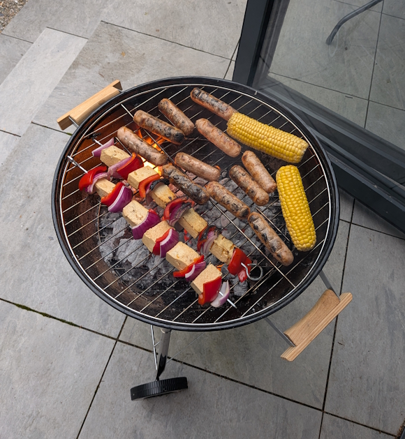
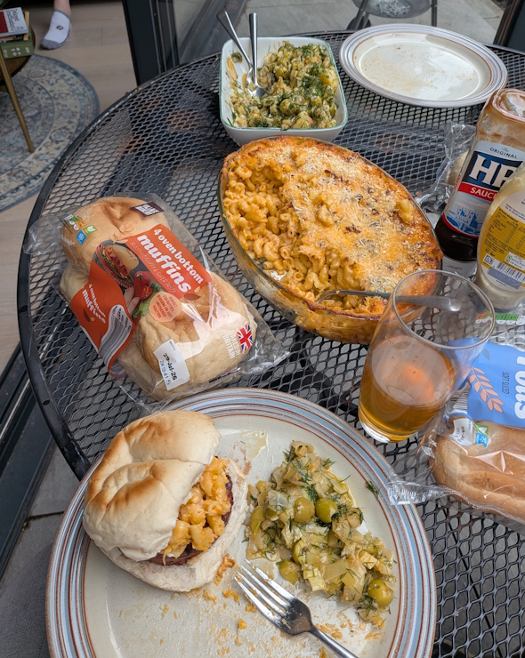
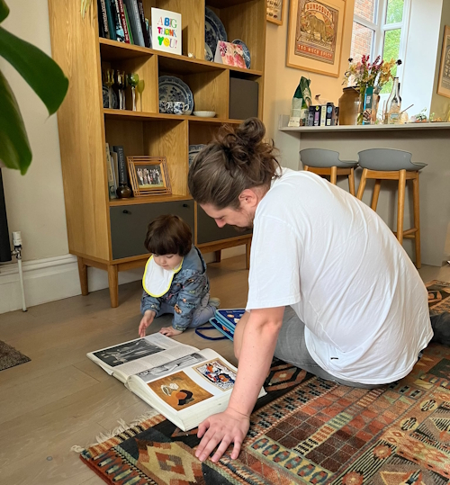
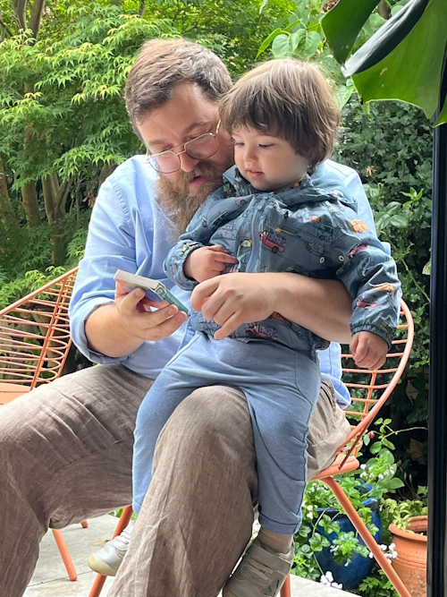
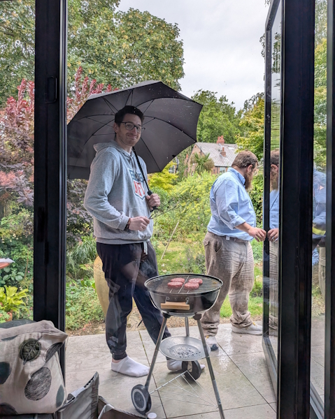
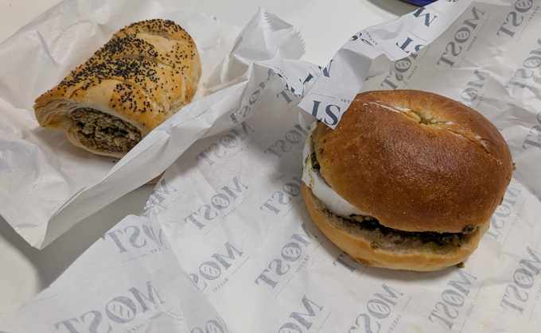
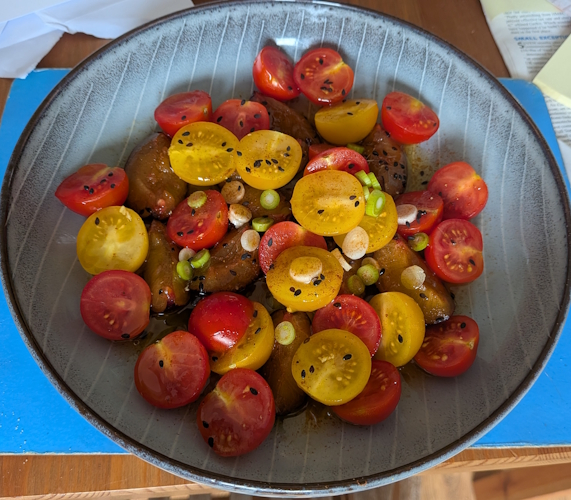
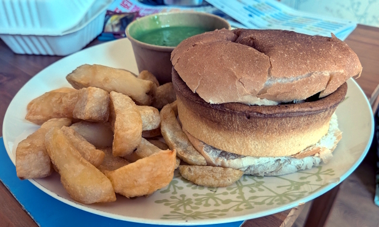
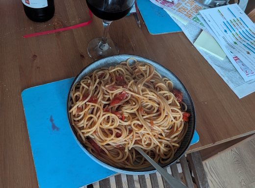
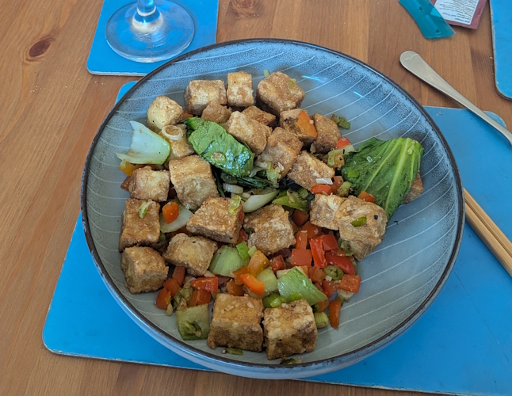

+++
date = '2026-08-15T04:00:56Z'
draft = false
title = "Week 31 - Breaking out the BBQ"
description = "A big veggie BBQ in my parents' garden (rain and all), an Ottolenghi tomato and plum salad, and putting the Wigan kebab on blast"
image = 'cover.jpg'
+++

# Week Thirty-one: Sunday July 26th - Saturday August 1st

* **July 26th**: Big veggie BBQ
* **July 27th**: Leftover BBQ
* **July 28th**: Goats cheese, walnut and pesto bagel, and a veggie sausage roll
* **July 29th**: Tomato and Plum salad
* **July 30th**: Wigan kebab
* **July 31st**: Cherry tomato spaghetti
* **Aug 1st**: Andrew's stirfry

# July 26th: Big veggie BBQ
As mentioned last week, I was staying at my parents house over the weekend to look after their cat Captain, which gives me a perfect excuse to invite some friends round for a BBQ. It's honestly not something I'm in the habit of doing a lot, since in my flat there's only a slightly depressing gravel yard filled with loose wood, but since my parents garden is so beautiful it could not be better for BBQs.

I picked up a few veggie burgers/sausages and some corn on the cob, as staple british BBQ fare. I also marinaded some cubes of tofu in a mix or orange juice, brown sugar and soy sauce, then making tofu swekers with slices of red pepper and onions.

For sides, I had a lot of leftover Braised leek and potato harissa salad. I also did a baked macaroni cheese, made with a mornay using bits of cheddar and smoked red leicester, and some grated parmesan on top. 

Andrew brought along some very good mezze dips, and weaver had a couple of meat burgers for him and Rick. All in all a proper feast!

Highlight of course was little baby Alex. It took a few hours but we managed to get him to learn my name, although the J could use some work. Sounds more like 'Osh, but that's just kids these days, don't want to put the effort in.

And of course, is it even a BBQ in England if there isn't a shower half way through?

# July 28th:  Goats cheese, walnut and pesto bagel, and a veggie sausage roll

I picked up dinner from Altrincham while I was in the office since I was feeling a little lazy. There's a bakery there called Most which do very good bagels and pastries. My default order is their goats cheese, walnut and pesto bagel, and I picked up one of their veggie sausage rolls since I was feeling extra peckish.

# July 29th: Tomato and Plum salad

The unicorn had a bunch of plums going, so I tried my hand at an Ottolenghi recipe I saw a while ago for tomato and plum salad.

https://www.theguardian.com/lifeandstyle/2016/oct/01/tomato-recipes-plum-salad-clam-mussel-pasta-stuffed-courgettes-yotam-ottolenghi

Chop up your tomatoes and plums, along with spring onions. Make a dressing from sugar, vinegar, soy sauce, oil, ginger, garlic, orange zest. LEave to infuse for a bit then pour over your tomatoes and plums with some sesame seeds. I've skipped a few steps from Ottlenghi's recipe but the gist is there. Fruit like plums and tomatoes work surprisingly well together in a salad, I'll be adding that to my repertoire. 

# July 30th: Wigan kebab

After the elevated meal yesterday I had to bring it back down, with a chippy tea. I noticed there had a good selection of veggie pies, so I got a cheese and onion pie, bap, mushypeas and chips to make my own wigan kebab. I don't think I've ever bothered before, and honestly I won't again. Chip butty I understand, but I just don't think the pie gains anything from being wrapped in bread. I mean I hate to state the obvious but it's already wrapped in pastry. Wigan, consider this my official call-out.

# July 31st: Cherry tomato spaghetti

Gearing up for heading off for a hiking holiday in Switzerland next week, so using up some of the bits still in my pantry. I had about half a punnet of cherry tomatoes from the salad going, So I fried them up with some garlic and tomato paste, until the cherry tomatoes started to break down. I mixed in a bit of pasta water from the spaghetti and voila, a very easy and a bit boring tomato pasta for dinner. I had some wine with it to make it all feel a bit more fancy.

# Aug 1st: Andrew's stirfry

I'd been busy on the saturday, so had been planning on just ordering a takeaway, but Andrew very kindly offered to share some of the tofu stirfry he'd made. I always appreciate having a meal cooked for me, but being suprised by one makes it taste even better.

