+++
date = '2026-09-09T14:30:56Z'
draft = false
title = "Week 32 - Grand Swiss Adventure Part 1"
description = "A week of hearty cheese, potatoes, and excellent views as we set off for the Swiss Alps."
image = 'cover.jpg'
+++

# Week Thirty-two: Sunday August 2nd - Saturday August 8th

* **Aug 2nd**: Lounge Falafel mezze bowl + macaroni cheese
* **Aug 3rd**: Quesadilla & guacamole
* **Aug 4th**: Pesto pasta
* **Aug 5th**: Raclette, potatoes and salad
* **Aug 6th**: Pizza, and cheese and dips
* **Aug 7th**: Mountain hut meal?
* **Aug 8th**: Vegetable risotto

# August 2nd: Panadero lounge Falafel mezze bowl + macaroni cheese

The week started off with another trip down to macclesfield, to help Rick and River with a bit more painting in their new place. We took the opportunity to have a bit of a wander around the town while we were there, and stopped off at their local Lounge (this one's called Panadero) for some drinks and dinner. I went for a pulses-forward bowl of falafel, giant cous cous, hummus and salad, but I made sure to offset any potential health benefits with a big side bowl of macaroni cheese.

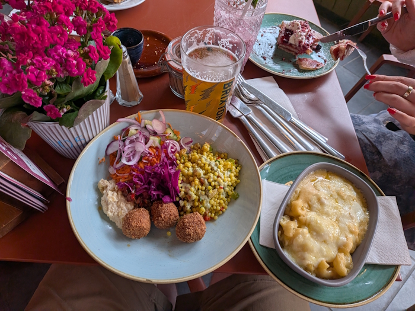

# August 3rd: Quesadilla & guacamole

Kept it very simple on the monday, using up a couple of leftover wraps, bits of cheese, and a tin of black beans I had lying around, in preparation for leaving for switzerland for a week. Guac was shop bought with some leftover coriander chopped up and stirred in.

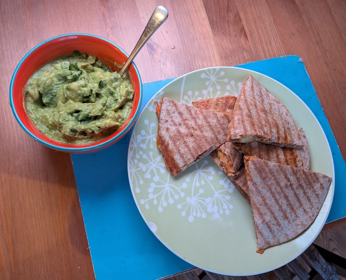

# August 4th: Pesto pasta

I found out I could order pasta from Tre Chiccio, the restaurant we went to with work [a few weeks ago](/posts/week-29/#july-16th-spaghetti-romana-at-tre-chiccio), so I treated myself to a pesto pasta from them.

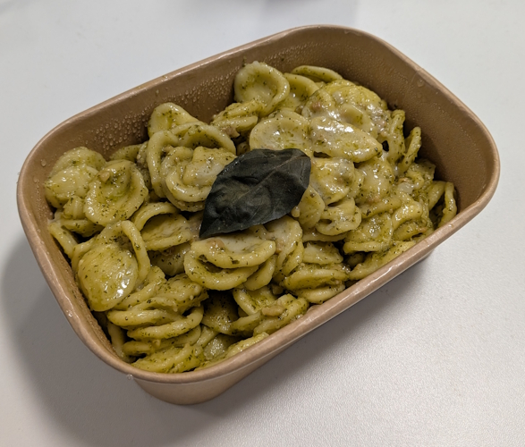

# August 5th: Raclette, potatoes and salad

Wednesday was an early start, getting to the airport and meeting up with mum for our flight out to Geneva. We ended up getting stuck for over an hour in the queue at arrival, due to the new fingerprint scanning they've introduced for non-eu residents. There was a moment of panic where we almost missed our connecting train, but a nice security guard let us duck under a rope and cut the queue. After a brisk run through the airport we made it onto the train with minutes to spare.

Special shout out to the swiss train app, genuinely incredible. We got a little worried as we had a train transfer with a 5 minute window, however the app shows you a map of the station, exactly where your train will be arriving and the next one leaving, and a little dotted route of where exactly it is you need to walk to get to your platform. The trains obviously were on time to the minute. Why can't we have this in England!

First stop of the strip is in a place called lauterbrunnen. We didn't have the best first impression, as it's part of the junfrau unesco world heritage site the place was rammed with other tourists and we had to duck a few swinging selfie sticks. It quietened down a little in the evening and got a bit more bearable.

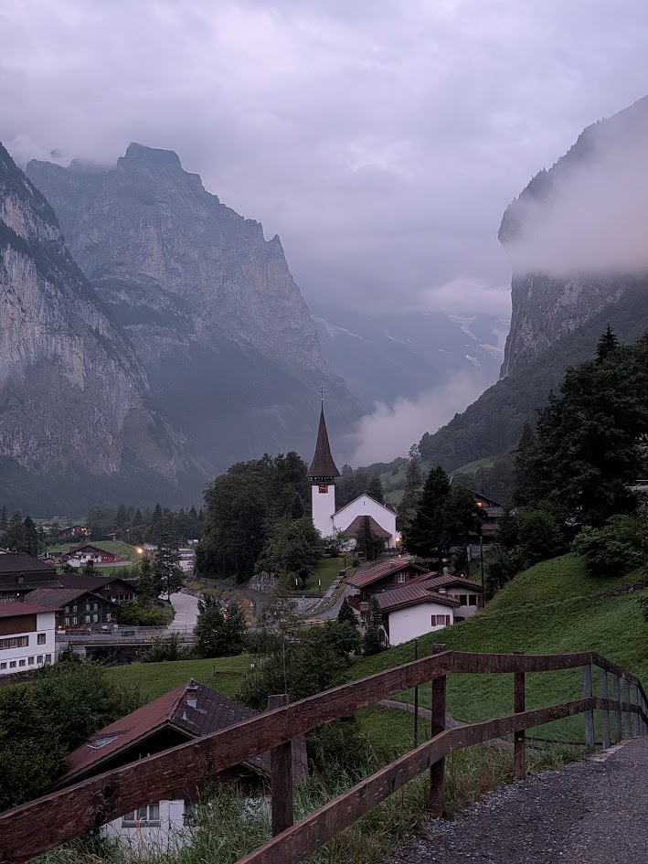

The place we were staying did food as well, so the meal that night for me was a raclette with potatoes. I'd expected from the name it would be potatoes covered in melted cheese, but weirdly it was just raclette melted directly onto the plate, with some pickles and boiled potatoes on the side. Mum went for the superior choice of Älplermagronen, Alpine herder's macaroni. You'll notice over the course of this holiday that swiss food is generally hearty, and features a lot of cheese and potatoes. 

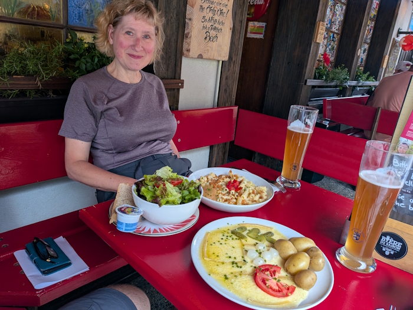

# August 6th: Pizza, and cheese and dips

We decided to acclimatise by taking a short walk around lauterbrunnen valley on the Thursday. First stop was Trümmelbach, getting there nice and early before all the tourist buses started to arrive. It's an incredible place, 10 waterfalls which cut through the mountain, most of them hidden away in caves. They've added walkways so you can follow the waterfalls all the way up and into the mountain. 

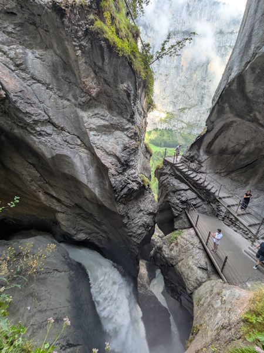
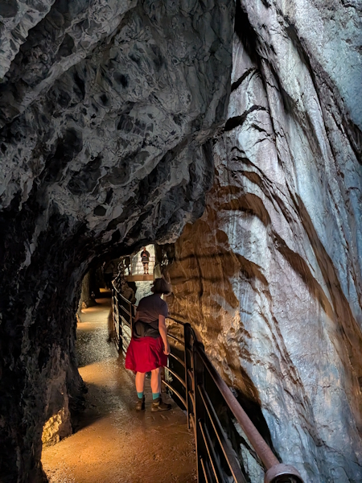

We picked up lunch at the cafe at the waterfalls, I went for a brie and walnut sandwich with a slice of apricot cake. Got to keep the strength up for the next few days of walking of course.

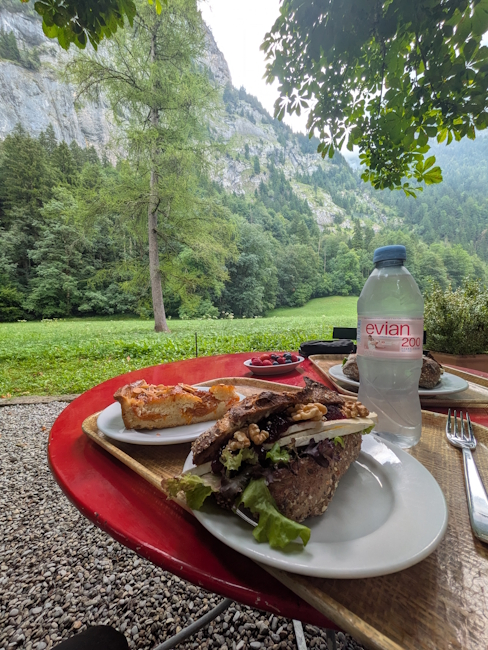

After that we explored a bit more of the valley floor before turning round and getting the cable car up to our next accommodation, a very bohemian hostel in Gimmelwald. Vibe wise it's a bit more like paragliders, yoga classes and rock climbing, compared to the straight mountaineering huts we'd be staying in the rest of the trip, which made for a fun contrast.

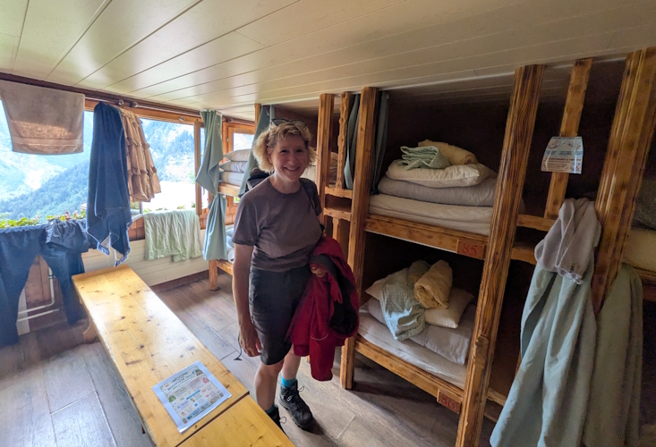

We spent a nice evening having a few drinks and with pizza, and a sharing platter of dips and cheeses. It was just a really nice vibe, and the food was surprisingly good. Leant a bit more into the vegan health concious, as opposed to the meat and potatoes of most of the german part of the alps.

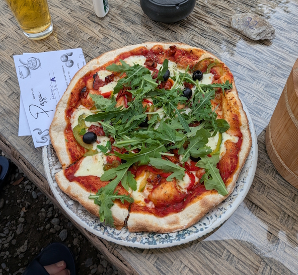
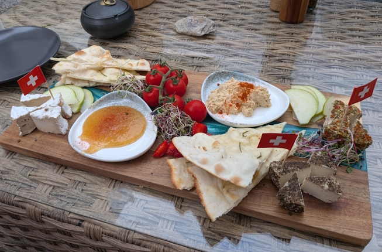

There was even live music, a canadian singer was making a stop off on his european tour. It seems like they have musicians stopping off there pretty regularly, I can't imagine they make a lot of money as there was only one hostels worth of people. It must be mostly for the experience of playing a gig up in the mountains, and some probably very impressive looking promo shots for their instagram.



After a very pleasant evening it was off to bed in our vaguely coffin shaped bunks, ready for the first serious day of hiking on the friday.

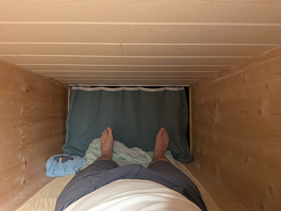

# August 7th: Mountain hut meal?

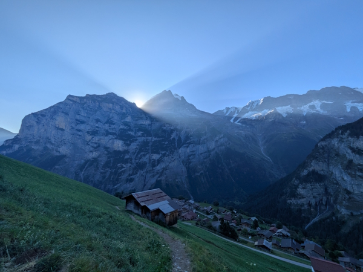

It was an early start the next day, leaving as the dawn was breaking over the mountains. This first day would be our longest overall, climbing a total of 1565 meters (1 and a half Yr Wyddfa/Snowdon), up over Sefinafurgga pass and to a mountain hut on Gspaltenhorn.

This is a route I'd tried to do once before with Rick, but we'd been thwarted by heavy snow.

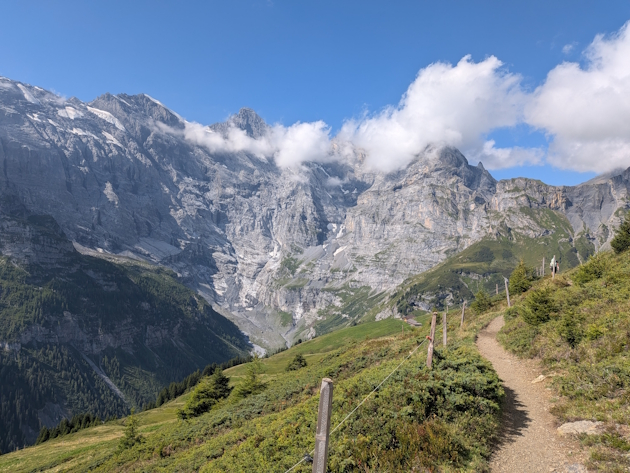
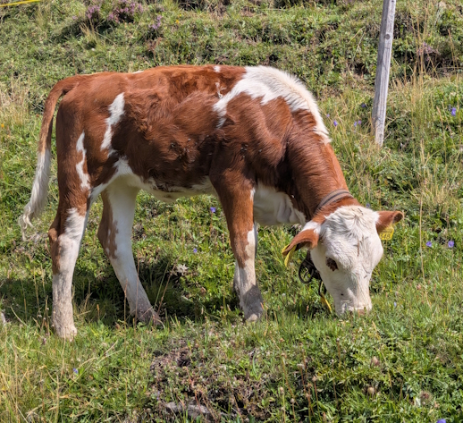

It's a glorious morning, incredibly sunny and hot weather. We handily stopped by another mountain hut around lunch time called Rotstockhütte, where we had some lovely leek and potato soup, with a bit of local cheese. They also had milkshakes on offer, again made with milk from the local cows. I'm not sure if it was the freshness or the heat but god damn was that one of the most satisfying banana milkshakes I've ever had.

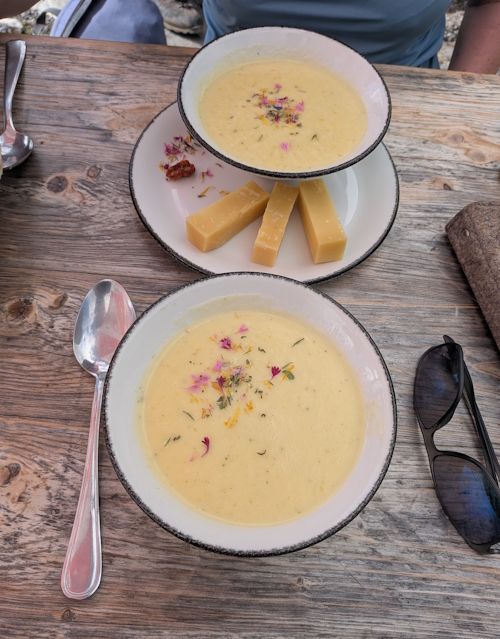
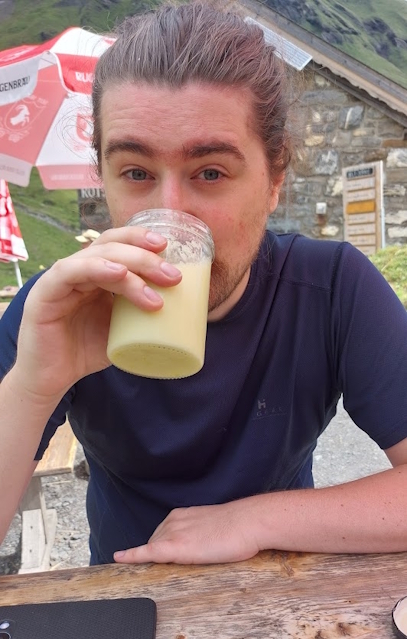

It's a long journey up and over the pass, and the lovely alpine meadows we were walking through in the morning start to disappear for more rocky terrain and a thick dense layer of clouds. 

Having now done the walk in dry but cloudy conditions, I'm reassured that we made the right decision to abandon the walk the last time Rick and I were here. It's hard enough with low visibility, but trying to do this while scrambling through snow would have been fatally stupid.

The hut itself is very different to the hostel from last night. No running water obviously, and fixed meal times where everyone who's staying there eats together.

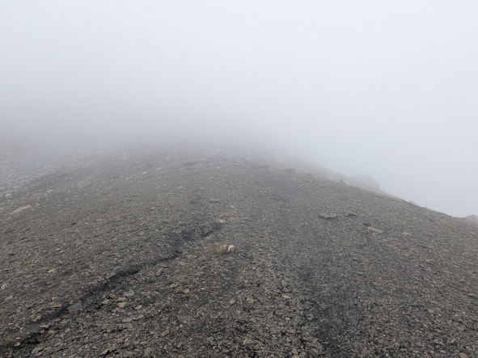
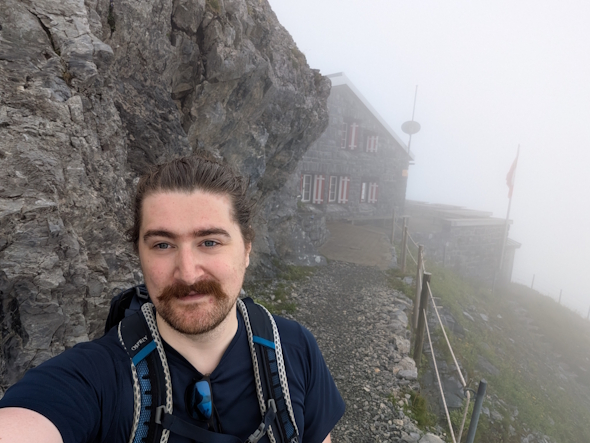

After the long day of hiking I completely forgot what it was we ate for dinner that night in the hut. I remember having a nice chat with a dutch family and a very impressive american dude (he'd been running the mountain trails) who were at our table, I think it was three courses. Probably a soup and some sort of pasta? Lost to the sands of time.

# August 8th: Vegetable risotto

Next day was a shorter walk, only climbing 1000 meters this time, but it packed that climb all into one final steep ascent rather than spread out across the day.

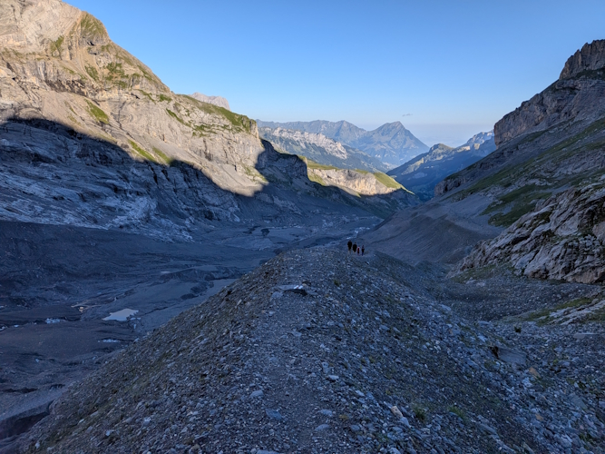

We got luckier today with visibility, all the clouds which had hung over the valley cleared and we got some incredible views. No fancy huts to stop for lunch this time however, we had a packed sandwich but to be honest between the exertion and the heat we didn't feel like eating much.

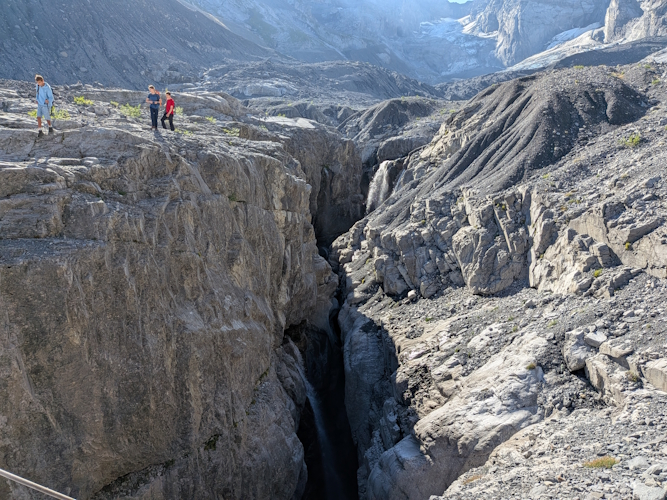
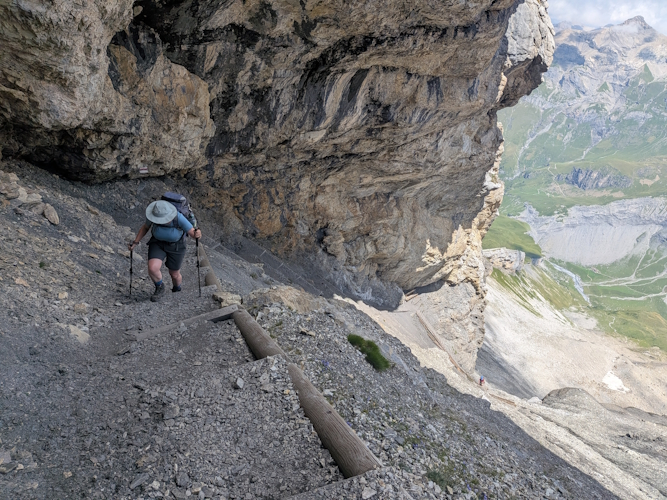

That final ascent really was punishing, but nice to be up and over into a new valley. This next place we were staying would be the highest hut of the trip, bluemlisalphutte at nearly 3000 meters. By the time we got there we were ready to sit down and have a well deserved gallon of sweet tea, while watching some mad bastards throw themselves off the mountain next to us.

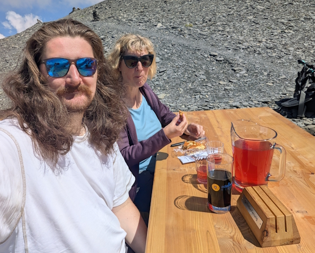
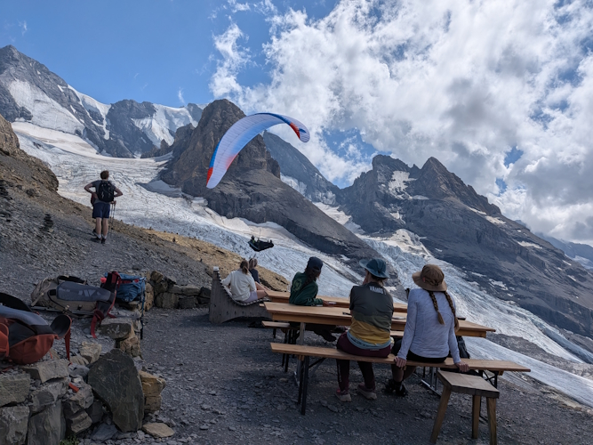

Dinner in this hut was similar to the last, in that it's a set menu that everyone eats together. This time we were next to another dutch family, although a little younger, and a Chinese guy who had swiss citizenship who was trying to stay in every hut across the country. It was interesting listening to him talk about language discrimination in switzerland, apparently in some of the more remote parts if you don't speak german they'll refuse to host you. Apparently there were a few moments where he'd book in german over the phone, and then the hosts would double take when he turned up and looked obviously chinese. It's a funny place switzerland, very modern in some ways (like the incredible trains) and very old fashioned/conservative in others. I mean, there's a canton in switzerland called Appenzell Innerrhoden which didn't let women have the vote until 1991!

The meal was again typical swiss fare. A soup made more hearty and bulked out with some grain in it, and a vegetable risotto. I ended up wolfing down several portions of the risotto after all the exercise of the day.

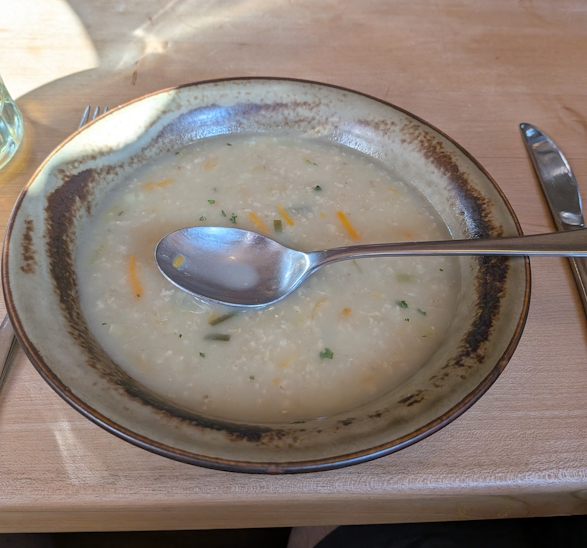
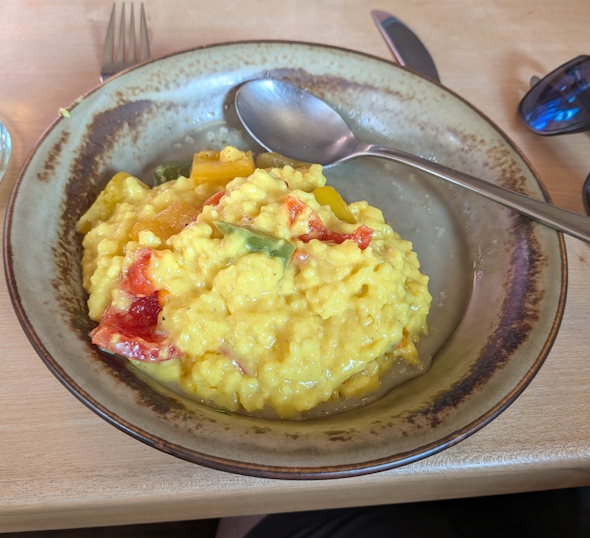

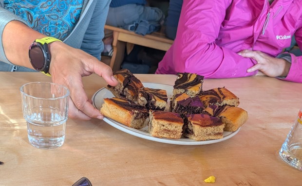

Dessert was a marbled brownie thing, a little dry to be honest but welcome all the same.

After the meal we had a bit of a wander down to the glacier, near the hut, and then watched the sun set over the mountains. Bluemlisalphutte is well situated with views down several valleys, so it's a glorious sight, pictures can't really capture it. We did get this nice selfie though with the sun setting and the hut in the background.

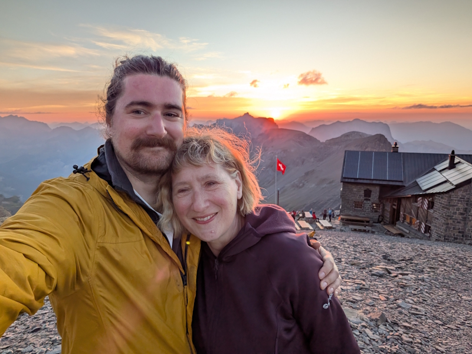