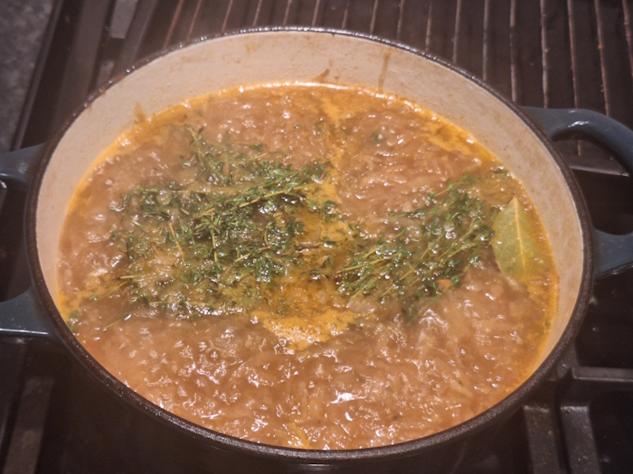
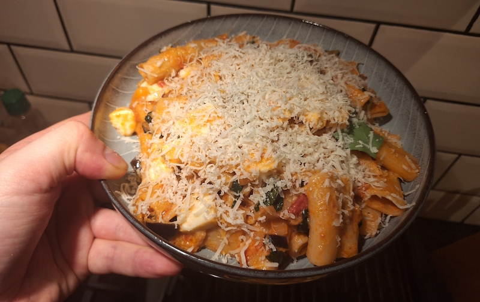
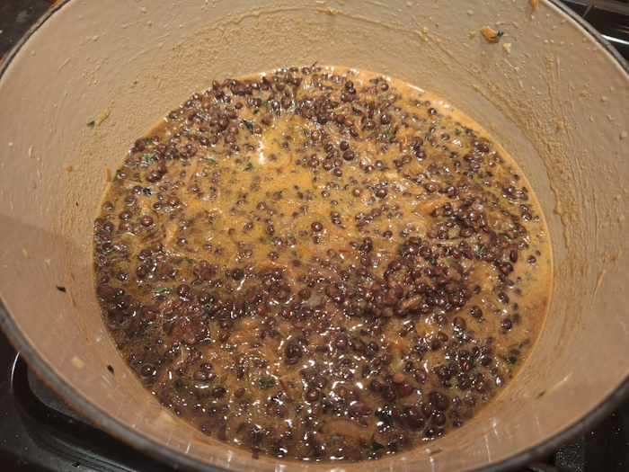

+++
date = '2026-01-25T20:01:03Z'
draft = false
title = "Week 04 - Good soup"
description = 'I drink a lot of french onion soup.'
image = 'onions.jpg'
+++

# Week Four: Sunday Jan 18th - Saturday Jan 24th

* **Jan 18th**: French onion soup (*new*)
* **Jan 19th**: French onion soup
* **Jan 20th**: French onion soup (I've got to stop making so much soup)
* **Jan 21st**: Aubergine pasta
* **Jan 22nd**: Leftover pasta
* **Jan 23rd**: Puy lentils (*new*)
* **Jan 24th**: Pumpkin/sweet potato katsu from Gyoza Wang

# Jan 18th: Very untraditional french onion soup
I'm endeavouring this week to not just cook Meera Sodha recipes. This one come's from Georgie Mullen's "What to cook & when to cook it".
She's the one who named it 'untraditional', I'm guessing because it's got butter beans and kale mixed in. It feel's pretty magical, this recipe. You start by cooking down 6 onions with some balsamic vinegar and sugar for 40-50 minutes, until they basically become jam. Add in white wine, soy sauce, herbs. Really deep flavour, delicious, especially this time of year.

In classic Josh fashion, I've underestimated quite how much this recipe make however, so I spent three days getting through it all, including some lunches!

# Jan 21st: Aubergine pasta

This one is a Kidd family classic. I'm not actually sure where it's from, almost certainly a Jamie Oliver book we had growing up. I've probably been eating this for almost 20 years now. 

As I remember it:

Cube an aubergine and salt it over the sink to draw out moisture. After about half an hour, dry them off and then gently fry in a lot of olive oil. After they've cooked for a bit, add a chopped onion and garlic, continue to cook until onion is soft. Add in a tin of chopped tomatoes and a splash of balsamic vinegar, some chilli flakes, salt and pepper, and the chopped stalks of a handful of basil. Simmer for 20 minutes then pour in some cream. Take it off the heat and mix it into your pasta, then tear some mozzarella in. The heat of the pasta will be enough to gently start to melt the cheese. Top with the basil leaves and a grating of parmesan.

# Jan 23rd: Miso onions & Puy lentils

This is another Georgie Mullen recipe. Apparently, her partner James invented it and it's the best meal he ever made her. 
With a recommendation like that I had to try it. It actually pretty easy to put it all together. It uses a bag of pre-cooked puy lentils which saves a bunch of hassle. 

After cooking down the onions, this time with thyme and sugar, you mix in your cooked lentils, miso paste, and stock. Grate over some cheese and bake in the oven. It is pretty hearty, but I think I added a bit too much liquid, I'll have to remember to hold back on the stock next time.

# Jan 24th: Pumpkin/sweet potato katsu from Gyoza Wang

We finally managed to get the D&D gang back together for a night of defending a town from Hob-goblins, seven samurai style. We had takeout from a place I've not been to before, Gyoza wang. I had a Sweet potato katsu curry, and swapped a bit with Katie for some of her pumpkin katsu curry. The pumpkin was better tbh.