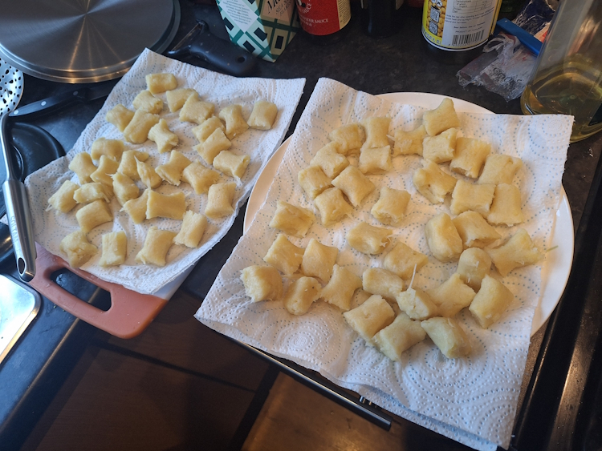
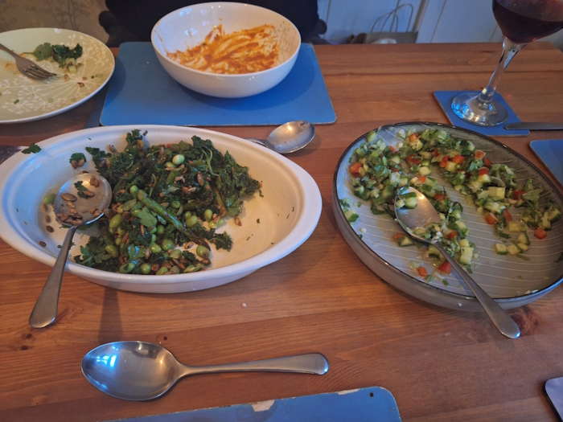
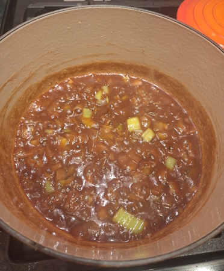
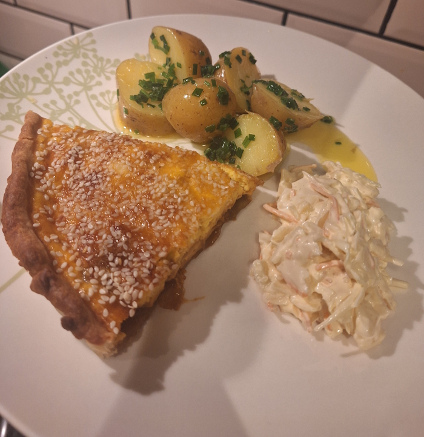
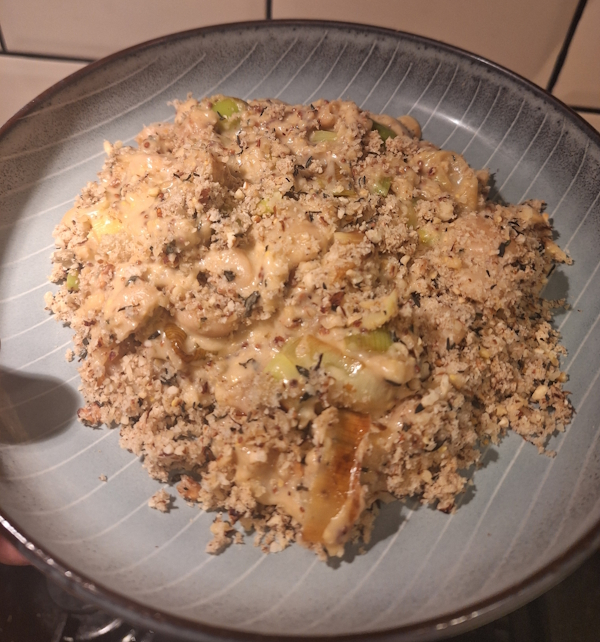
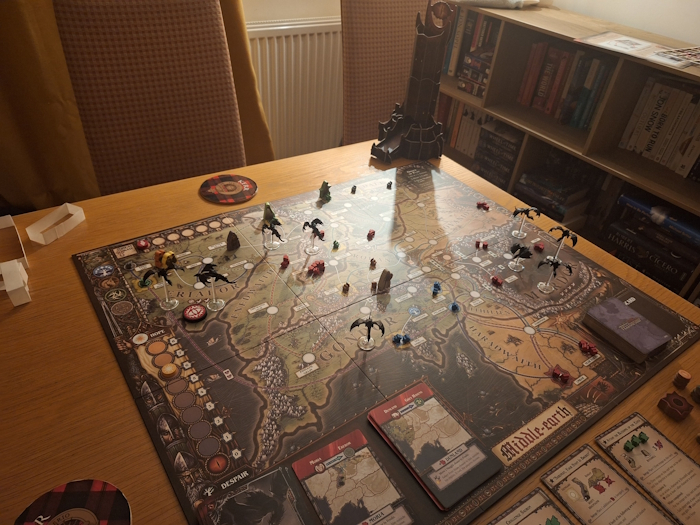

+++
date = '2026-02-01T08:08:55Z'
draft = false
title = 'Week 05 - Flan and Fam'
description = 'I cook a bigger meal for my family, and I make a flan.'
image = 'flan-cover.jpg'
+++

# Week Five: Sunday Jan 25th - Friday Jan 30th

* **Jan 25th**: Parsnip Gnocchi with Salads
* **Jan 26th**: Leftovers
* **Jan 27th**: Miso leek flan (*new*)
* **Jan 28th**: Leftover flan
* **Jan 29th**: Leek, thyme & butter bean gratin (*new*)
* **Jan 30th**: Leftover gratin
* **Jan 31st**: Meal out at Skof (on another page)

# Jan 25th: Parsnip gnocchi with mustard-marinated kale, and spring onion salad

On the sunday my parent's came round to book out flights to Switzerland later in the year. Andrew and I pulled out all the stops making a meal for us all. I went with the Parsnip gnocchi I made a couple of weeks ago, with two of Ottolenghi's salads on the side.

1) Mustard-marinated kale with asparagus
Roast some sunflower and pumpkin seeds in maple syrup, then leave to crisp up.
Next you have to take kale, mix it with with more maple syrup, olive oil, vinegar and mustard, then massage it with you hands for a minute. Kales usually tough, but something about the massage soften it up so it's nice to eat raw. Leave to marinate for half an hour.
Fry up some asparagus then chop it up, defrost some edamame, then toss everything together with some tarragon and dill.

2) Spring onion and herb salad
Mix together spring onions, baby cucumbers, a green pepper, mint, coriander, with a dressing of mashed ginger, lemon juice and olive oil.

# Jan 27th: Miso leek flan

This one's not from a cook book, but I spotted it on guardian food and thought it sounded good. You cook down leeks in miso and honey until they go jammy, make your pastry, then layer the leeks with an egg and milk mix. You're supposed to add dashi granules but I couldn't find anywhere selling them so I added a splash of soy sauce instead.

I ate it with a few potatoes (in butter and chive) and some coleslaw.

https://www.theguardian.com/food/2026/jan/20/miso-leek-custard-tart-recipe-fennel-slaw-kenji-morimoto

# Jan 29th: Leek, thyme & butter bean gratin

Another from Georgie Mullen's "What to cook & when to cook it". I'm really liking this book, the Winter section has some hearty meals which are perfect for this time of year. Lots of leaks, butter beans, slow cooked onions. It's nice to feel like I'm eating a bit more seasonally.

This one packed quite a mustardy punch as well, after I misread tsp as tbsp. Honestly it still works, I like a punchy flavour.

# Other than food

Played about half of a new boardgame at Rick and River's house: The fate of the fellowship.

It took a while to set all the pieces up, but it's actually pretty intuitive once you start playing. You each control two characters, and you've got to stop the slowly advancing red cubes (forces of Sauron) from making their way across the board to attack the strongholds, while also achieving a few objectives and ultimately throwing the ring into the fires of mount doom. 

