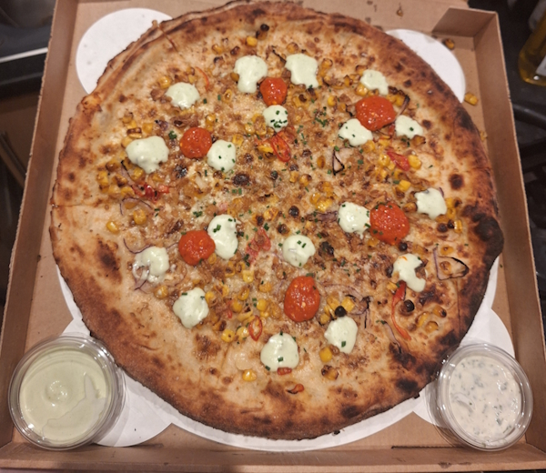
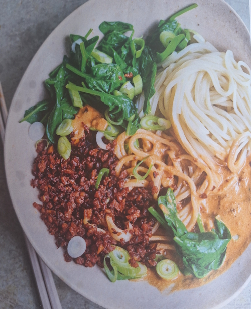
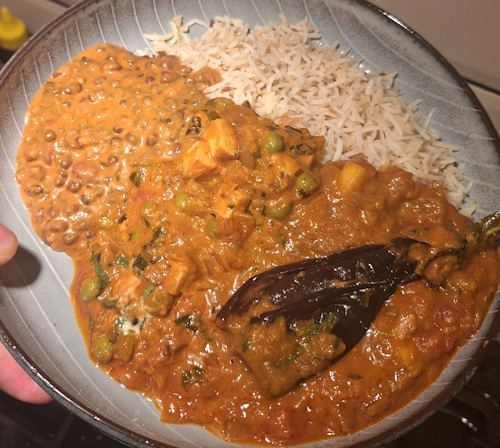
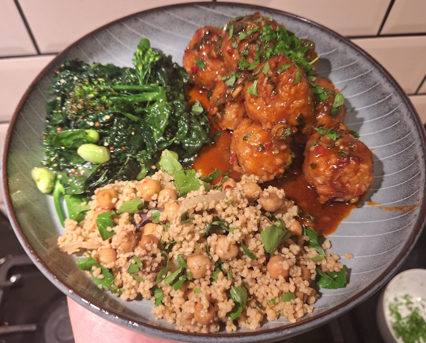
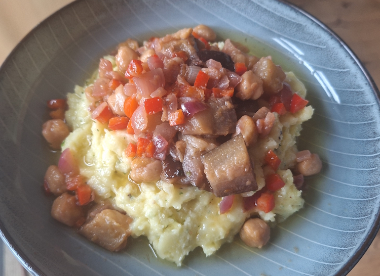

+++
date = '2026-02-08T14:39:03Z'
draft = false
title = "Week 06 - Veggie meatballs & mash potato"
description = 'Its a disappointing start to the week, but ends with a very good *new* recipe for Spiced bulgur balls, and a Dennis Cotter mash potato.'
image = 'bulgur.jpg'
+++

# Week Six: Sunday Feb 1st - Friday Feb 7th

* **Feb 1st**: Corn supremacy 
* **Feb 2nd**: Sesame noodles with spicy fried soya mince (*new*)
* **Feb 3rd**: Takeaway curry
* **Feb 4th**: leftover curry
* **Feb 5th**: Spiced bulgur balls with pomegranate (*new*)
* **Feb 6th**: leftover bulgur balls
* **Feb 7th**: Roast garlic & fennel mash with lemon-braised chickpeas & aubergine

# Feb 1st: Nell's corn supremacy pizza (slightly burned)
Pretty much any meal after Skof was bound to be a little disappointing, so I opted for a takeaway pizza from Nells. 

Honestly? It wasn't one of their best. 

Corn supremacy is my usual go to; Miso corn, Lancs cheese, garlic cream, red onion, chives, crispy onion, chilli, jalapeno crema.
This one however was a little too burnt around the edge. You're on notice Nells, better buck your game up.

# Feb 2nd: Sesame noodles with spicy fried soya mince

I messed this one up a little. It's a meera Sodha recipe, from Dinner, and from the picture it's meant to be quite a runny tahini based sauce. I left it a little too long, so it turned into more of a thick paste and wouldn't mix well into the noodles and soya mince. The flavours worked well, it was just too clumpy, which is never a texture you want your food described as.

I also forgot to take a picture, so you'll have to make do with a picture from the book of what it should have looked like.

# Feb 3rd: Curry from Indian Tiffin Room

I was feeling a little under the weather and sorry for myself on Tuesday, so I ordered in another takeaway, this time a curry. 

Or, I guess I should say three currys.

These ones came from the Indian Tiffin room: a Dal Makhani; a Methi Mutter Malai, which is paneer in a sauce of fenugreek leaves and green peas; and a Mango and Aubergine masala. I don't think I've ever had mango in a curry before, but the sweetness worked really well. Might be one to try and replicate myself.

Unfortunately my meager food photography skills couldn't make this photogenic, but trust me it was delicious.

The benefit of over ordering is I have a few lunch and dinners sorted as well.

# Feb 5th: Spiced bulgur balls with pomegranate

Another guardian recipe, this one from Sami Tamimi. Apparently the bulgur balls are known as Kbeibat, and come from syria. Honestly, I can not recommend this one highly enough. I've had a fair few disappointing 'fake meat' vegetarian meatballs over the years, but this hits exactly in the way I'd want a veggie meatball to hit. It's dense, right about of chewy, good flavouring because it's not trying to be meat, soaks up the sauce it's in. Will absolutely be making these again. 

Actual process isn't too complicated either. Mix Olive oil, spices and bulgur wheat in bowl with some boiling water, then leave for 20 minutes like you would with couscous. Mix in a bit of flour, roll into balls, and boil. The sauce isn't cooked, you just mix it together and pour over the Kbeibat.

I made a salad with some leftover kale, and a bit of couscous salad I bought from the Unicorn for my lunch.

https://www.theguardian.com/food/2026/feb/03/spiced-bulgur-balls-pomegranate-fennel-salad-recipe-sami-tamimi

# Feb 7th: Roast garlic & fennel mash with lemon-braised chickpeas & aubergine

Riding high off the success of the Kbeibat, I  decided to venture back into the Dennis Cotter 'For the love of food' cookbook.

This is a recipe I have made before, and it's simpler than a lot of his recipes, but still more involved than the average mash potato recipe. 

It involves roasting two heads of garlic (that's right, heads not cloves!), then blitzing them into some butter and milk to make a garlic paste. Steam the potatoes, gently fry the fennel, and chop up some parsley. Mash the potato with the garlic paste, fold in the fennel and parsley.

You've also got to cook off onions, red pepper, chickpeas and aubergine, before braising in white wine and lemon juice. All in all, quite a lot of steps. Luckily I enlisted the help of a Sous Chef, Andrew, for this one.

Weirdly, the two whole heads of garlic didn't add as much of a garlic taste as I'd have thought. I think roasting mutes the flavour a lot. Next time, I've got to remember to up the ratio of garlic to potato, could do with more of the fennel as well.