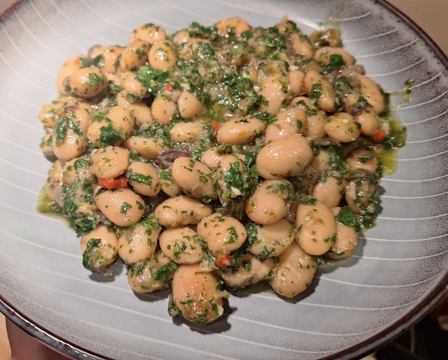
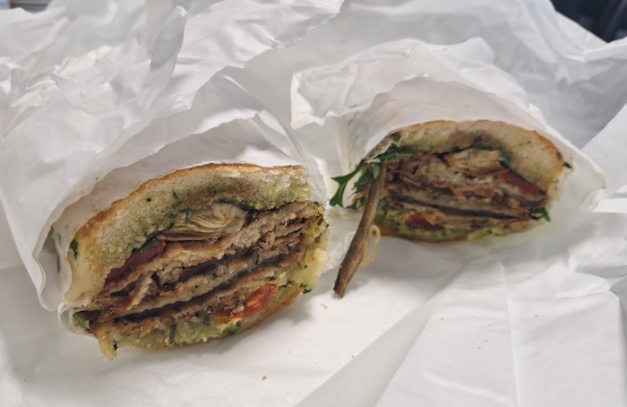
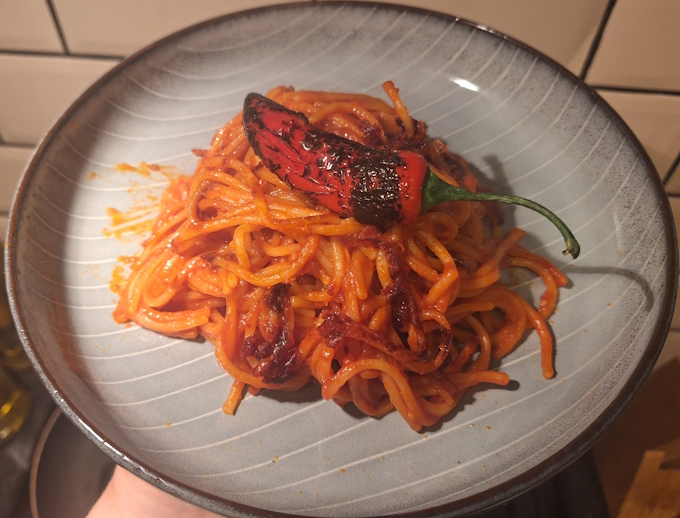
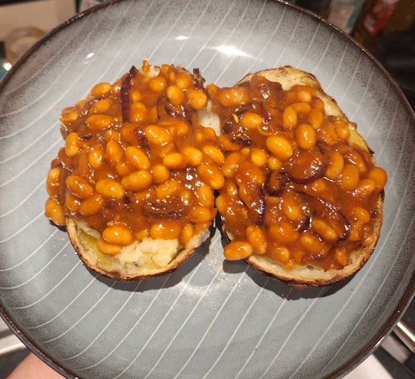
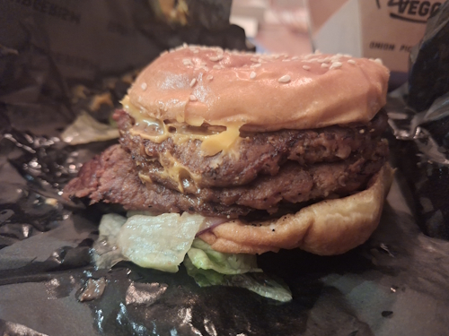

+++
date = '2026-02-15T11:00:06Z'
draft = false
title = "Week 07 - Cult sandwich & crispy spaghetti"
description = "Looking back while writing this, I hadn't noticed how many beans I ate."
image = 'pasta-cover.jpg'
+++

# Week Seven: Sunday Feb 8th - Friday Feb 14th

* **Feb 8th**: Leftover roast garlic & fennel mash
* **Feb 9th**: Butter beans in salsa verde
* **Feb 10th**: Aubergine Muffuletta from Fat Pats
* **Feb 11th**: Leftover butter beans
* **Feb 12th**: Leftover butter beans
* **Feb 13th**: Spaghetti all'assassina
* **Feb 14th**: Jacket Potato & masala baked beans

# Feb 9th: Butter beans in salsa verde

This is my second time making it this year, and it's still one of my favourite Meera Sodha recipes. Blitz a heap of herbs with capers, vinegar and garlic, pour it over butter beans (It's worth buying a jar of good beans). It gets even better after a night in the fridge, so I made a bunch and ate it all week.

# Feb 10th: Aubergine Muffuletta from Fat Pats

Fat Pats is a bit of a cult sandwich shop in Manchester. My most dangerous discovery was finding out that I'm in the delivery catchment area. I really have to restrain myself for the sake of my wallet and waist.
They've only got one veggie sandwhich but it's a banger, the aubergine muffuletta. Aubergine breaded and fried, with grilled peppers, artichokes, tomatoes, pesto, balsamic glaze and parmesan. It's about the size of a small child, and if you get it with fries it's enough food for the whole day. They also do a 'Montreal' dipping sauce which I've tried to reverse engineer a few times to no success. 

Only downside is they insist on calling it an 'eggplant' muffuletta. God damn american nonsense.

https://www.fatpats.co.uk/product/eggplant-muffuletta/13

# Feb 13th: Spaghetti all'assassina

Spaghetti all'assassina, aka killer spaghetti. It's from Bari in Italy, and involves frying spaghetti in a pan instead of boiling it so it goes crispy in places.

No specific recipe for this one as it's so simple, I had a bit of a look online but they're all pretty much the same. It just uses garlic, chilli flakes, passata and dried pasta. First fry a bit of garlic for a minute, add your dry spaghetti straight into the pan, then spoon in passata (thinned out a bit with water) mixed with chilli flakes, bit by bit, as if you were making risotto. Just add enough to cover the dried pasta each time, it cooks directly in the sauce so it takes on a lot of the tomato flavour.

I copied a technique from Adam Ragusea and grilled a chilli pepper over the flame on my hob, then left it to quick-pickle in red wine vinegar and sugar. Makes a pretty garnish, but isn't really required.

# Feb 14th: Jacket Potato & masala baked beans

I heard once that a jacket potato and beans were a complete protein. Not sure if it's actually true, or what exactly a 'complete protein' even means, but I'll repeat it uncritically anyway. That's just the world we live in.

Stick a potato in the oven and forget about it for an hour. For the beans I cooked up garlic and onion, a few teaspoons of whatever spices I had in my cupboard, some tomato paste, and a can of baked beans. 

I went out after this watched RRR with some friends and got a little drunk, so I had an ill advised second dinner when I got back. A veggie burger from one of the few places open after midnight.

I um'd and ah'd about whether to include it, but I don't want to corrupt the sanctity of this food blog by not including something. Here is my shame:

