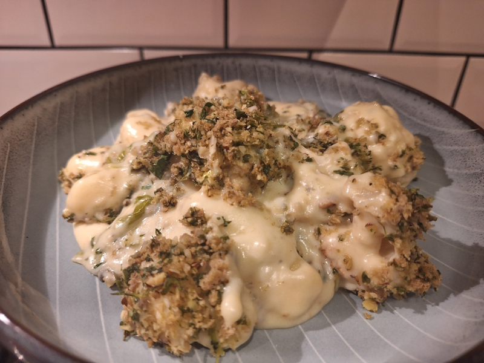
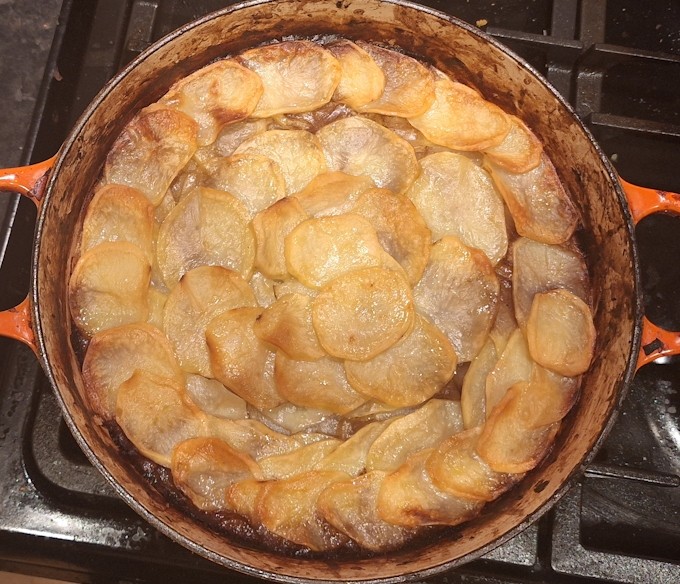
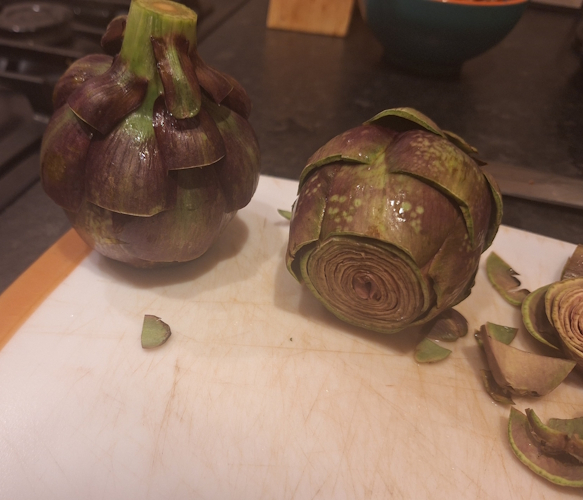
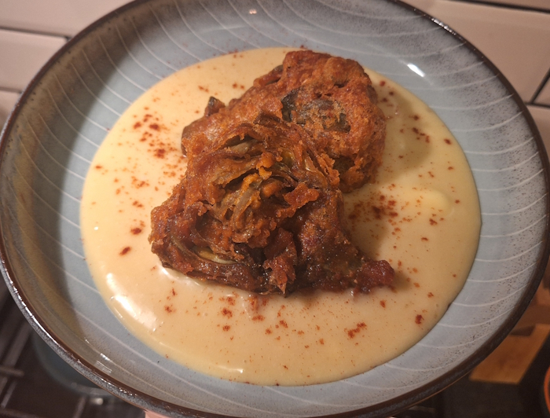
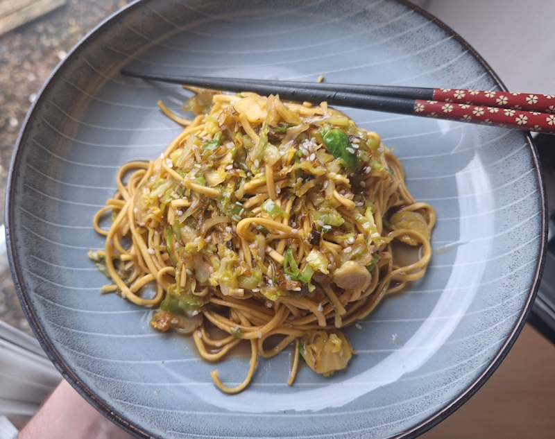
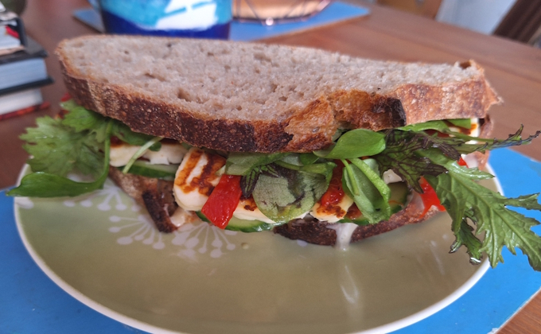
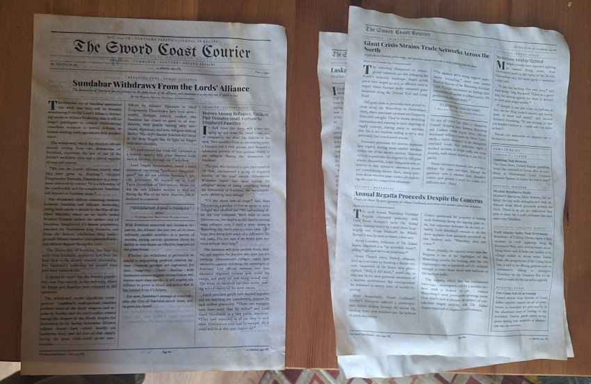

+++
date = '2026-02-22T12:02:42Z'
draft = false
title = "Week 08 - Fried artichokes, Lancashire hotpot, gnocchi, and noodles"
description = "In a bold move for me, I make two things without a recipe."
image = 'cover.jpg'
+++

# Week Eight: Sunday Feb 15th - Saturday Feb 21st

* **Feb 15th**: More spaghetti all'assassina
* **Feb 16th**: Cauliflower gnocchi cheese & a green crumb (*new*)
* **Feb 17th**: leftover cauliflower and gnocchi (*new*)
* **Feb 18th**: Lancashire hotpot
* **Feb 19th**: Crispy fried artichoke with quince aioli (*new*)
* **Feb 20th**: leftover hotpot
* **Feb 21st**: Honey teriyaki, sesame & sprout udon (*new*)

# Feb 16th: Cauliflower gnocchi cheese & a green crumb

This one's from Georgie Mullen's 'What to Cook & When to Cook It', and a pretty hearty one for mid-February. Roast a cauliflower and make a Mornay sauce. Blitz breadcrumbs, hazelnuts, capers, parsley (with stalks) to make the green crumb. Mix the roast cauliflower with gnocchi, pour over the cheese sauce, and top with breadcrumbs, bake.

The green crumb on top does a surprisingly good job at stopping it from being completely stodgy. The capers add a touch of sourness, and it all adds a bit of texture. Thumbs up, would recommend. 

# Feb 18th: Lancashire hotpot

I stepped out of my comfort zone with this one, and didn't follow any recipe. Lancashire hotpot is a bit of a loose recipe anyway, as long as it's got potato on top I think it counts.

I went to the Unicorn and bought a bunch of root vegetables; carrot, swede, parsnip. Cooked some onions, celery and a bit of the carrots diced finely (a 'mirepoix' for the french/pretentious among you) down with red wine and rosemary, added in my root veggies with some stock, and a splash of henderson's relish. Let it bubble away, then threw in some pearl barley to soak up some of the sauce. Topped with a layer of thin sliced potato, brushed with butter and baked in the oven. 

Genuinely pretty pleased with how it turned out. I'm making a lot of hearty food lately, but the weather calls for it. The pearl barley was a good idea, I nicked that from a bbc good food article. 

# Feb 19th: Crispy fried artichoke with quince aioli

This is another invented recipe, but based on a dish we had when we went out for a meal at Porta in didsbury. It's a tapas style restaurant, and the dish was crispy fried artichoke with a quince aioli sauce.

I've never cooked with artichoke before but it was kind of fun. There's a hairy mass in the middle you need to cut out, called the choke, so named because if you eat it you will choke.

I ended up steaming them, then made a wet batter with flour, paprika, chilli, cornflower, and sparkling water, and then fried them in oil. I remember my brother always talking about wet-dry-wet frying, which is dip in your seasoned flour, dip in your wet batter, then back in your dry crumb before frying, and honestly I probably should have followed his advice. My method did an *ok* job of sticking to the artichoke, but it wasn't particularly uniform. I also envisioned the layers of the artichoke separating like a bloomin' onion, but it ended up stuck together. Not complaining too much though, it tasted great.  

I also made a quince aioli out of a small jar of quince jam, mayonnaise, garlic clove, lemon juice, olive oil. 

# Feb 21st: Honey teriyaki, sesame & sprout udon

Back to Georgie Mullen for a dead simple one to end the week. Cook up some honey, rice vinegar, soy sauce, sesame seeds, and ginger until thick. Take off the heat and add butter. Fry your shredded sprouts until just starting to turn black and crispy, then mix with your noodles and sauce. Voila! 

I've said it before but I appreciate a meal which has a high effort vs payoff ratio. Only real fiddly bit was shredding the sprouts, but you could do a rougher job and it's come out just as good to be honest. It all get's cooked down anyway.

# Honourable Munchion

After making the fried artichoke I ended up with roughly a jars worth of quince aioli, which has been making some very delicious sandwiches. Like this one, which is quince aioli, sun-dried tomatoes, roast pepper, grilled halloumi and rocket.

# Other than food

I went out to a gig on friday to see the Paper Kites at the ritz. I don't think I've been to the ritz since I was in my late teens/early 20s, and the night ended when Rick got punched in the face. I had a better time on friday than that, so maybe I should stop holding a grudge.

The Paper Kites are a mostly nice acoustic-y folk, although they did stray into Dire Straits territory at one point:



I also copied an idea from my boss who plays D&D, and wrote up an in-universe newspaper for my players, *The Sword Coast Courier*. I had a lot of fun writing the articles, sprinkling in some quest thread, group in-jokes, a letter to the editor about dragons secretly being behind everything by Davyd Icke, and a two star review of a play about star crossed giant lovers.

I also dug up my old primary school arts and crafts knowledge and stained the paper with tea to make it look like parchment.

The group loved it, which is a bit of a double edged sword because they've already requested a crossword and horoscope section for the **next** newspaper I give them.

