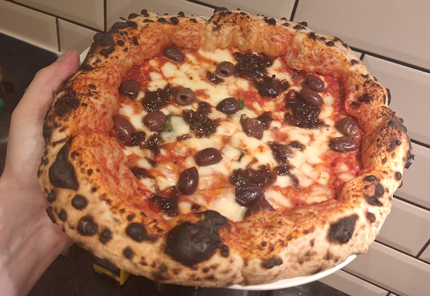
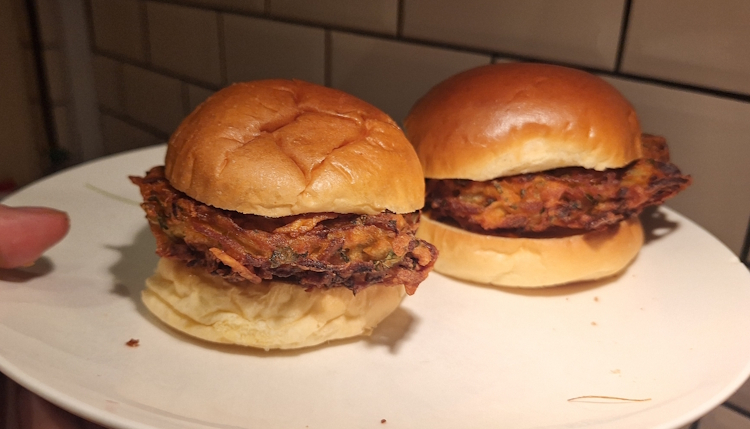
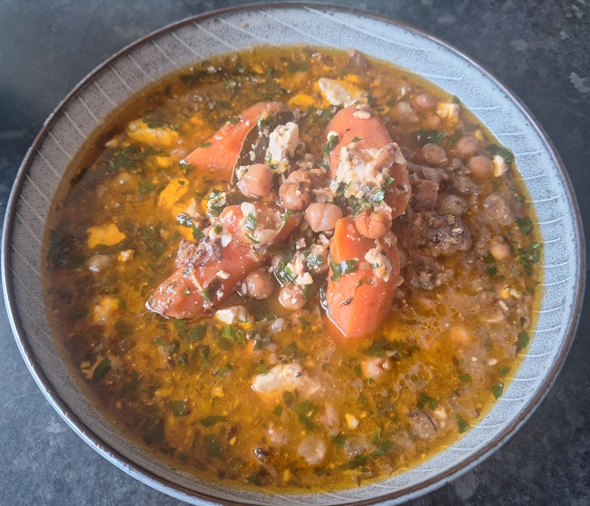
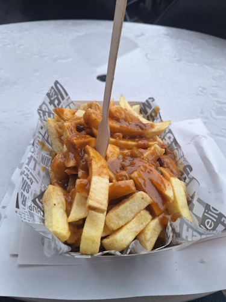
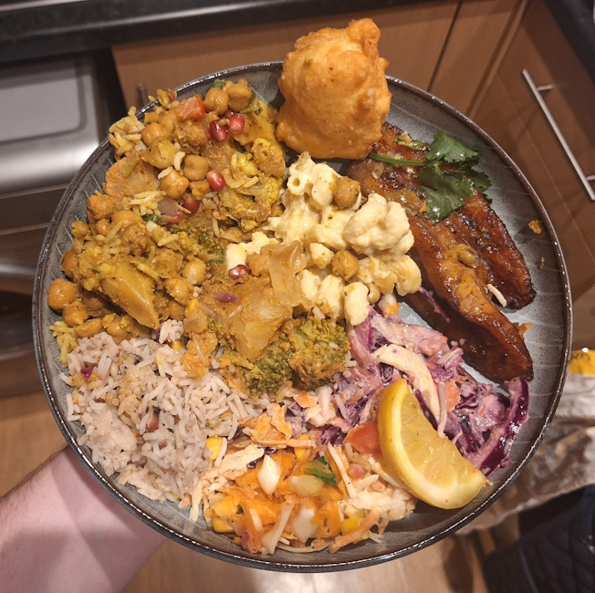
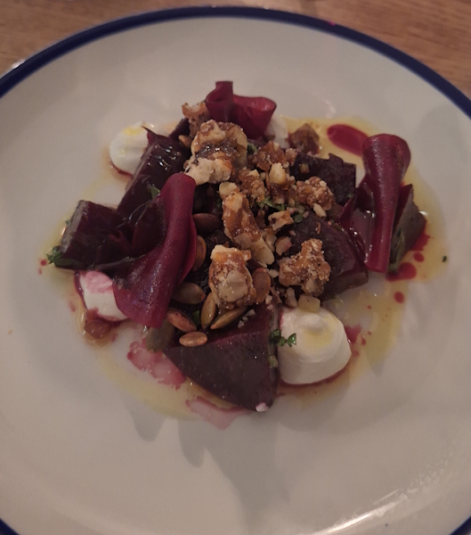
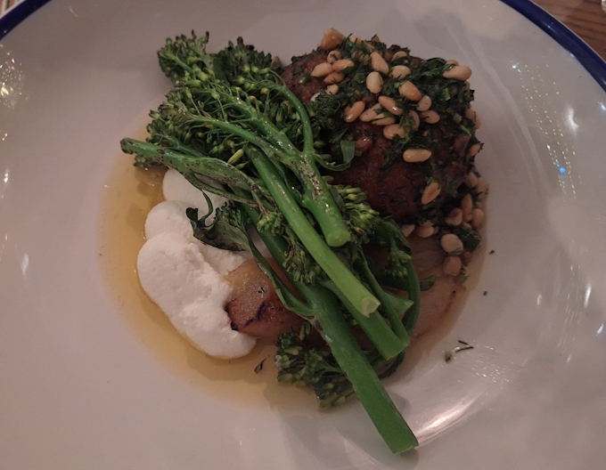
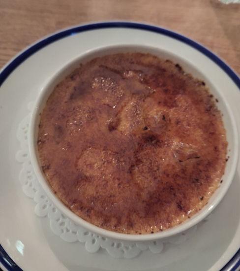

+++
date = '2026-03-01T13:03:01Z'
draft = false
title = "Week 09 - The junkfood trifecta"
description = "I barely cook this week, mostly eating out and takeaways"
image = 'cover.jpg'
+++

# Week Nine: Sunday Feb 22nd - Saturday Feb 28th

* **Feb 22nd**: Olive pizza from Double Zero
* **Feb 23rd**: Onion and potato bhaji burgers
* **Feb 24th**: Braised chickpeas with carrots, dates and feta (*new*)
* **Feb 25th**: Leftover braised chickpeas
* **Feb 26th**: Chips
* **Feb 27th**: Caribbean takeaway from Dropbar
* **Feb 28th**: Meal out at Hispi

# Feb 22nd: Pizza from Double Zero

I'm very lucky to live near, for my money, the best pizza place in Manchester. You've got Nell's pizza nearby who do good New York style crispy pizzas, but my heart is with the Neapolitan. The crust is so soft, pillowy and blistered on the edges. And double Zero have it down pat. They could give me just the dough and a bit of olive oil and I'd eat it. 

I usually keep it pretty simple on the toppings, this time I went for a Margherita with olives and caramelised onions.

# Feb 23rd: Onion and potato bhaji burgers

Good old Meera Sodha back once again with another of her recipes I've been making for years now. It's pretty simple to make: grate up your potato, slice your onions, mix in some spices, lime juice, chickpea flour, and a bit of water, then shape into balls and fry for a few minutes.

The real way to elevate these is with the sauces. You need something to cut through the fried potato. In the original recipe she uses mango chutney, but I had some of the Quince Aioli from last week left, which has a similar level of sweet and fruity-ness. Also, you can't see from the pictures but there's a bit of greenery in there as well.

The recipe's available here: 

https://www.theguardian.com/food/2021/aug/07/meera-sodha-vegan-recipe-onion-potato-bhaji-burgers

# Feb 24th: Braised chickpeas with carrots, dates and feta

A new recipe to me, from Ottolenghi. I figured it was probably best to get a few pulses and legumes in me, given the burgers and pizza. 

Not too difficult by Ottolenghi standards, although I made the classic mistake of not noticing there's a 2 hour step in the middle where you leave it to cook, so I ended up eating around 9. 

Still, it turned out alright. It wasn't too much prep work, most of it is blitzed together in a food processor, and you don't even need to chop up the carrots particularly finely. Best bits was the marinated feta which you make separately then dollop on top at the end.

I ended up with a lot of leftovers as well, so this was my lunch for several meals this week as well.

https://www.theguardian.com/food/2019/jan/19/yotam-ottolenghi-recipes-traybakes-pork-mushroom-pasta-spicy-chicken-chickpeas

# Feb 26th: Chips and curry sauce

I figured I may as well complete the junk food trifecta; pizza, burger and chips. I ended up eating this on my lunch break, on the only dry outside seat under an awning. There's something quite nice about eating warming chips, looking out at a cold rainy street. I'm not particularly nationalistic but this is one of the few things that makes me proud to be British.

It did make me lethargic for the rest of the day though, I just wanted to lie around like a python digesting its meal, so I didn't end up eating anything in the evening. 

# Feb 27th: Henchbox from Dropbar 

This is a classic takeaway for me, although the amount of food you get is ridiculous. Note that the picture below is only about half of it.

Dropbar is a caribbean restaurant, which do a pretty good job catering to vegan and vegetarian food. You can get various 'Hench boxes', packed full of lots of different bits and pieces. I went for the veggie one which comes with curried veg, steamed sweet potato and white potato, cauliflower and chickpea curry, plantain, dumpling, slaw, mango-coriander salsa, mac and cheese, and coconut rice 'n' peas.

# Feb 27th: Meal out at Hispi

It's my dad's 70th birthday in a couple of weeks, so we went out for a meal at Hispi, in Didsbury, to celebrate.

Hispi's been running for about 10 years now, and it's nice to see it still doing well. I remember growing up in the area it used to be a place called Gem&I. 

We opted for the three course meal, I had a Roast beetroot salad with walnuts, goat's cheese and pumpkin seeds as a starter.

Main course was Cashel Blue cheese arancini, with beurre noisette, poached pear and ricotta. It was the only veggie option on the menu but to be honest I'm not complaining, very delicious.

Mum managed to drop in a mention that it was dad's 70th birthday, so they very sweetly gave us some extra fudge for desert. I opted for the crème brûlée, but I did end up eyeing dad's plate of stilton on honey soaked walnut bread pretty enviously.  

It's always nice to catch up with my parents. Just walking from their house to the restaurant was interesting. Didsbury's changed quite a bit over the time I've known it, definitely more and more of a night out destination. It was always a little that way, with the Didsbury dozen, but I remember when it had a bit more of a 'village' feel to it. Maybe that's just a trick of the memory, I would have been a kid for most of my time there. 

I don't particularly mourn it though, the new didsbury is an interesting place, and the food is undeniably better!

