+++
date = '2026-02-01T12:08:03Z'
draft = false
title = "January 31st - Tasting menu at Skof"
description = 'A one off, where I go over a single meal'
image = '0.jpg'
+++

# Special one-off: Saturday Jan 31st

This is a special one-off entry in the blog, as it wouldn't do it justice to try and squeeze it into the weekly post. Andrew and I went to Tom Barne's restaurant Skof, in a former drapery warehouse near New Century. This is the first michelin stared restaurant I've ever eaten in, and we went for a staggering 18 course tasting menu, with a mixed drink pairing. 

The atmosphere and the staff were great, really friendly and welcoming. It's pretty relaxed inside, the food was fine dining but it didn't feel silver service.

As soon as we sat down and they took our coats we had a broth of Grilled onion and lemon thyme. Nice and warming after the dash to the restaurant in the rain.

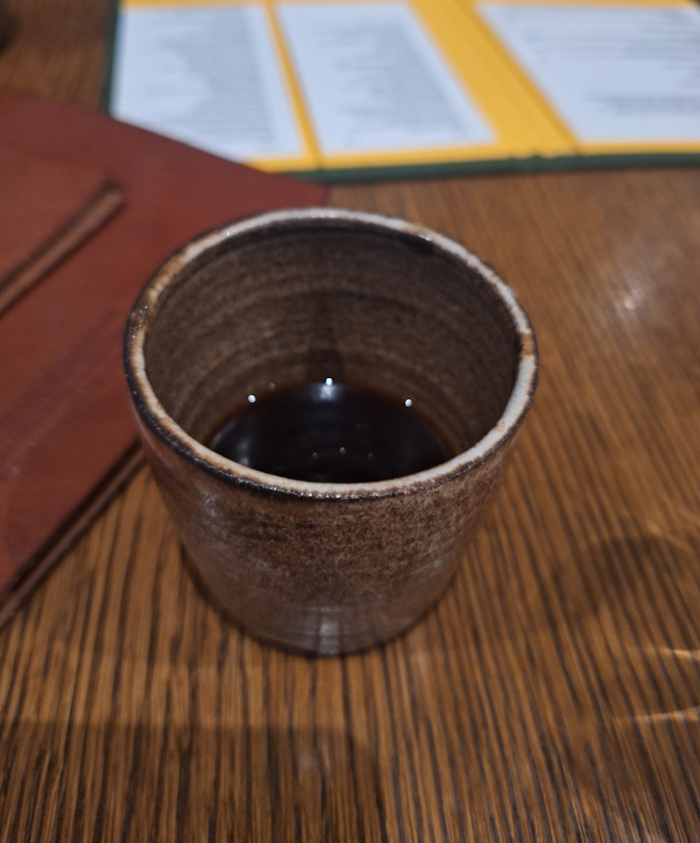

The paired drinks didn't start until later, so I had a Sonoma from Track, a Manchester brewery. Feels a little funny to be drinking something I drink from the tin at home in a michelin star restaurant.

There were two options for the meal, a short and a long tasting menu. We settled on the longer tasting menu (This is a once a year experience, why not spend an extra £40), and the first few courses came out pretty quick. They're all meant to be eaten in a single bite.

The first was a celeriac tartlet, covered in roasted yeast, and with cured egg yolk. 

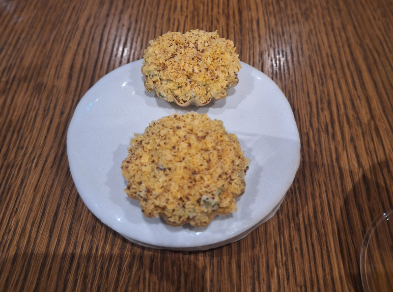

Next was a whipped goats cheese curd, with jerusalem artichokes and shiso vinegar, between two cheese biscuits.

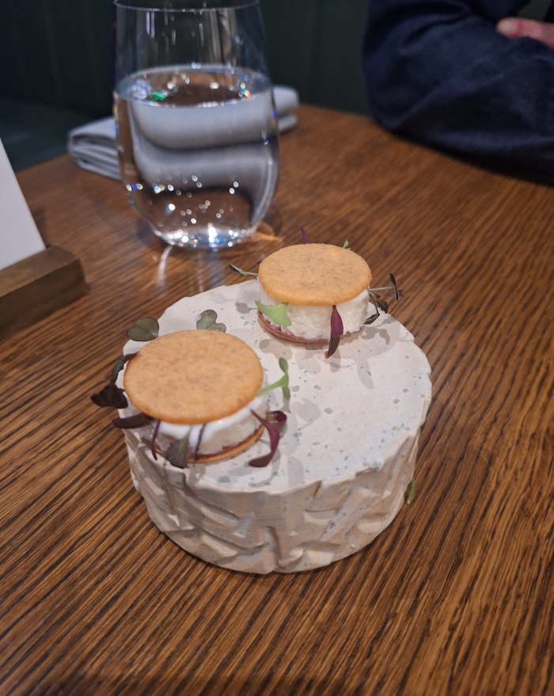

The third bite was the best one of the three, salt-baked Kohlrabi on a small potato flatbread. There were fermented gooseberries under the Kohlrabi which gave it a sweetness. 

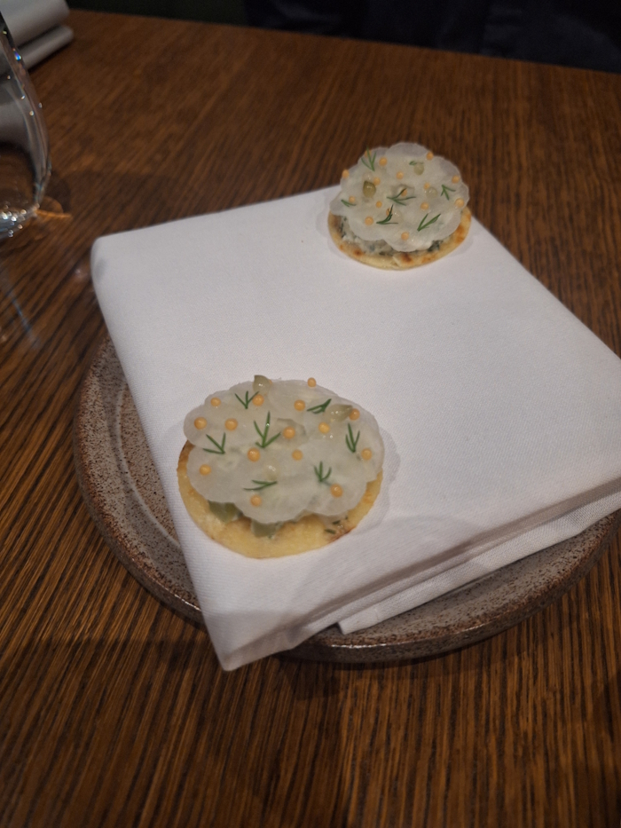

After that we had a small plate of sugarsnax carrots which had been coated in a slated plum condiment. It was more sour than I expected, I guess I thought plum would be sweet.

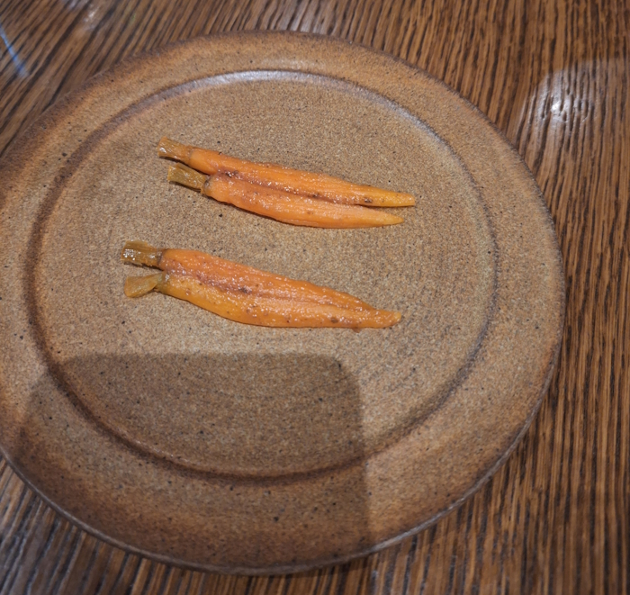

Next was crown prince pumpkin. They had thin crunchy sticks of it, over softer cubes which had been cooked or maybe marinated in hot sauce.

The aubergine was really good, very soft and sweet, on crunchy brown butter soaked sourdough, and wrapped with a little fermented cabbage.

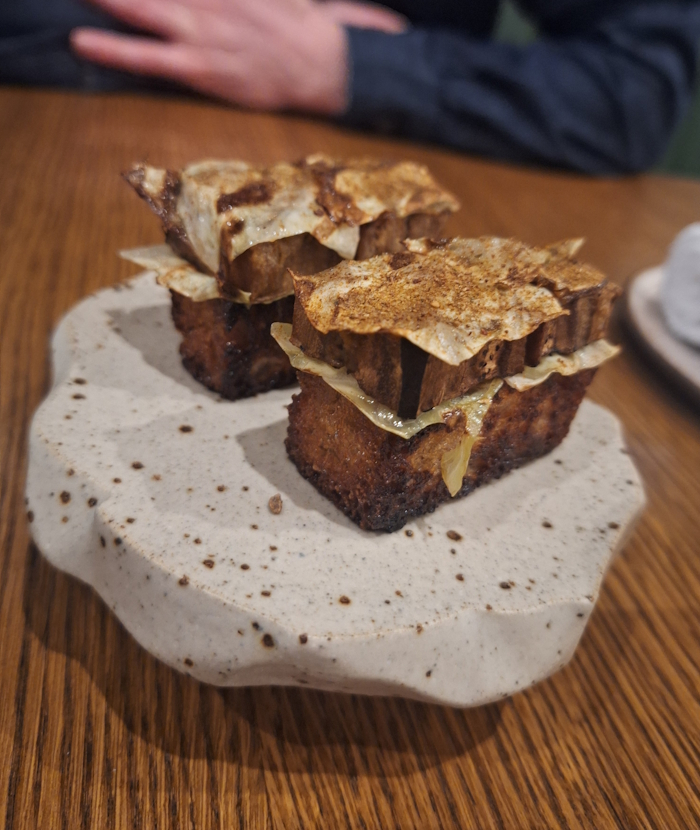

The mixed drink flight started at this point, with a beer from another Manchester brewery called balance. 

The dish it came with was sungold tomatoes, in a kind of fruity tasting broth, with some crunchy kohlrabi on top. There was a bit of theatre where they sprinkled a very cold white powder over the top. Very delicious, but it feels a bit redundant to keep saying that. From this point forward, assume everything is very delicious.

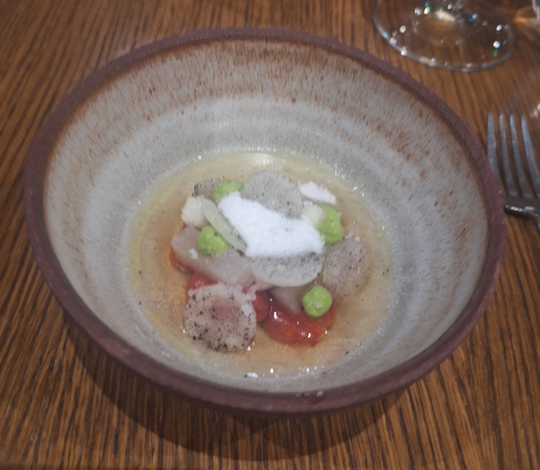

Next we were taken up to sit by the bar, to watch the pass. The couple next to us were very chatty, and clearly loving the chance to chat with Tom Barnes. I eavesdropped as they asked about his favourite restaurants in manchester (Lots of meaty ones, but the Sparrows got a mention) through to his favourite kind of crisp.

Next dish was a miso custard, with lots of mushrooms and truffle on top, and a sort of smoky hay on top of that. The drink we had with this was a cucumber water infused with rose petals.

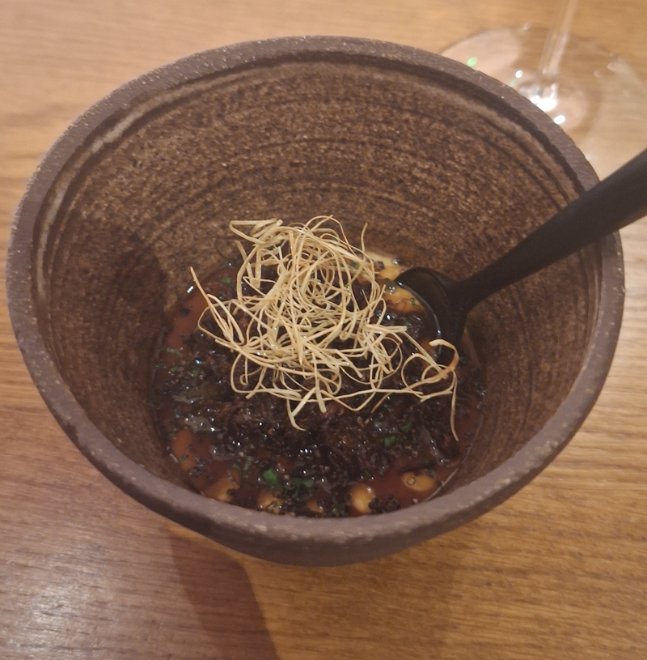

After that we were back to the table for the next course, Ragout of English grains. This might be my favourite of the night, if I had to pick. Just incredibly well balanced, super deep flavours in the broth, with a little tang of something vinegary, and some drops of an intense herby green oil on top. A little marinated quail egg as well, floating on top.

This and the next course came with a Gooseberry and tarragon drink from Track brewery. Light, and a surprisingly strong tarragon taste to it.

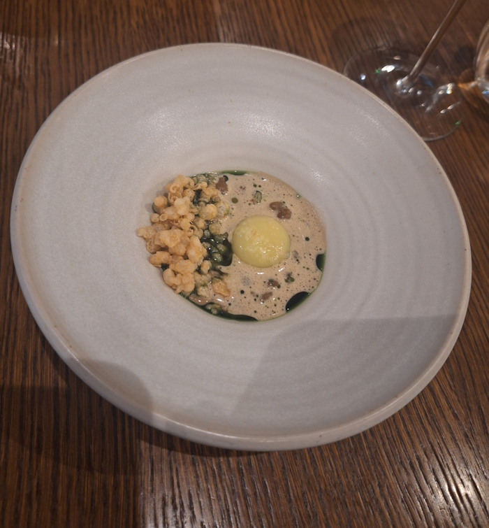

This next course has little balls of confit potato and pickled walnut in a slightly milky looking broth. There was also a kind of odd looking Croissant cylinder. I'm so curious how they made it, the outside shell was pretty solid, but once you tore it open it was flaky and soft like the inside of a Croissant. Served with a fermented butter.

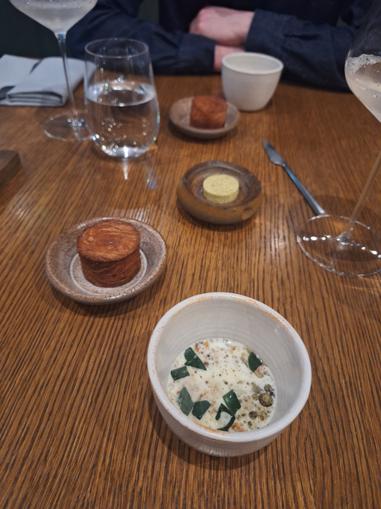

Next we had smoked and roasted cauliflower, served in a yoghurt whey sauce. Under the cauliflower there were a load of caramelised onions. 

They started us on the wines, with a glass of South African white.

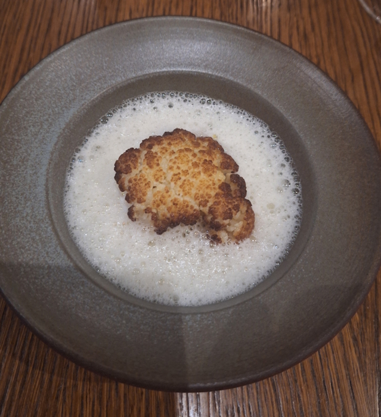

After that we had a roasted cabbage with a rich, red wine-y sauce and celeriac mash. It came with a lovely bread stuffed with mushroom Pâté.  

This came with a glass of German red wine.

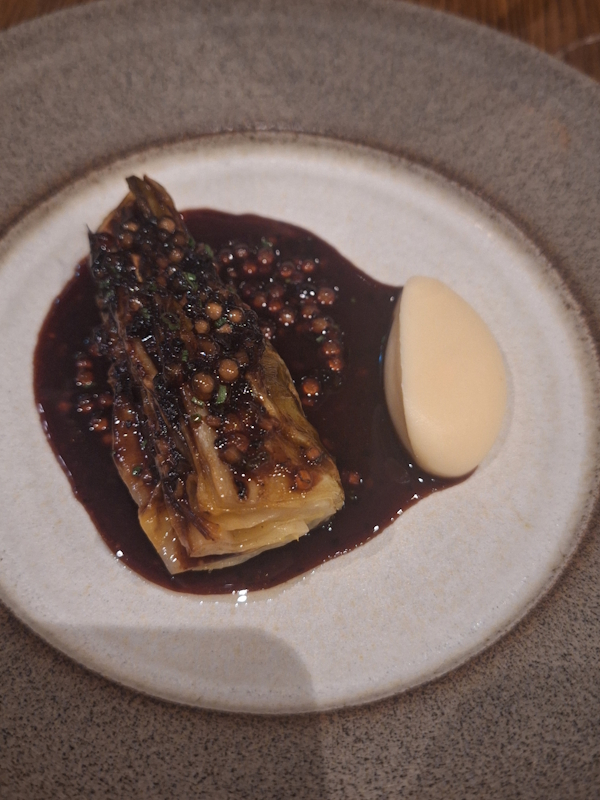
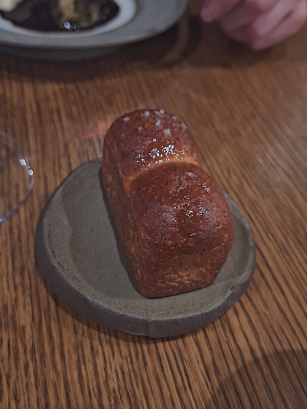

After all that we're on to the desserts. They came with another beer from Balance, a cherry wild ale. After chatting to the waiter apparently it's made like a sourdough starter, they re-use some of the yeast each time perpetually. I think the cherries are fermented whole as well, rather than juiced. Tastes like a sour, funky in a good way. 

This sorbet is not what I expected after eating it. Very savoury, and malty tasting. A bit of sweetness to it but not too much. It's made of Amazake which is a traditional Japanese fermented rice drink.

This was a bit like a deconstructed rhubarb crumble, although they didn't write that on the menu. Thin, sharp tasting and crunchy rhubarb, with some sweet breadcrumbs and some of the cold white powder from an earlier dish, all on a base of set custard.

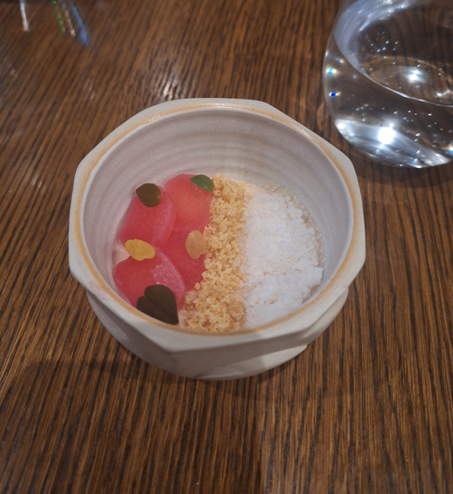

I'm not even sure exactly what this one was. It tasted like a very milky ice cream (it didn't call it icecream on the menu), with some tin peels of squash, and a piece of gingerbread. 

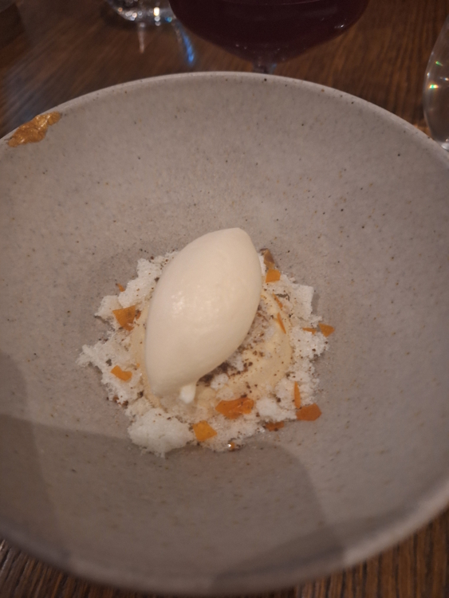

These were very cute, two mini ice cream cones, with a honey ice cream on top and the cone stuffed with rum and raisin toffee. 

Final dish of the night was Barney's tiramisu. Apparently it's in memory of the head chef Tom's dad, who sadly passed away. Before he died he mostly had to eat soft foods, so Tom would make Barney this Tiramisu.

A very sweet way to end the night, in honour of his dad. There's nothing weird or chefy about this pudding, just a really well made Tiramisu.

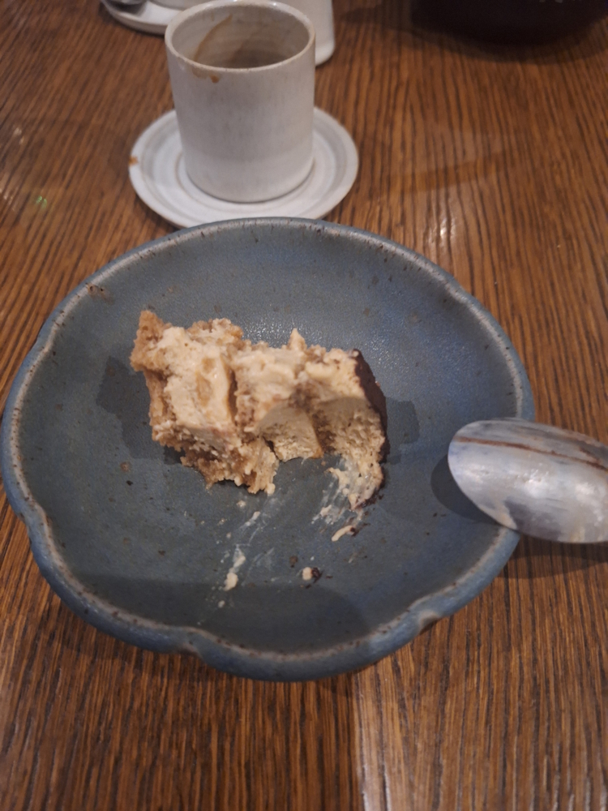